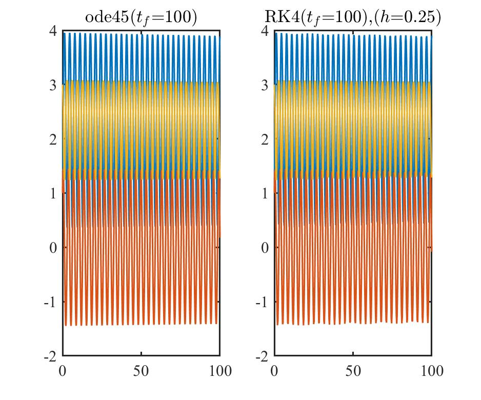
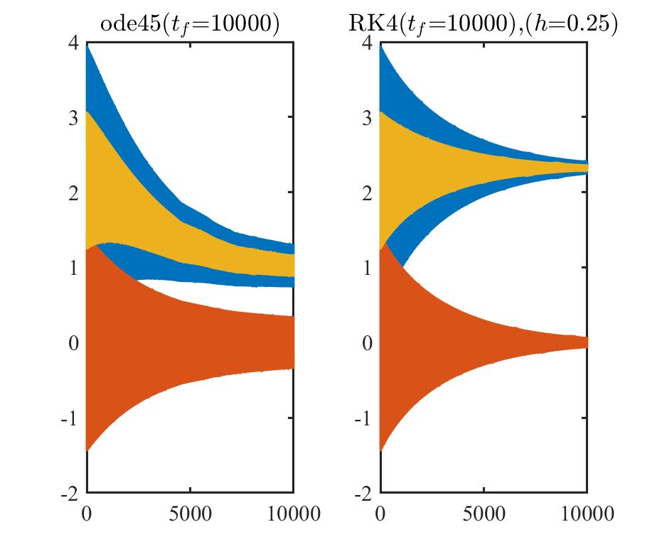
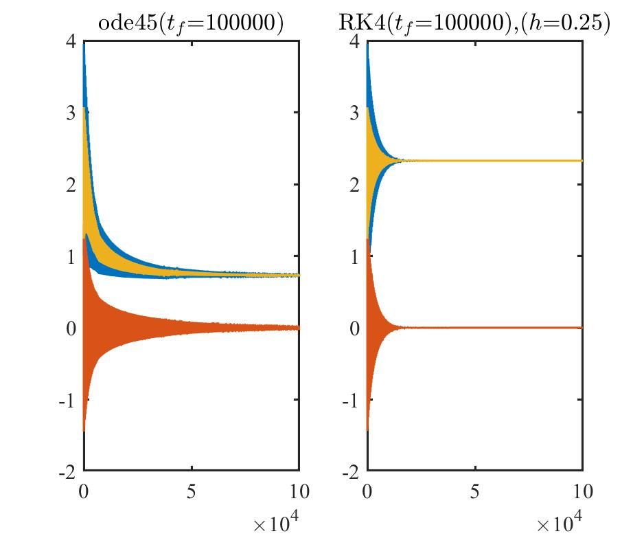
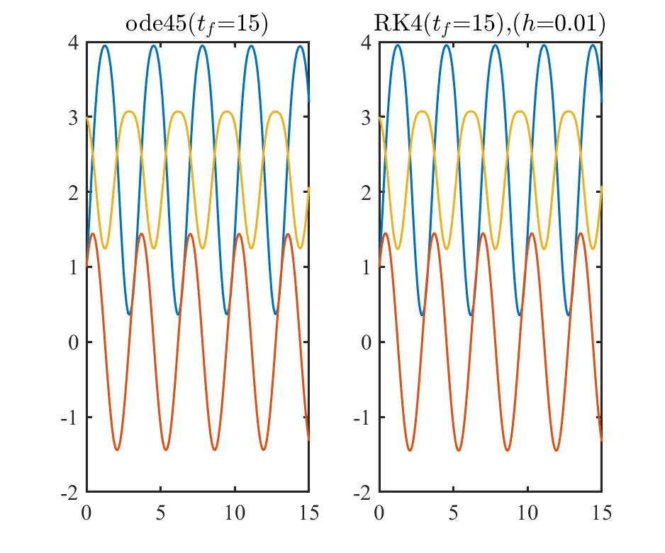
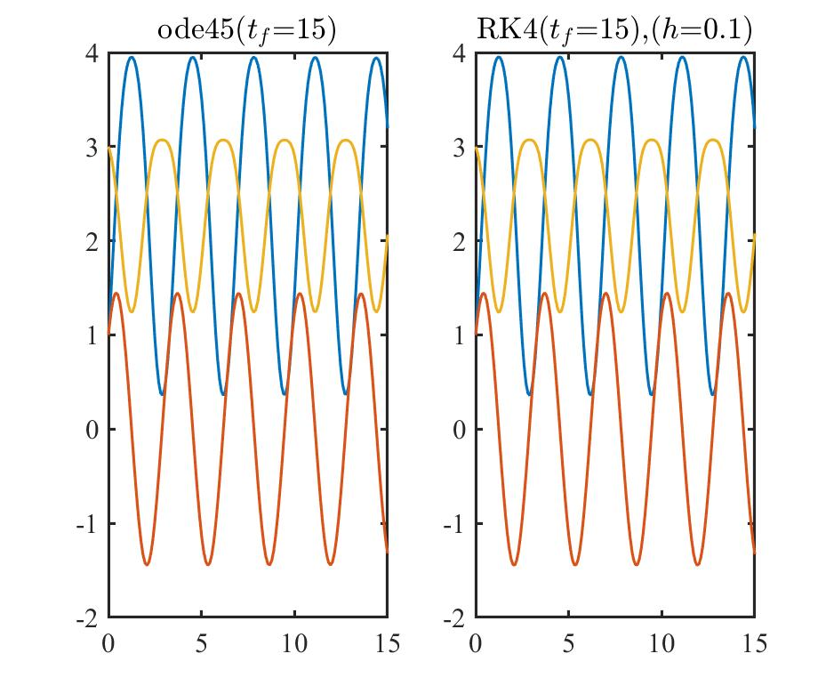
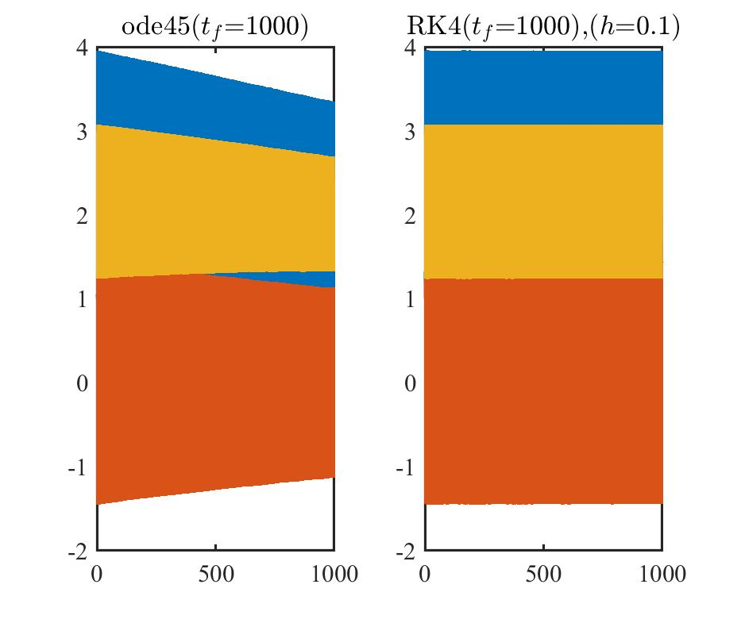
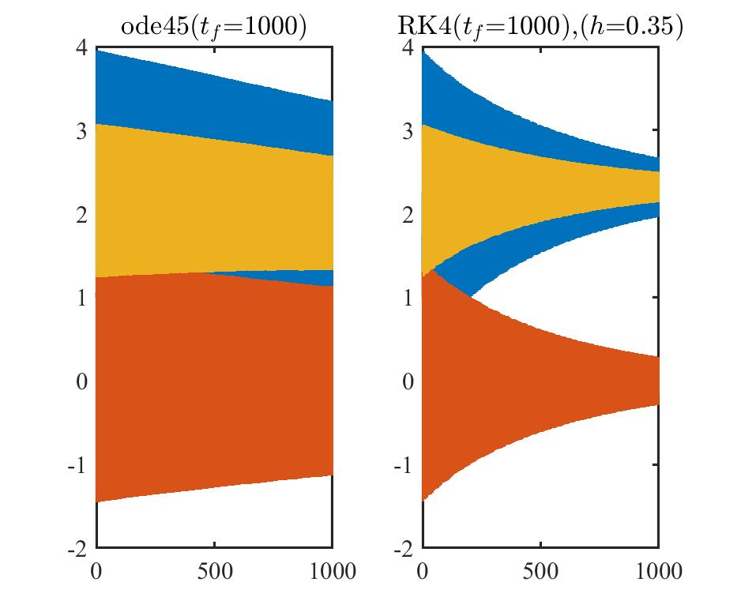
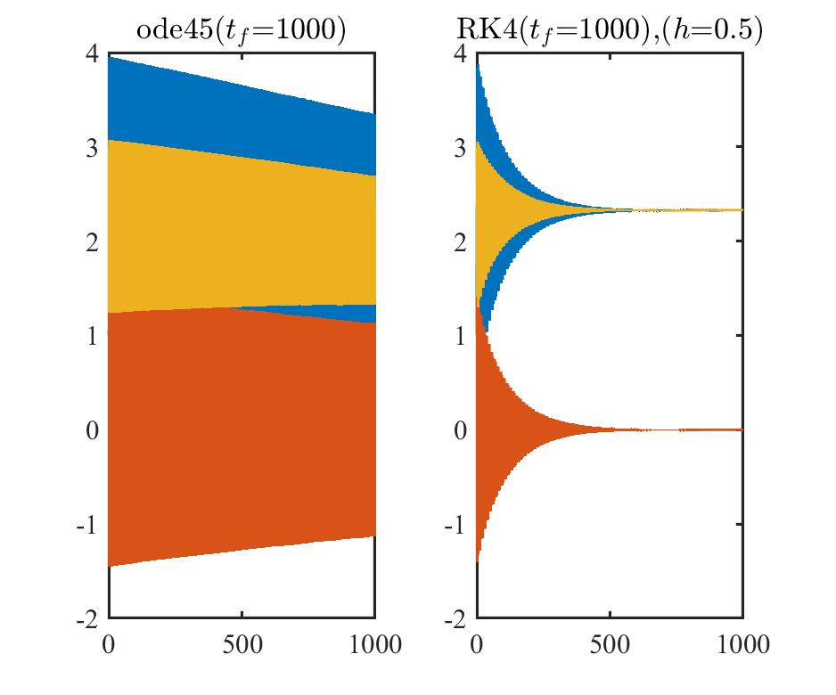

# 引言

写这篇博客目的是自己在求解微分方程的时候，考虑到 `ode45()` 可能求解速度比较慢，想用一种快速一点的微分方程求解算法，又想到 `ode45()` 用的就是 Runge-Kutta （RK）算法，所以想是不是自己可以自己编写一个 RK 算法用来代替 `ode45()`。因为 MATLAB 的 `ode45()` 算法中可能存在较多的判断条件，这也许是让 `ode45()` 速度较慢的一个原因，而自己编写的 RK 算法省略了很多不必要的判断，也许会快一些。

# ode45()

`ode45()` 算法是 MATLAB 中专门用于求解常微分方程（Ordinary differential equations，ODE）的函数，它在求解微分方程时的步长是变步长的，使用也是 RK 算法。

`45` 代表了 `ode45()` 使用 4 阶- 5阶 RK 算法。其中，4 阶方法用于提供 ODE 的候选解，5 阶方法用于控制误差，整体截断误差为 $\Delta x^5$。

# Runge-Kutta 算法

RK 算法是德国数学家 Runge 和 Kutta 在 1900 年前后提出的一种高精度求解微分方程的数值算法。该算法间接使用 Taylor 级数展开构造高精度数值方法，利用函数 $f$ 在若干点的值的线性组合代替 $f$ 的导数，再利用 Taylor 级数展开方法确定其中系数。

下面详细说明 RK 算法如何求解一阶微分方程。

对于如下问题：

$$
\left \{\begin{matrix}
\begin{aligned}
&\boldsymbol{\dot{y}} = f(t,\boldsymbol{y}),\\
&\boldsymbol{y}(t_0) = \boldsymbol{y}_0,    
\end{aligned}
\end{matrix}
\right.
$$

式中，$t_0$ 为初始时间，$\boldsymbol{y}_0$ 为初始状态，$f(t,\boldsymbol{y})$ 为关于时间 $t$ 和状态 $\boldsymbol{t}$ 的函数。

那么 4 阶 RK 算法为：

$$
\left \{\begin{matrix}
\begin{aligned}
&k_1 = f(t(k)      ,\boldsymbol{y}(k)),              \\
&k_2 = f(t(k) + h/2,\boldsymbol{y}(k) + k_1 h/2),    \\
&k_3 = f(t(k) + h/2,\boldsymbol{y}(k) + k_2 h/2),    \\
&k_4 = f(t(k) + h  ,\boldsymbol{y}(k) + k_3 h),      \\
&\boldsymbol{y}(k+1) = \boldsymbol{y}(k) + h(k_1+2k_2+2k_3+k_4)/6,   \\
&\boldsymbol{y}(0) = \boldsymbol{y}_0.
\end{aligned}
\end{matrix}
\right.
$$

上式即为 $\boldsymbol{y}(k)$ 向 $\boldsymbol{y}(k+1)$ 递推的形式，根据初始条件可以求出 $\boldsymbol{y}(1)$，$\boldsymbol{y}(2)$，$\boldsymbol{y}(3)$，$\boldsymbol{y}(4)$，$\cdots$ $\boldsymbol{y}(N)$，该离散序列即为微分方程的数值解。

# RK 算法程序

在这里给出 RK 算法的 MATLAB 程序。

```python
%--- RK 算法 ---%
% ufunc - 微分方程组的函数名
% y0 - 初始值
% h - 步长
% a - 初始时间
% b - 末端时间
function [x,y]=runge_kutta1(ufunc,y0,h,a,b)
% 步数
n = floor((b-a)/h);
% 时间起点
x(1) = a;
% 初始值
y(:,1)=y0;

% 算法开始
for iter=1:n
% 时间变量
x(iter+1) = x(iter)+h;
% 开始迭代
k1 = ufunc(x(iter),       y(:,iter));
k2 = ufunc(x(iter) + h/2, y(:,iter) + h*k1 / 2);
k3 = ufunc(x(iter) + h/2, y(:,iter) + h*k2 / 2);
k4 = ufunc(x(iter) + h,   y(:,iter) + h*k3 );
% 得到结果
y(:,iter+1) = y(:,iter) + h * (k1 + 2*k2 + 2*k3 + k4) / 6;
end

end
```

# 仿真

用一个一阶微分方程数值求解例子来对比 `ode45()` 和 自编 RK 算法的效果。

对于问题

$$
\left \{\begin{matrix}
\begin{aligned}
    \dot{y}_1 &= y_2 y_3,    \\
    \dot{y}_2 &= -y_1 + y_3, \\
    \dot{y}_3 &= -0.51 y_1 y_2, \\
    \boldsymbol{y} &= (y_{10},y_{20},y_{30}) = (1,1,3).
\end{aligned}
\end{matrix}
\right.
$$

在时间区间 $[0,t_f]$ 上的解，其中 $t_f$ 未定。

## 仿真代码

给出 MATLAB 解决上述问题的仿真代码。

```python
clc;clear;close all;

%% 主函数
% 时间变量
t0 = 0;
tf = 1000;
% 初值
y10 = 1;
y20 = 1;
y30 = 3;
y = [y10,y20,y30];
% RK 算法步长
h = 0.25;
% 对该微分方程组用ode45和自编的龙格库塔函数进行比s较，调用如下：
% ode45()函数
tic;
[T,F] = ode45(@fun,[t0 tf],y);
time_record_ode = toc;
toc;

% 自编RK函数
tic;
[T1,F1]=runge_kutta1(@fun,y,h,t0,tf);
time_record_rk = toc;
toc;

%% 画图
figure('color',[1 1 1],'position',[600,100,500*1.5,416*1.5]);
subplot(121);
plot(T,F,'LineWidth',1.5);
title(['ode45','($t_f$=',num2str(tf),')'],'Interpreter','Latex');
set(gca,'FontSize',15,'FontName','Times New Roman','LineWidth',1.5);

subplot(122);
plot(T1,F1,'LineWidth',1.5);
title(['RK4','($t_f$=',num2str(tf),'),($h$=',num2str(h),')'],'Interpreter','Latex');
set(gca,'FontSize',15,'FontName','Times New Roman','LineWidth',1.5);

% 保存数据
str = ['tf_',num2str(tf),'_h_',num2str(h),'.mat'];
str_fig = ['tf_',num2str(tf),'_h_',num2str(h),'.jpg'];
save(str);
saveas(gcf,str_fig)
%% 子函数部分
% 微分方程
function dy = fun(t,y)
dy = zeros(3,1);%初始化列向量
dy(1) = y(2) * y(3);
dy(2) = -y(1) + y(3);
dy(3) = -0.51 * y(1) * y(2);
end

%--- RK 算法 ---%
% ufunc - 微分方程组的函数名
% y0 - 初始值
% h - 步长
% a - 初始时间
% b - 末端时间
function [x,y]=runge_kutta1(ufunc,y0,h,a,b)
% 步数
n = floor((b-a)/h);
% 时间起点
x = zeros(n,1);
x(1) = a;
% 初始值
y(:,1)=y0;

% 算法开始
for iter=1:n
% 时间变量
x(iter+1) = x(iter)+h;
% 开始迭代
k1 = ufunc(x(iter),       y(:,iter));
k2 = ufunc(x(iter) + h/2, y(:,iter) + h*k1 / 2);
k3 = ufunc(x(iter) + h/2, y(:,iter) + h*k2 / 2);
k4 = ufunc(x(iter) + h,   y(:,iter) + h*k3 );
% 得到结果
y(:,iter+1) = y(:,iter) + h * (k1 + 2*k2 + 2*k3 + k4) / 6;
end

end
```

算法主要对比的有 2 项指标，**计算精度**和**计算效率**。

## 不同终端时间下的算法对比

分别对比 $t_f=15,10^2,10^3,10^4,10^5$ 时，`ode45()` 和 RK 算法的**计算精度**和**计算效率**。









从计算精度来看，计算时间比较小的时候， RK 算法和 `ode45()` 的区别不是很大，但是计算时间增大之后，到了 $t_f=10^3,10^4,10^5$ 的时候，RK 算法的精度就逐渐跟不上 `ode45()` ，此时 RK 算法累积的误差更大一些了。

|           | $t_f=15$ | $t_f=10^2$ | $t_f=10^3$ | $t_f=10^4$ | $t_f=10^5$ |
| --------- | -------- | ---------- | ---------- | ---------- | ---------- |
| `ode45()` | 0.000863 | 0.002703   | 0.020696   | 0.165518   | 1.204862   |
| `RK4()`   | 0.000448 | 0.001650   | 0.015817   | 0.136802   | 1.336549   |

从计算效率来看，RK 算法的计算效率要优于 `ode45()` ，不过计算时间增大到 $t_f=10^5$ 的时候，`ode45()` 的计算效率超过了 RK 算法，猜想是计算时间太长，自编的 RK 算法无法针对这么长计算时间的微分方程做特定优化，所以导致计算时间慢于 `ode45()`。

## 不同步长下的算法对比

分别对比 $t_f=15$ 和 $t_f=10^3$ ，Rk 算法步长为 $h=0.01,0.10,0.20,0.25,0.35,0.50$ 时，`ode45()` 和 RK 算法的**计算精度**和**计算效率**。













从计算精度来看，计算时间比较小的时候， RK 算法的步长越小，算的结果越和 `ode45()` 的结果接近，步长增加到 $h=0.35,0.5$ 的时候，得到的曲线已经呈现不光滑的趋势了。

计算时间增大之后，，RK 算法精度跟不上 `ode45()` ，这个时候的步长选取就值得考虑了，可以发现，不论是步长取得过小（$h=0.01,0.10,0.20$），还是步长取得过大（$h=0.35,0.50$），得到的结果都和 `ode45()` 的结果不相符合，在 $h=0.25$ 时，Rk 算法求解微分方程的效果会好一些，和 `ode45()` 的结果有差距，但相较其他步长的结果来说，要更好一些。

| $t_f=15$   | $h=0.01$ | $h=0.10$ | $h=0.20$ | $h=0.25$ | $h=0.35$ | $h=0.50$ |
| ---------- | -------- | -------- | -------- | -------- | -------- | -------- |
| `ode45()`  | 0.000795 | 0.000781 | 0.000881 | 0.000863 | 0.000992 | 0.000870 |
| `RK4()`    | 0.005705 | 0.000901 | 0.000493 | 0.000448 | 0.000380 | 0.000251 |
| $t_f=10^3$ | $h=0.01$ | $h=0.10$ | $h=0.20$ | $h=0.25$ | $h=0.35$ | $h=0.50$ |
| `ode45()`  | 0.021820 | 0.020883 | 0.020322 | 0.020696 | 0.020698 | 0.020758 |
| `RK4()`    | 0.343084 | 0.035581 | 0.017536 | 0.015817 | 0.011288 | 0.007863 |

从计算效率来看，RK 算法的步长越小，计算效率越低，因为步长小的话，每次更新迭代的值也小了，需要更多步才能迭代到理想值；步长大的时候，计算效率较高，但是计算精度较低。


# 结论

因此，可以得出结论，

- 在计算时间短的微分方程求解问题中，使用自编 RK 算法的计算精度与使用 `ode45()` 计算精度相近，计算效率更高；
- 在计算时间长的微分方程求解问题中，建议使用 `ode45()` 会得到更好的结果；
- RK 算法中，计算步长和计算时间区间是需要协调好的重要变量，把这 2 个变量设置好，计算精度和计算效率才会更加优越。