这是word教程的第二篇。

# 1 前言
很多同学在写作word文档过程中，需要用到自动编号标题、图表的功能，比如说自动编号第一章、第二章或者图1-1、图1-2这样的功能。有些同学可能不知道怎么在word里面实现，于是自己手动添加标题和图表编号，这样带来的工作量是很大的，而且章节号/图表号变化后，文中引用的内容也会相应一块儿变化，易导致出错。因此，本篇教程给出如何使用word自动编号标题和图表，并实现引用的教学。

首先给一个要实现标题与图表自动标号、分级及引用会使用到的功能框图，包括四个功能，按照使用顺序分别为：

（1）样式设置；
（2）多级列表；
（3）题注；
（4）交叉引用。

详细说明各个功能在word中的位置。

“多级列表”在图1中左边红色方框位置；

“样式设置”在图2中右边红色方框位置。

图1

“题注”功能在“引用”选项卡中，点击“引用”选项卡即可看见“插入题注”功能，如图2所示。

 
图2

“交叉引用”功能在“插入”选项卡中，点击“插入”选项卡即可看见“交叉引用”功能，如图3所示。

图3

# 2 样式设置

首先，进行样式设置，要设置的样式共计6个，包括：

（1）标题1；
（2）标题2；
（3）标题3；
（4）标题4；
（5）图表说明；
（6）题注。

标题1~5的设置过程相同，作用相似，为避免行文累赘，只介绍标题1的设置；图表说明和题注的设置过程与标题1相同，作用不同，为此单独介绍，说明2个样式的作用。

## 2.1 标题1样式设置

鼠标右键点击图4样式库中的某个样式（默认为“标题1”，“一级标题”是本文档已设置好后的样式名称），再点击“修改”，出现图5所示窗口。

图4

图5

图5中，要使用的功能有三个，包括“字体”、“段落”和“快捷键”。点击“字体”按钮，出现图6所示窗口，按照要求设置相应字体即可。

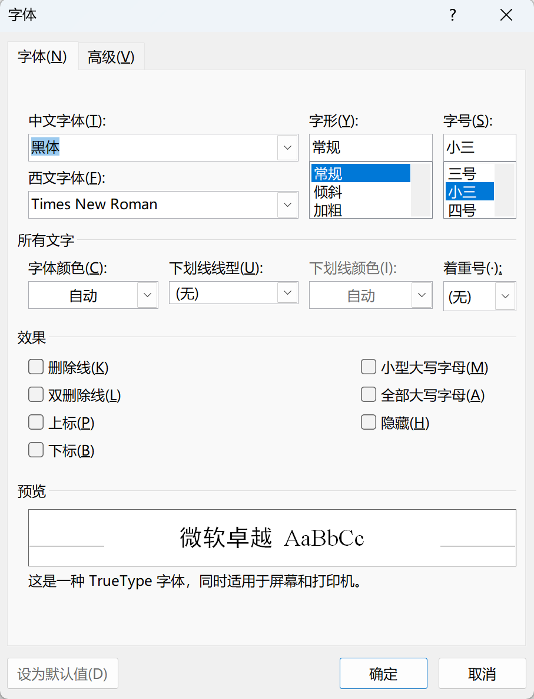
图6

点击“段落”按钮，出现图7所示窗口，按照要求设置相应段落格式即可。

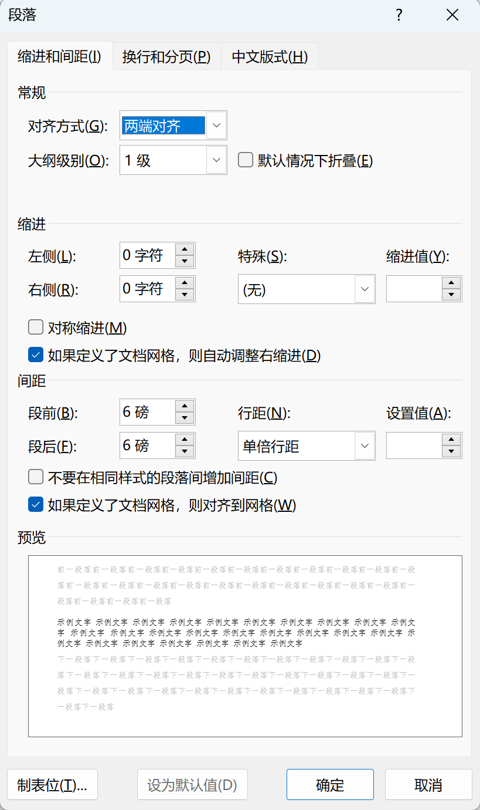
图7

需要注意的是，在“大纲级别”选项中需要选择对应的级别。本例演示的“标题1”样式的设置，那么在“大纲级别”中应选择“1级”；如若设置“标题2”的样式，则在“大纲级别”中选择“2级”，“标题3”和“标题4”样式的段落格式设置依次类推。

点击“快捷键”按钮，出现图8所示窗口，按照要求设置相应快捷键即可。此处按照个人习惯设置为“ALT+1”，“二级标题”、“三级标题”和“四级标题”分别设置为“ALT+2”、“ALT+3”和“ALT+4”。

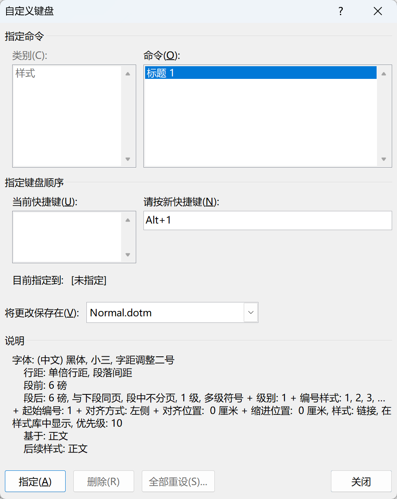
图8

## 2.2 图表说明样式设置

“图表说明”是用于图、表下方解释性文字的格式设置。同样地，“图表说明”样式设置操作过程与“一级标题”样式设置相同，但唯二不同之处在于：

（1）段落设置中，将“大纲级别”设置为“正文”。
（2）快捷键设置中，将“快捷键”设置为“ALT+F”。这个是我自己的习惯，因为F是Figure的首字母。

## 2.3 题注样式设置

“题注”是用于交叉引用中题注的格式设置。同样地，“题注”样式设置操作过程与“一级标题”样式设置相同，但唯不同之处在于：
（1）段落设置中，将“大纲级别”设置为“正文”。

# 3 多级标题设置

点击图9中的“定义新的多级列表”，出现如图10所示的窗口，点击左下方的“更多”。

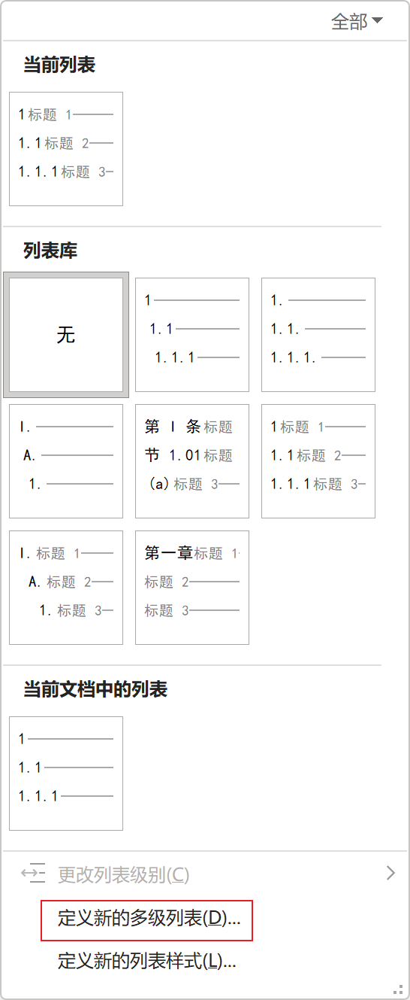
图9

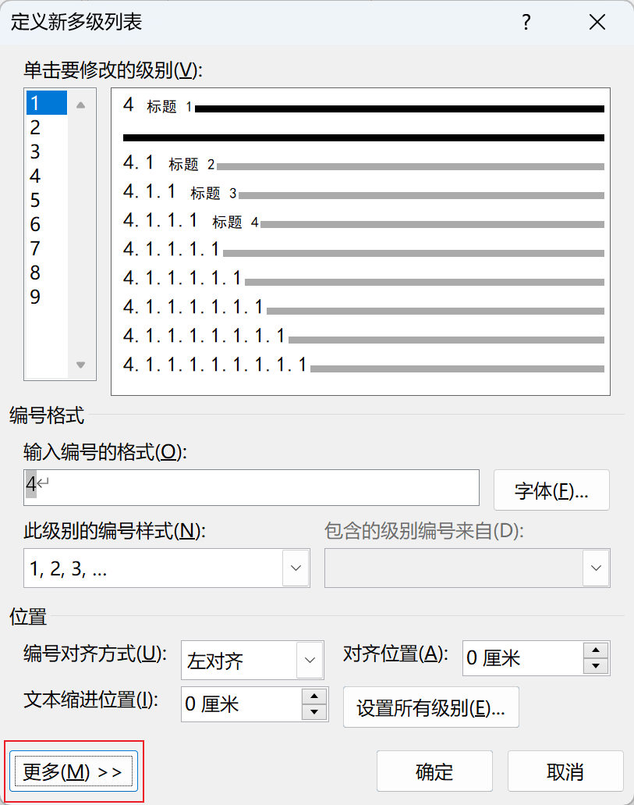
图10

点击“更多”之后，出现图11所示的窗口，根据具体需求设置相应的标题序号格式即可。

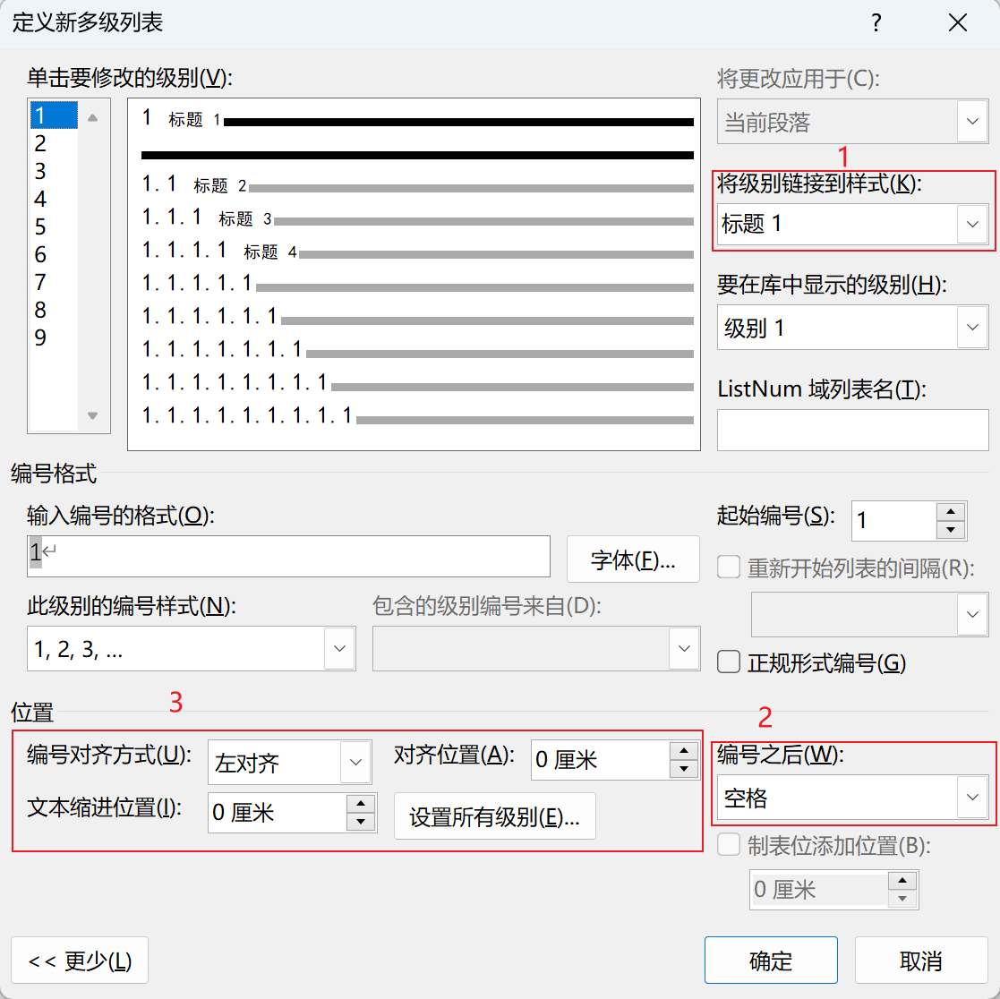
图11

注意，图11中，编号1的“将级别链接到样式”中需要选择对应的样式。例如，目前设置的是一级标题，那么将“将级别链接到样式”设置为“标题1”。标题2、标题3、标题4均如此设置；编号2的“编号之后”建议设置为“空格”而不是“制表符”，对于word新手来说，这样更好控制间距；编号3的“位置”中的“对齐位置”和“文本缩进位置”全部设置为0厘米，标题2、3、4均如此设置。

# 4 题注的设置

题注的设置很简单，首先在“引用”选项卡中点击“插入题注”，如图12所示。

图12

出现如图13所示的窗口。

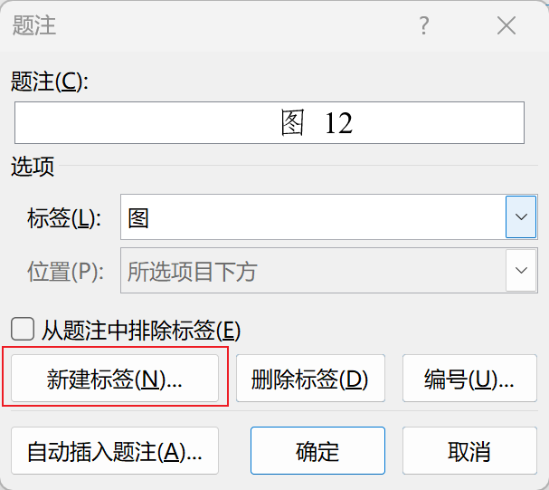
图13

需要设置的属性有两项，（1）新建标签；（2）编号。
首先点击“新建标签”按钮，出现如图14所示窗口。

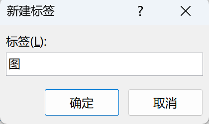 
图14

“标签”即为要说明的内容，一般是图或者表，可以在文本框中输入“图”或者“表”。
再点击“编号”按钮，出现图15所示窗口。

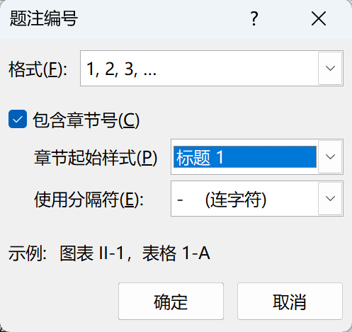
图15

按照自己需求设置即可。
题注设置完毕后，将光标移至需要插入题注的图片/表格下方，点击“插入题注”，再点击“确定”，即可为图片/表格插入题注，如图16所示。 

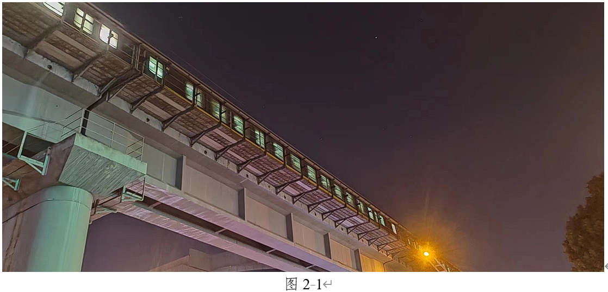
图16

# 5 交叉引用

在“插入”选项卡中点击“交叉引用”，出现如图17所示的窗口，点击左边菜单栏（即“引用类型”），选择在题注设置时建立好的标签名（这里是“图”标签名），再点击右边菜单栏（即“引用内容”），选择“仅标签和编号”，再点击确定，即可在正文中得到“图2-1”的文字内容，如图18所示。 

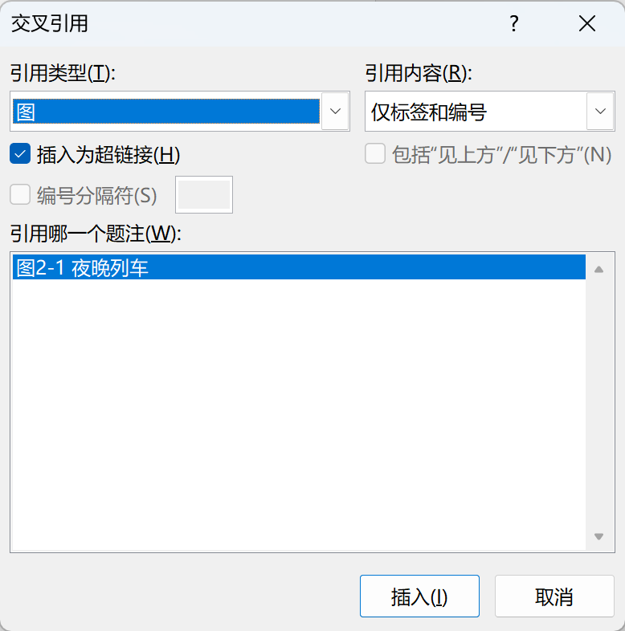
图17

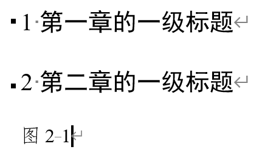
图18

如若想插入章节号，则“引用类型”选择“编号项”，“引用内容”选择“段落编号”即可。

如果标题/图/表序号更改，例如图2-3删除，原来的图2-4将变为图2-3，正文中引用的内容也需作出相应更改。那么只需要选中全文（ctrl+A），再按下“F9”即可实现更新全文。（F9键实现的功能是“更新域”）

就这么多！

--- 

欢迎通过邮箱联系我：lordofdapanji@foxmail.com

来信请注明你的身份，否则恕不回信。