[TOC]


# 写在前面

> 这篇文章面向没有任何 LaTex 基础的小白，主要讲解了 LaTex 的安装和使用。读完文章之后，已经具备基础的 LaTex 文档编写能力，可以使用 LaTex 进行写作。

刚开始上研究生的时候，写论文和文档用的是 Word。后来第一次写小论文的时候，接触了 LaTex ，学会了用 LaTex 写论文，于是发现了 LaTex 的好。

比起 Word来， LaTex 实在好用太多。

比如说写一本百来页的学位论文，页码、标题编号、图编号、表编号、公式编号、文献引用等等，都是一件十分十分繁杂的事情。特别容易出现察觉不到但又无从解决的问题。

有的同学可能觉得既然难办，那就不办咯。

于是选择纯手工敲 Word。

导致整个 Word里，标题数字是自己手打上去的，图编号是自己手打上去的，表编号是自己手打上去的，公式编号说不定也是自己打上去的，说不定还在头痛怎么把数学公式居中，公式编号放在最左边呢。

也有可能100多篇文献的引用也是自己手敲上的。

内心十分佩服这样的新世纪勇士。

但是有没有想过一个这样的问题：

假如你引用了100篇参考文献，突然！！！中间的第42篇文献你不需要了，在正文里把这篇文献删掉，那么后面的文献是不是需要把所有的文献序号往前提一位？

其实这个时候还好，因为只删了一篇文献，还算有一些规律。

但要是删掉好几篇文献呢？这个时候序号就完全乱掉了，要是再重新把文献序号改成正常的顺序，是一件让人头皮发麻的事情。

不过我承认，多花一些时间，是可以整出来的。

但是，为什么要花那么多时间来整这样没有意义的事情呢？能不能用一些更快的方式呢？关于Word的使用教程，我在前面的文章里面已经详细介绍过，这里想介绍一种新的文档编写工具。


 LaTex 是一种可以让写作者专注于内容的文档编写手段，它把文档格式和文档内容分开，格式是格式，内容是内容，两者互不干扰。让写作者不用再为乱糟糟的文档格式发愁，只需要专心把文字内容写上去就好了。

至于之前提到的页码、标题编号、图编号、表编号、公式编号、文献引用什么的，统统都不用管。

甚至连目录都只需要一行指令就可以自动生成。


> 趣闻：LaTex 的诞生。
>
> 计算机领域有一本特别特别著名的书，《计算机编程艺术》。这本书是斯坦福大学的 Donald Knuth 教授计划编写的一系列书籍。Donald Knuth 在写这本书的时候，遇见一个很大的问题——没有一种很好的排版方式来实现他想要达到的效果。于是自己开发了一种编程语言来给自己正在写的书排版，也就是 TeX 语言。
>
> 再后来，Leslie Lamport 在已有的 TeX 语言上开发一系列更加易于使用的宏，并将这些宏开源。于是只需要运行一个程序，让 Tex 引擎先读取这个宏，来实现复杂的需求。于是 LaTex 诞生了。
>
> 很有意思的出现过程啊。
>
> 相当于本来想吃顿红烧肉，于是从养猪这一步开始做起，最后没有想到，猪也被人养得挺好的。

# 安装

首先要介绍的是 TeX Live 的安装和 TeXstudio 的安装。

在我的理解里，TeX Live 是运行 TeX 文档制作系统的基础语言，而 TeXstudio 是编译 TeX 的工具，那么 LaTex 就是一把使用TeX语言大杀四方的宝刀。

## Texlive的安装

进入清华大学开源软件镜像网站，[https://mirrors.tuna.tsinghua.edu.cn/CTAN/systems/texlive/Images/](https://mirrors.tuna.tsinghua.edu.cn/CTAN/systems/texlive/Images/)。

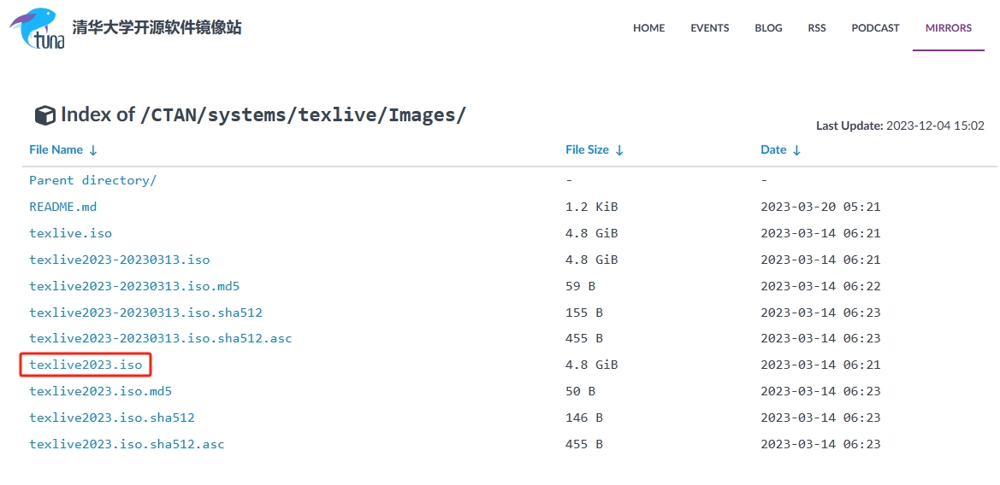

网站里一般会给出最新版本的 Tex Live ，现在是最新的 Tex Live  2023。

年初给自己电脑下载 Tex Live 的时候，还是 Tex Live  2022。

这里建议尽可能地保持自己电脑中的 Tex Live 是比较新的版本。因为有的期刊给的 LaTex 模板里，使用比较老的 Tex Live 版本可能没有办法编译成功。

下载 `texlive2023.iso` 文件。下载好之后，解压到文件夹中。

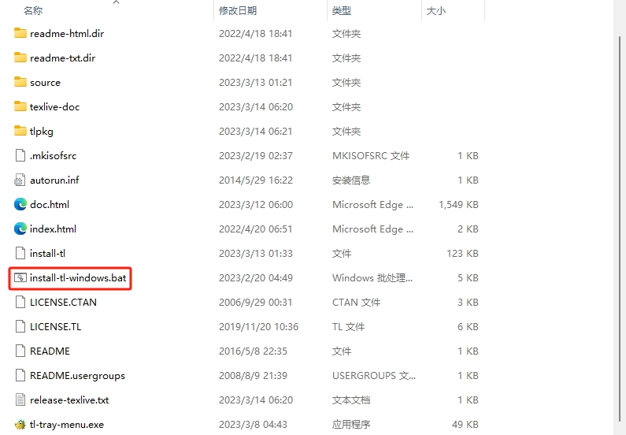

点击 `install-tl-windows.bat` 安装。

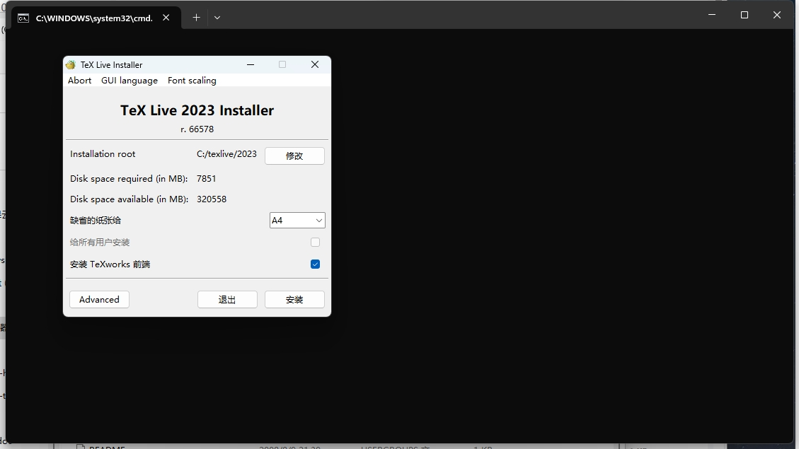

最好不要更改任何设置，点击安装即可。会出现下面的界面，表示正在安装。


当出现如下所示的界面时，说明安装完毕，点击退出即可。 

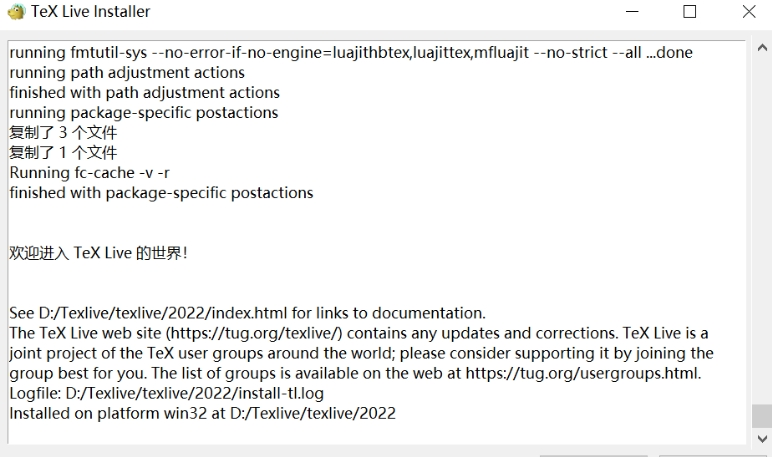

最好再验证一下 Tex Live 是否真的安装成功。

按下 `win+R`，输入 `cmd`，出现系统终端界面。再输入 `tex -v`，出现以下信息，说明安装成功。

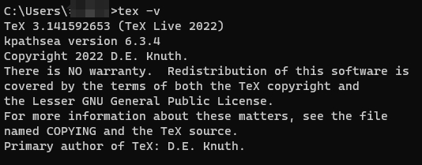

## TeXstudio 的安装

安装好 Tex Live 后，需要再安装 Texstudio ， Texstudio 是编写 Tex 的工具。其实安装好 Tex Live 后，会自带一个编写工具。但是那个工具实在不好用，基本上没有人会用，现在用得比较多的工具还是 Texstudio 。

进入  Texstudio  官网（[https:// Texstudio .sourceforge.net/](https:// Texstudio .sourceforge.net/)）点击下载（Download now）即可。

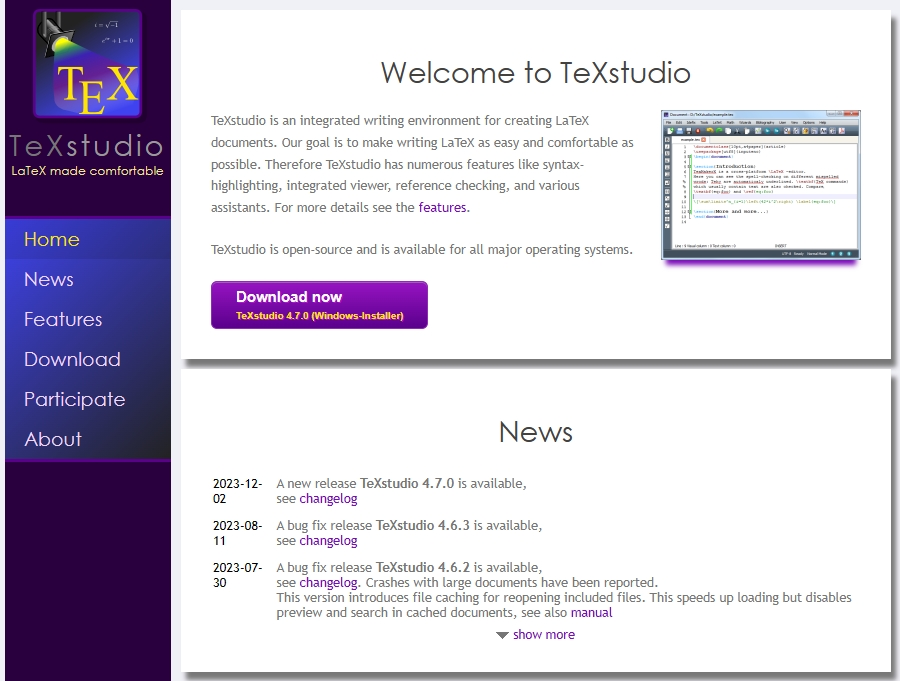

 Texstudio 很简单，一路点击下一步即可安装成功，这里不再赘述。

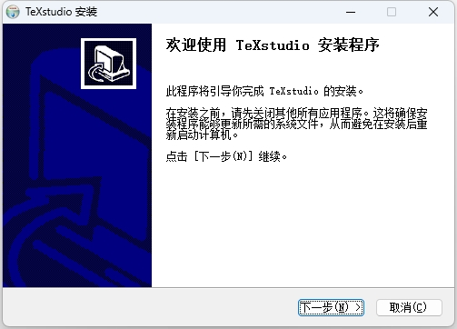


安装好之后，打开TeXstudio，界面如下所示。

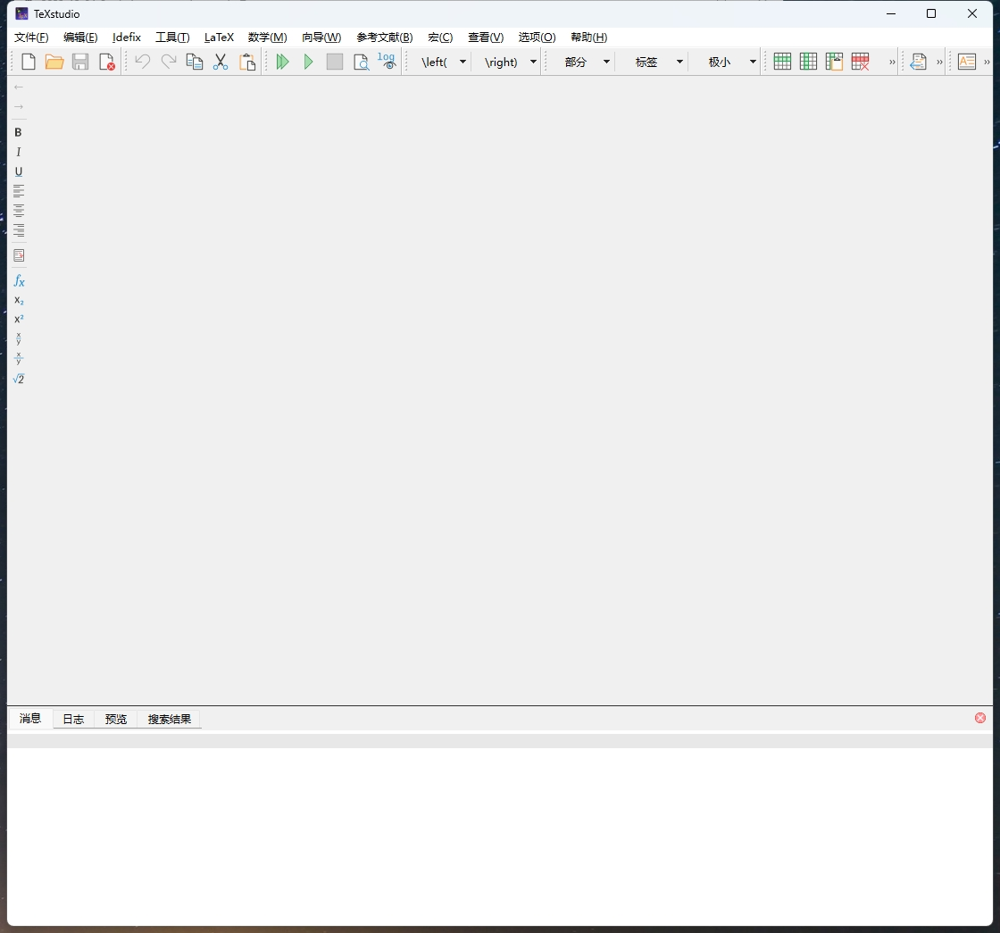

这样，TeXstudio 也安装好了。


# LaTex 的使用

安装好 Tex Live 和TeXstudio后，就可以开始 LaTex 的编写了。

在这里我用一个期刊的模板作为讲解。因为99%的情况下我们都不用自己写 LaTex 的风格文件，只需要用期刊编写好的风格文件就可以，所以不用担心自己需要从零到有创造一个全新的 LaTex 文件出来。

一般来说，期刊给的 LaTex 模板里包含了投稿所需的所有内容，我们只需要把文字填写进去即可。

这里我用的是出版 Nature 杂志的出版社 Springer 的 LaTex 模板，可以点击[这里]((../../assets/download/files-2023-12-04/CCSICC_TeX.rar))下载。

好了！下面让我们开始编写 LaTex 。

因为这篇教程是面向小白的文章，所以我只会介绍几种最常用的指令，以免一下子接收太多知识无法消化。

要介绍的指令一共有以下 6 种：

1. 节指令：`\section{}`和`\subsection{}`。
2. 图指令：`\begin{figure} ... \end{figure}`。
3. 表指令：`\begin{table} ... \end{table}`。
4. 公式指令：`\begin{equation} ... \end{equation}`。
5. 参考文献指令：`\bibliography{}`。
6. 引用指令：`\cite{}`、`\ref{}`和 `\eqref{}`。

## 节指令

`\section{}`和`\subsection{}`是用来生成论文中的“节”。

`\section{}` 生成的是论文中的某节，比如第1节，第2节，第3节，等等。

`\subsection{}` 生成的是论文中的某子节，比如第1.1节，第1.2节，第1.3节，等等。

或许还有机会用到 `\subsubsection{}`，生成的是第三级的子节，比如第1.1.1节，第1.1.2节，第1.1.3节，等等。

## 图指令

通常写法是这样子的：

```latex
\begin{figure}[htbp]
	\centering
    \includegraphics[width=0.5\textwidth]{fig.pdf}
    \caption{Some caption}
    \label{fig:your_label}
\end{figrue}
```

从上往下讲解。

- `\begin{figure} ... \end{figure}`代表插入图的框架。
- `[htbp]` 表示插入图的位置。现在你不用知道为什么 `htbp`要全部写上，反正能用就行。
  - `h`：here，当前位置。
  - `t`：top，页面顶部。
  - `b`：bottom，页面底部。
  - `p`：page，浮动页面。
- `\centering`表示插入的图为居中格式。
- `\includegraphics[width=\textwidth]{fig.pdf}`表示插入图片。
  - `[width=0.5\textwidth]`：图宽度是页面宽度的1/2。
  - `{fig.pdf}`：要插入的图文件，一般与`.tex`文件放在同一路径。
- `\caption{Some caption}`表示图例说明，**一定要放在`\includegraphics[width=\textwidth]{fig.pdf}`的下面**。
- `\label{fig:your_label}`表示图引用标签，为后面引用作准备。

**插入图的话，记得在文档最开始插入宏包 `\usepackage{graphicx}`。**

## 表指令

通常写法是这样子的：

```latex
\begin{table}[htbp]
	\centering
	\caption{your_caption}
	\label{tab:your_label}
	\begin{tabular}{ccc}
		\toprule
		xxx	& xxx & xxx	\\
		\midrule
		xxx	& xxx & xxx	\\
		\bottomrule
	\end{tabular}
\end{table}
```

从上往下讲解。

- `\begin{table} ... \end{table}`代表插入表的框架。
- `[htbp]` 表示插入表的位置，含义已在前面解释过。
- `\centering`表示表格居中。
- `\caption{your_caption}`和`\label{tab:your_label}`的含义在前面已经解释过，但**需要注意的是，这两行代码一定要放在`\begin{tabular}{ccc} ... \end{tabular}`的前面**。
- `\begin{tabular}{ccc} ... \end{tabular}`表示创建表格环境，表的内容全部写在这里面。
  - `{ccc}`表示表格有3列，居中格式。
  - `\toprule`、`\midrule`和`\bottomrule`分别为三线表的上、中、下线。
  - `&`连接一行之中的各元素，`\\`表示表格换行。

**插入表的话，记得在文档最开始插入宏包 `\usepackage{booktabs}`。**

如果不会写表格的话，可以用[在线网站](https://tableconvert.com/zh-cn/ LaTex -generator)编辑表格，把编辑好的表格代码复制进 LaTex 文档中就好了。

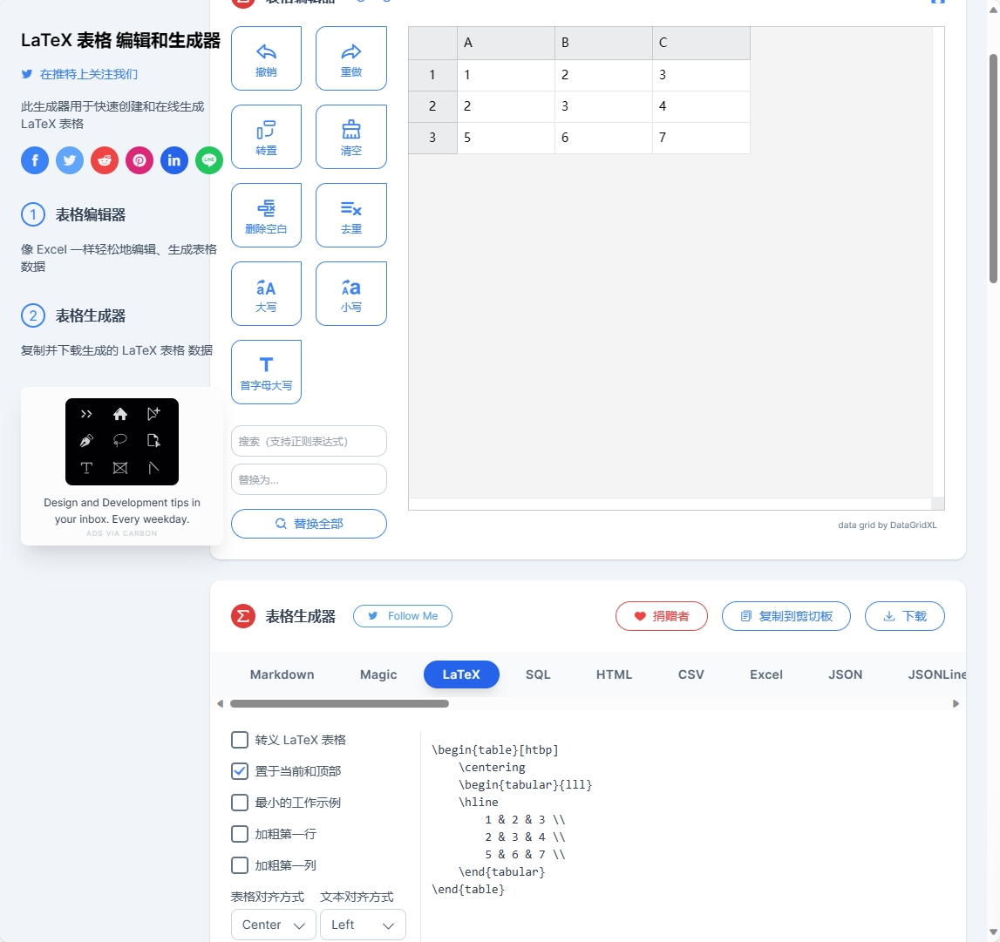

## 公式指令

通常写法是这样子的：

```latex
\begin{equation}
	\label{eq:your_label}
	r=a(1-\sin \theta)
\end{equation}
```

上面的公式写出来是这样子。
$$
r=a(1-\sin \theta)
$$
从上往下讲解。

- `\begin{equation} ... \end{equation}`代表插入公式的框架。
- `\label{eq:your_label}` 为数学公式的标签。
- `r=a(1-sinθ)`为想要编写的公式。

**插入公式的话，记得在文档最开始插入宏包 `\usepackage{amsmath}`。**

你可能会担心，不知道如何写 LaTex 公式怎么办？

没有关系，有[在线网站](https://www.latexlive.com/ )可以解决这个问题。大家可以在网站里面编写好公式，再把代码复制进 LaTex 文档中就好啦。

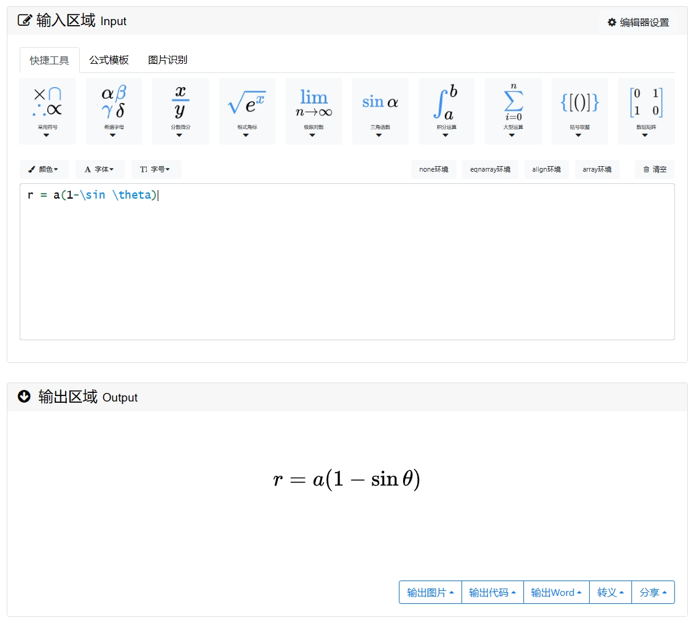

## 参考文献指令

只有一行，很简单，`\bibliography{reference}`。`reference`代表文件`reference.bib`，文件名可以随便取。

`reference.bib`为要引用的参考文献，各期刊网站都会给出论文的`bibtex`格式，导出的时候选择`bibtex`即可。

举个例子，我在`reference.bib`里写入一篇文献。

```latex
@article{long2018performance,
  title={Performance analysis for minimally nonlinear irreversible refrigerators at finite cooling power},
  author={Long, Rui and Liu, Zhichun and Liu, Wei},
  journal={Physica A: Statistical Mechanics and its Applications},
  volume={496},
  pages={137--146},
  year={2018},
  publisher={Elsevier}
}
```

第一行 `long2018performance` 就是要在正文中引用文献的关键字。

一般来说，使用了`\bibliography{reference}`作为参考文献的引用方式，还需要另外加上一个参考文献的风格文件，代码是`\bibliographystyle{}`。

> 另外，这篇论文很浪漫，作者在最后的致谢里向对象求婚了。
>
> 

还有另外一种引用参考文献的方式，不过没有 `\bibliography{reference}` 简洁。所以防止大家吸收知识太多导致脑袋混乱，这里就不再作介绍了。

## 引用指令

常用的引用指令有 3 种，`\cite{}`、`\ref{}`和 `\eqref{}`。

- `\cite{}` 为参考文献的引用方式，像前面提到的论文要在正文中引用的话，输入代码 `\cite{long2018performance}` 即可。
- `\ref{}` 通常用于引用打了标签（`\label{}`）的地方，比如说章节号、图号、表号等等。
- `\eqref{}` 用于引用公式编号。

## TeXstudio 编译

好了！掌握了上面 6 种指令的使用，现在就可以在 TeXstudio 中编译 LaTex 了。

打开 TeXstudio ，再打开 `.tex` 文件，点击编译。


点红框那个按钮！其他的不用管。

如果没有报错的话，就可以得到一份全新的文档啦！

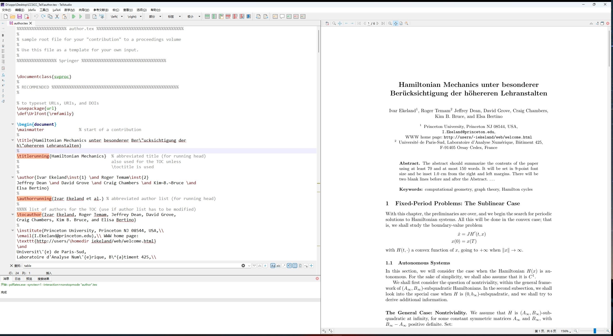

如果没有编译成功，TeXstudio 会在下面的信息框里提示错误信息，根据错误信息上网搜搜解决方法，一般都可以解决。

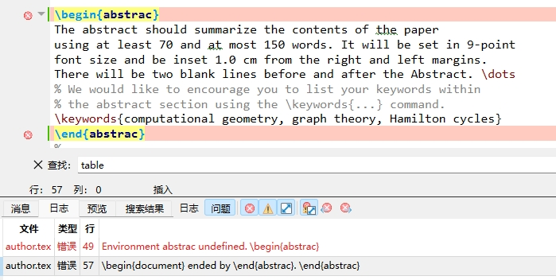

假如文档中出现“?”的情况，比如下面这样子。


不要慌，多编译几次就会出来了。这是 LaTex 编译链的问题，不理解没有关系，记住就好啦！

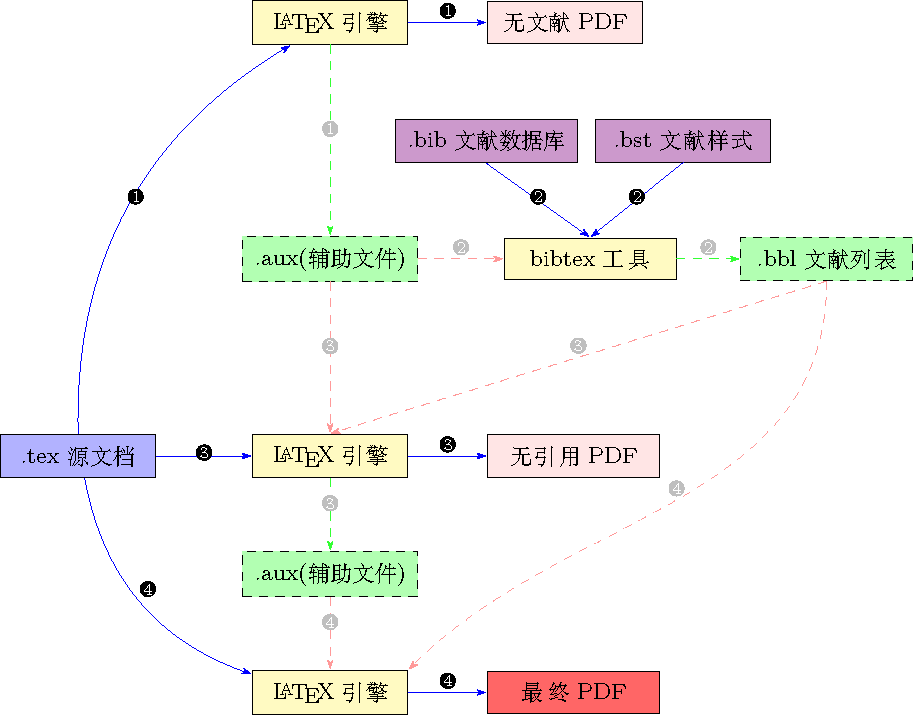


# LaTex 的 `\label{}` 写法建议

这个部分我想单独拿出来讲，因为假如 `\label{}` 写得不好的话，写成的 LaTex 文档维护难度很高。拿公式举例子，一篇论文里面有 5 个公式，有些小伙伴可能就很简单地按照顺序命名成：

```latex
\label{eq1}
\label{eq2}
\label{eq3}
\label{eq4}
\label{eq5}
```

这样的命名方式是不太推荐的。也许 `\label{eq2}` 代表论文中的第 2 个公式，但如果第 2 个公式删掉了，第 3 个公式成为了第 2 个公式。那么现在代表第 2 个公式的 `\label{eq3}` 就有点意义不明，所以不推荐这样的命名方式。

我的命名习惯是这样：`要引用的文本类型: 该文本意义`。

比如说，前面提到的公式就可以命名为

```latex
\label{eq:heart}
```

因为  $r=a(1-\sin \theta)$ 是心形函数，所以把它命名成 `eq:heart`。

下面是具体实例：

- 节（section）：`sec:name`
- 子节（subsection）：`subsec:name`
- 子子节（subsubsection）：`subsubsec:name`
- 图（figure）：`fig:name`
- 表（tab）：`table:name`
- 公式（equation）：`eq:name`
- 算法（algorithm）：`algo:name`
- 定义（definition）：`defi:name`
- 定理（theorem）：`theo:name`
- 引理（lemma）：`lma:name`
- 证明（proof）：`prf:name`
- 备注（remark）：`rmk:name`
- 假设（assumption）：`asp:name`

# 最后

好了，就这么多！祝大家编写 LaTex 文档顺利！

欢迎通过邮箱联系我：lordofdapanji@foxmail.com

来信请注明你的身份，否则恕不回信。
