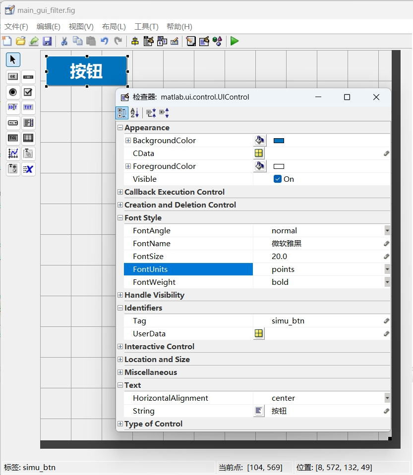
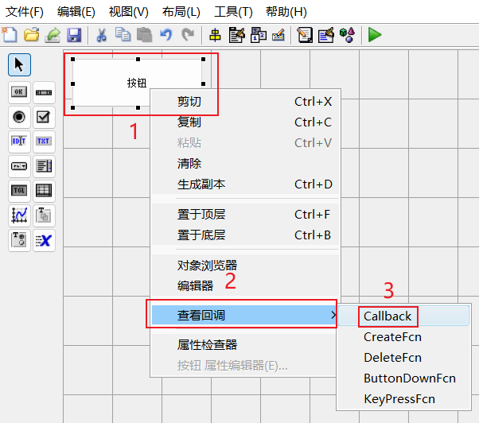
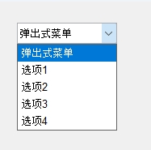
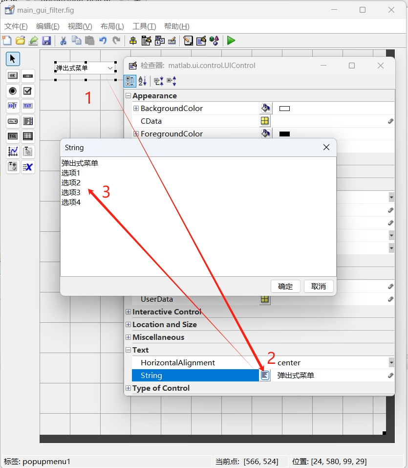
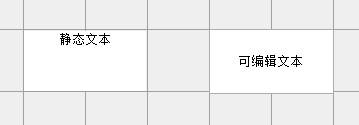
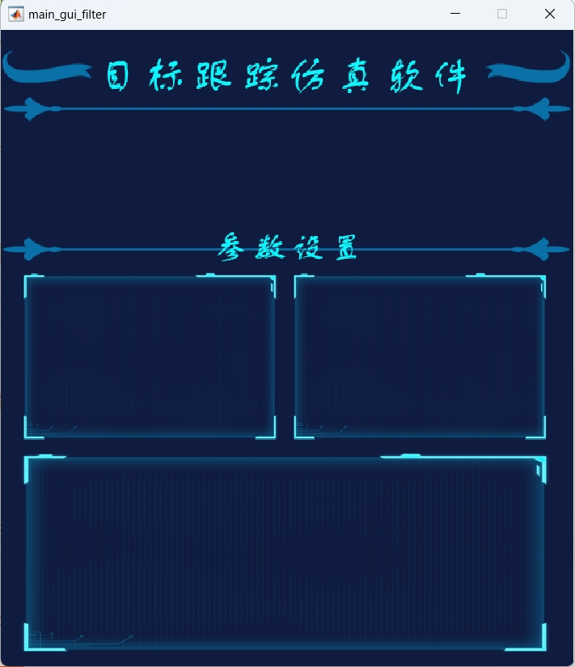

# 写在前面

图形用户界面（Graphic user interface，GUI），实际上就是人与计算机交互的界面显示格式。广义来说，现在正在看这篇文章使用的浏览器，也是一个GUI。阅读者可以通过这个浏览器获取信息，可以点击“最小化”、“窗口”和“关闭”按钮实现自己想要的功能，可以阅读浏览器中的文字。

我们常说的做个“软件”，其实大概率是做一个实现与后端算法交互的界面。因为绝大多数用户看不懂后端代码，但又想使用这个算法实现自己想要的功能，所以做一个简明、整洁、易用、美观的GUI，对于提升后端算法的适用性是十分有必要的。

总不可能开发一个项目，把算法写好之后，直接给用户，说：“喏，这就是你想要的功能，你简简单单改几个参数就可以实现你想要的功能啦！”显然是不可行的。用户看见代码的时候只会感到头脑眩晕，开始抗拒，并且怀疑我们的代码能力到底行不行？

举个例子。

程序员小雷写了一套卡尔曼滤波算法，交付给用户的时候，是这样的：

```matlab
mode = 'IF'; 
% mode = 'UD';
% mode = 'FD';
% mode = 'FT1';
% mode = 'FT2';
```

和用户说，“想要用信息滤波就取消`mode = 'IF'`的注释就可以啦！”

“想要用UD滤波就取消`mode = 'UD'`的注释就可以啦！”

……

“但别忘记把其他不想用的滤波算法给注释掉噢，不然会出bug的！”

用户听完小雷的介绍之后说不定就已经头脑发昏，也不知道什么算法要注释哪行代码了。

或者更加极端一点，小雷写代码也不规范，变量名乱写，比如这样：

```;
aaa = '1';
% aaa = '2';
% aaa = '3';
% aaa = '4';
% aaa = '5';
```

天知道哪行对应哪个滤波算法啊！！

但如果写一个GUI呢，比方像下面这样简单的选择框：


是不是清楚好多？

用户也不用自己翻开后端算法的代码看来看去了，那样看半天说不定也看不出来门道。现在用户想要用什么滤波模式，自己选择想要的滤波模式，然后点击确定就可以啦。

不过这样的界面还没有满足用户的需要。

假如用户想自己改算法参数呢？想改改仿真时长啊初始状态啊噪声矩阵啊……上面的选择框显然没有提供合适的地方让用户可以改算法参数。

所以小雷又重新设计了一下界面，把它改成了下面这样：


现在给用户的选项可丰富啦。可以选择滤波模式，可以选择是否保存图片、数据，可以修改仿真参数，还可以显示不同滤波算法的核心原理公式，给用户直观的感性认识。广义来说这样就可以当作一个软件来用啦。

用户感到很满意。

所以，这样的界面怎么开发呢？

下面根据自己的实战经验，给出开发GUI的完整流程，或许会少掉一些控件不作介绍，因为觉得在自己开发过程中没有使用这些控件。但我觉得控件的使用方法大同小异，核心逻辑掌握之后，换另外一个控件只需要自己在网上搜索一下经验学习一下，很快就能掌握。

先说明，这里说的GUI全部指的是MATLAB 2018版本上的GUI，MATLAB后续版本中推出了APP功能，将原来的GUI替代了。但本人常用的软件还是MATLAB 2018，所以写的都是MATLAB 2018上GUI开发的教程。至于其他真的像个“软件”一样的教程，请见[《PyQt5+Anaconda+PyCharm安装、配置和使用》](https://blog.csdn.net/Ruins_LEE/article/details/116279032)(https://blog.csdn.net/Ruins_LEE/article/details/116279032)。使用QT可以做一个像“软件”的软件出来了。

下面是整篇教程的顺序：

- MATLAB GUI启动方式；

- 按钮：

  - 查看属性；
  - 回调函数；

- 下拉菜单；

- 单选框和复选框；

- 静态文本和可编辑文本；

- 轴； 

- 组；

- 进度条；

- GUI源代码。[https:\\luwin1127.github.io\assets\download\assets\download\files-2024-01-22\main_gui_filter.zip](https:\\luwin1127.github.io\assets\download\assets\download\files-2024-01-22\main_gui_filter.zip)

# MATLAB GUI启动方式

打开MATLAB，在命令行输入

```matlab
guide;
```

得到下图所示界面。


这里我们选“新建 GUI”，点击第1项“Blank GUI (Default)”，选好要保存的位置后，点击“确定”。

之后会出现一个新的界面，如图所示。


按照图片中的分区一一介绍功能。

1. 分区“1”中常用的按钮是最后一个绿色三角形，用于设计好GUI后运行，查看效果。其他的按键不常用，不用花费精力在上面。
2. 分区“2”是控件区，给出了MATLAB GUI中可以使用的控件。我们在设计GUI时，常用的控件主要有（按照从上往下、从左往右的顺序）：
   - 按钮；
   - 单选按钮；
   - 复选框；
   - 可编辑文本；
   - 静态文本；
   - 下拉菜单；
   - 轴；
   - 组；
     后面的内容里会一一介绍。
3. 分区“3”说明了该GUI的标签（tag），在句柄（handles）操作中会用到。
4. 分区“4”说明了当前鼠标的在GUI中的位置和选中控件的位置与尺寸。
   - `当前点: [369,451]`意为鼠标在距离GUI（用`figure1`更加准确，但出于文章易读性考虑，使用GUI更易理解。后面提到的GUI均为`figure1`之义。）最左侧`369`像素、最下侧`451`像素的位置；
   - `位置: [760, 584, 567, 630]`意为选中控件在距离父对象[^1]最左侧`369`像素、最下侧`451`像素的位置；尺寸大小为宽度`567`像素、长度`630`像素。

# 按钮（Push Button）

## 查看属性

在功能区中选中“按钮”的标签，将其拖进GUI中。


第1步和第2步很简单，第3步需要左键双击“按钮”，弹出来“检查器”窗口。

检查器很重要啊，绝大部分操作都是在检查器里面完成的。


检查器有2种查看方式，在红框里面标出来了。第1种是按照功能分类列好，第2种是按照字母顺序列好。这里推荐使用第1种方式查看按钮的属性。需要关注的属性不多，只有4种，分别是：

- Appearance：设定按钮的外观，比如背景颜色和文字颜色；
- Font Style：设定按钮字体风格；
- Identifiers：设定该按钮的标识，也就是`tag`；
- Text：设定按钮显示的内容。

把按钮美化一下，可以得到下图这样的按钮风格。



**其余控件都是这样设置，在这里用按钮作为例子讲解一下，后面介绍其他控件的时候不再赘述。**

## `tag`的命名方式

多提一嘴`tag`这里该怎么设置。

将按钮拖进GUI后，`tag`默认为`pushbutton1`。这个`tag`不好，没有辨识度，将来控件多了之后不知道哪个`tag`对应哪个功能了，所以需要加上标识，方便以后阅读代码。

我自己的习惯是用下划线法命名`tag`，即“功能_控件标识”，这里按钮的`tag`是`simu_btn`，意思就是用于实现仿真的按钮。

其余控件命名原则如下：

- 下拉菜单：`xxx_ppmenu`；
- 单选框：`xxx_rbtn`；
- 复选框：`xxx_cbox`；
- 静态文本：`xxx_txt`；
- 可编辑文本：`xxx_edit`；
- 轴：`xxx_axes`；
- 组：`xxx_group`。

## 回调函数

选中按钮，单击右键，选中“查看回调”，再选中“Callback”，在MATLAB中会生成对应的回调函数。



MATLAB中会显示下图所示的代码。


**这个功能很重要。**

是实现所有我们想要开发功能的地方。因为一开始自己对GUI也是一头雾水，不知道要用GUI实现功能的话，要在什么地方写自己的逻辑。后来查了资料之后才知道——噢，要在回调函数里面写逻辑啊~

其他控件的逻辑也都是在相应的回调函数里面写，这点不要忘记，后面就不再提其他控件的回调函数怎么弄出来了。

## 小小的总结

总结一下，按钮（包括其他控件）的使用步骤分为3步：

1. 将要用的控件拖进GUI中；
2. 打开该控件的检查器，根据需要设置属性；
3. 编写回调函数。

# 下拉菜单（Pop-up Menu）

下拉菜单和下拉列表（Listbox）作用差不多，但是下拉菜单更加节省空间。在项目GUI设计中，个人习惯用下拉菜单实现多个选项的逻辑。

它在GUI里面长这样：



图中的“选项1”、“选项2”、“选项3”和“选项4”要在检查器中设置。



也就是`text`中的`string`属性，一个选项一个回车键，这样就可以排列好。

设置好弹出式菜单的选项之后，很重要的一步就是怎么读弹出式菜单的选项？

代码在这里：

```matlab
mode_flag = get(handles.filter_ppmenu,'value');
```

通过`get()`函数就可以取到弹出式菜单的值啦。这里我给这个弹出式菜单设的`tag`是`filter_ppmenu`，代码的意思就是获得句柄为`filter_ppmenu`的值（`value`）。

得到弹出式菜单的值之后，可以用`switch()`函数来选择相应的操作，代码如下：

```matlab
switch mode_flag
	case 1
		% 想要实现的功能
	case 2
		% 想要实现的功能
	case 3
		% 想要实现的功能
	case 4
		% 想要实现的功能
	case 5
		% 想要实现的功能
end
```

注意哈，`mode_flag=1`的时候，实际上就是默认选项的值，也就是`弹出式菜单`这个选项的值。`mode_flag=2`开始才是真正要选的选项的值，这一点很容易出错，要记住。

如果怕出错，可以在第1行不要弄什么`弹出式菜单`这样的值，直接写要选的选项就好。

# 单选框（Radio Button）和复选框（Check Box）

单选框是一个圆圆的可以选中的按钮，通常用来实现与其他功能互斥的选择功能。

复选框是方方正正的样子，通常用来实现多种功能选择的组合。

一般单选框选中之后就没法儿取消，或者选择这个选项之后，其他被选中的功能被取消；复选框则是选中这个功能之后，还可以继续选择其他的功能，而且被选中的功能是可以取消的。

它们长下图这样。


这俩框没有什么复杂的，要记住的地方就是它们在GUI中的作用就是获取它们的值。除了这个作用之外，其他的作用还没开发出来。

代码为：

```matlab
% 单选框获取值的方式
xxx_rbtn_flag = get(handles.xxx_rbtn,'value');
% 复选框获取值的方式
xxx_cbox_flag = get(handles.xxx_cbox,'value');
```

# 静态文本（Static Text）和可编辑文本（Edit Text）

静态文本通常显示固定不动的标签，可编辑文本可以用来输入参数，这是两者功能的区别。它们俩分别长下面这样。



静态文本放在GUI里就不用动了，可以不去管它，要管的是可编辑文本。

获取可编辑文本中的文本，代码为：

```matlab
xxx_edit_str = get(handles.xxx_edit,'string');
xxx_edit = str2double(xxx_edit_str);
% xxx_edit = str2num(xxx_edit_str);
```

这里的属性不能用`value`，要用`string`，因为得到是可编辑文本中的字符（`string`）。

如果要使用可编辑文本中的数值，需要先将字符转换为数值，用`str2double()`或者`str2num()`实现。 

也可以设置可编辑文本中的值，一种方法是直接在可编辑文本框里设置，另外一种方式可以写代码，为：

```matlab
set(handles.xxx_edit,'string','Hello, world!');
```

这样就可以设置可编辑文本的代码了。

# 轴（Axes）

通常用来画仿真曲线图或者插入图片。

在之前的项目中用轴画过算法仿真曲线，代码为：

```matlab
axes(handles.xxx_axes);
plot(xxx);
```

如果要清除轴上的图，可以用下面的代码。

```matlab
axes(handles.xxx_axes);
cla;
```

可以看到不论是画仿真结果还是清除结果都要先用`axes(handles.xxx_axes)`，这行代码意思是指定对应的轴。如果一个GUI中有很多轴的话，不指定对应的轴，那么GUI就不知道该在哪个轴上进行操作了。

轴的另一个用处是插入图片，代码为

```matlab
axes(handles.xxx_axes)
image(imread('xxx.png'));
axis off;
```

第一行代码是指定对应的轴。

第二行代码是插入对应的图片。

第三行代码是取消轴的坐标轴显示。

> *这里我遇见了一个还没有解决的问题，就是在`xxx_axes_CreateFcn()`里写上面的代码的时候，再一次打开GUI的`.fig`文件，这个轴对应的`tag`就会消失不见，假如在其他控件下的`Callback()`里写上面的代码就不会出现这样的问题。*

所以，可以用轴插入图片，给GUI做一个背景。先提前规划好GUI各个部分的用处，用PS做一个简单的背景，比如下面这样。



要比没有背景的GUI好看一些吧？可以花些巧思在绘制背景上，这样能够提升GUI的美观程度。

# 组（Group）

组，通常用来容纳其他的控件，可以把实现同一作用或实现同一对象功能的控件全部放在一个组里。在操作过程中，只需要对组进行操作即可。


组a.k.a.面板，长上面那个样子，一个对象一个组，多个对象多个组。这样可以提高效率，不必每个对象都再重新调整一遍控件，初始的组调好之后，后面的组只需要ctrl+c，ctrl+v即可。

# 进度条（Waitbar）

进度条起一个提示作用，告诉用户现在算法进行到哪一步了，还有多久结束，让用户心里有数，不用着急。

**进度条是一个很重要的控件！**

没有进度条，用户都不知道算法的状况，可能等得不太耐烦了，把GUI关了。但是这样容易让电脑崩溃。

就连我们在生活里面做很多事情，假如没有进度条，也不知道这件事情到底在什么情况了，很容易放弃。

使用进度条的代码是：

```matlab
h = waitbar(1,'算法仿真中......','name','目标跟踪仿真软件');
```


对上面的代码进行解释。

- `1`代表进度条被全部占满；
- `'算法仿真中......'`代表进度条中间显示的文字；
- `name','目标跟踪仿真软件'`代表进度条左上角显示的文字。

如果想让进度条显示百分比的话，可以用下面的代码：

```matlab
h = waitbar(0,'算法仿真中......','name','目标跟踪仿真软件');
for i = 1:nt-1
	per_str = fix(i/nt*100);
	str = ['算法仿真中......',num2str(per_str),'%'];
	waitbar(i/nt,h,str);
end
close(h);
```

如果想简单一点，不用显示百分比，就让进度条动起来的话，用下面的代码：

```matlab
h = waitbar(0,'算法仿真中......','name','目标跟踪仿真软件');
for i = 1:nt-1;
	waitbar(i/nt);
end
close(h);
```

`close(h)`代表关闭句柄为`h`的进度条，不然之后画图的时候会错画到进度条上，或者出现其他奇奇怪怪的错误。


[^1]: 父对象，在我的理解中意思就是其他的控件都依存该对象存在，比如说有一个组，组里有两个按钮，那么该按钮显示位置就是在组里的坐标。组又依存于GUI之上，那么组的位置就是在GUI中的坐标。
