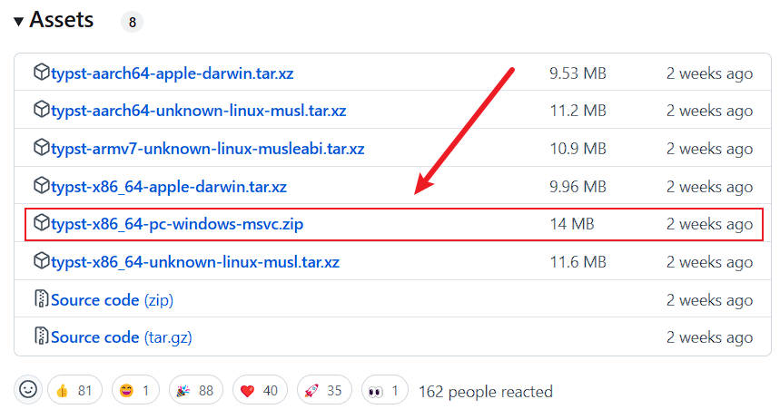
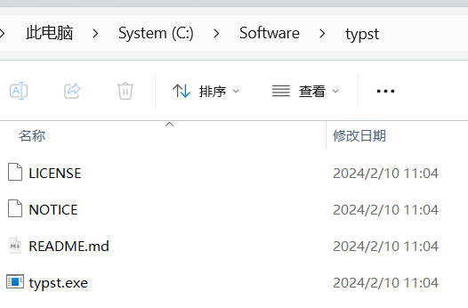
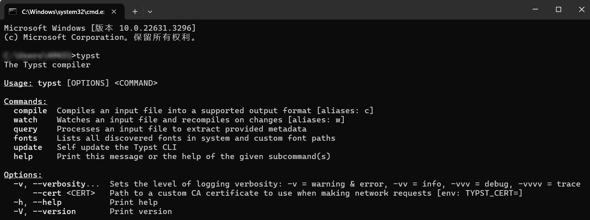

# 写在前面

Typst是一种排版语言（可用于出版与学术写作的可编程标记语言），与LaTex和Word类似。两位德国的研究生感觉LaTex太臃肿了，安装包都要几个G，编译速度很慢，于是决定自己开发一种用于学术写作的编程语言，也就是Typst。


真有意思。说自己“Just for fun”，然后开始开发自己的编程语言，免受LaTex臃肿运行的烦恼。

来讲讲Typst的优点吧。

- **编译快速。**Typst使用Rust语言编写，这也是Typ(e+ru)st为什么叫Typst的原因，
- **体量轻便。**本地离线Typst安装包仅有14mb（截止2024年2月10日），可以十分迅速地部署在自己的设备上。
- **语法简洁。**上手难度与Markdown相当，语法简洁，可阅读性强。语法简洁带来的另一个好处是可以自己修改文档的样式，并且明白修改了什么样式，而LaTex必须前往浩如烟海的.cls文件中阅读意义不明代码，小心翼翼地进行修改。
- **编程简单。**如果将LaTex类比为C++，Typst可以类比为Python。Typst的编程过程不拘泥于固定的表达式，可以通过多种多样灵活的编程方式实现自己的目的，提高写作效率。
- **社区开放。**Typst的社区十分活跃，每个用户都可以在上面提出修改意见，而且Typst团队的更新频率很高， 几个月前的版本和现在的版本比起来丰富了太多功能，简直日新月异。

当然，Typst也有缺点。

- **支持度不高。**因为它是一种新的排版语言，期刊对它的支持度不高。大多数期刊不提供Typst模板，只有Word模板和LaTex模板，因此要用Typst写英文论文可能存在论文风格不匹配的问题，需要自己设置样式。

- **中文匹配差。**此外，Typst对中文的支持程度仍然存在不足之处，没有像Word那么如指臂使。

但是，不管怎么说，作为一种新的可以用来排版的语言，学习一下Typst，掌握一项新技能，总不是一件坏事儿。

那么在这里对Typst进行简明扼要地介绍，期望读者看完这篇文章之后可以达到使用Typst进行初步写作的水平。

# 对比阅读

1. [LaTex的使用](https://mp.weixin.qq.com/s/717FISYFrCM4U_1ICQzUIg)。
2. [Word的使用](https://mp.weixin.qq.com/s/Coal0LhXcUES8eVtw1512Q)。

# 安装

Typst可以在官网的app（[https://typst.app/](https://typst.app/)）上写作，写作结束之后导出pdf即可。这样存在的一个问题是，要是没有网络怎么办？加上Typst官网在国外，在国内进入Typst官网不太稳定，所以我安装了一个离线版Typst使用，这样更加方便。

我用的是VSCode+Typst。

## Typst的安装

首先，在Typst的github（[https://github.com/typst/typst](https://github.com/typst/typst)）里下载Typst的安装包。

找到`Releases`，点进去。


点进去之后往下拉，看见`Assets`，选择`typst-x86_64-pc-windows-msvc.zip`，点击下载。



`typst-x86_64-pc-windows-msvc.zip`下载好之后，解压安装包，将包里面的文件放在想要放的盘符里。我放在了C盘里，新建了一个`typst`文件夹用来放Typst的程序。



好，到这里Typst的安装就结束了。总结来说就俩步：下载、解压。是不是很简单。

## 系统路径设置

记住刚才解压文件的位置，拿我电脑上的Typst举例，可执行文件`typst.exe`的路径为`C:\Software\typst`，在系统变量环境的`Path`中添加该路径即可。


配置完毕后，打开电脑终端（win+r 输入 cmd），输入`typst`，如果显示如下画面，则说明导入路径成功。



## VSCode的设置

接下来是VSCode的设置。

打开VSCode，找到扩展，搜索`Typst LSP`，点击下载。下载完毕之后，启用即可。


因为我自己电脑上原来配置好了LaTex，因此PDF查看器已经设置好了。如果没有相应的PDF查看器，可以再在扩展中安装一个名为`Typst Preview`的应用。

至此，Typst的前期准备工作全部完成。

下面可以开始Typst的编写了。

# 用Typst写作

好了，假如现在要写一篇IEEE的会议论文，一篇完整的论文包括文字、图片、表格、数学公式、参考文献，最后还要设置好符合IEEE会议论文的风格。

那么现在，打开VSCode，创建一个新项目，可以命名为`con_paper.typ`。注意嗷，Typst的文件后缀名是`.typ`。

和LaTex的教程一样，我这里介绍几种最常用的指令，学会这几种就可以写出一篇完整的学术论文了。

要介绍的指令有以下6种：

1. 节指令：`=`、`==`、......
2. 图指令：`#figure()`
3. 表指令：`#table()`
4. 公式指令：`$...$`
5. 参考文献指令：`.bib`
6. 引用指令：`@...`

最后介绍Typst文件的风格编写方式。不比LaTex，Typst现在还没有多少期刊支持，所以需要自己编写风格文件。好在Typst的风格文件编写难度要比LaTex的风格文件编写难度低，可读性也高，适合自己定制。要是改LaTex的风格文件，才叫欲哭无泪。

## 节指令

Typst的节指令很简单，输入`= xxx`，即认为该文字为一级标题；

输入`== xxx`，即认为该文字为二级标题；

输入`=== xxx`即认为该文字是三级标题。

## 图指令

通常写法是下面这样子。

```typst
#figure(
  image("/images/kanji_to_riga.jpg", width: 50%),
  caption: [
    Story of Tokyo
  ],
) <fig:tokyo>
```

从上往下讲解。

- `@figure()`代表插入图形的框架。
- `image("/images/kanji_to_riga.jpg", width: 50%)`说明了要插入的图片及其宽度，可以用相对路径，宽度为50%。
- `caption: [Story of Tokyo]`：说明了图的文字说明。
- `<fig:tokyo>`说明了插入图形的标签，用于引用。

效果如下图所示。


## 表指令

通常写法是下面这样子。

```typst
#table(
    columns: (0.25fr,0.25fr,0.25fr,0.25fr),
    inset: 10pt,
    align: center,
    [$t$],[1],[2],[3],
    [$y$],[0.3s],[0.4s],[0.8s],
)
```

从上往下讲解。

- `#table()`代表插入表的框架。
- `columns: (0.25fr,0.25fr,0.25fr,0.25fr)`说明表格有四列，每一列的宽度是`0.25fr`，即25%的剩余空间，也可以简单地写成`columns: 4`。
- `inset: 10pt`说明填充单元格的空间，这里设置了10pt，即10磅的空间，默认为5pt。
- `align: center`：说明单元格的对齐方式，这里设置了居中对齐，一般用居中对齐，也可以设置其他的对齐方式。
- `[$t$],[1],[2],[3]`和`[$y$],[0.3s],[0.4s],[0.8s]`说明了表格的内容。

通过上面的代码，可以得到下面的表格。


但是，这样的表格存在三个问题：

1. 表格整体是向左对齐，没有居中；
2. 表格没有说明文字；
3. 表格不能引用。

为了解决上面三个问题，需要使用如下代码。

```typst
#figure(
  table(
    columns: (0.25fr,0.25fr,0.25fr,0.25fr),
    inset: 10pt,
    align: center,
    [$t$],[1],[2],[3],
    [$y$],[0.3s],[0.4s],[0.8s],
  ),
  caption: [Timing results],
)<tab:timing_results>
```

即在图形中插入表格，让表格带上说明文字。Typst会检测到插入了表格的图形，并且使用单独的计数器。效果如下所示。


最后一个问题，Typst的表格如果没有导入相应的包的话，只能制作成上图所示效果，没有办法制作三线表。如果要制作三线表的话，还需要额外导入包`tablex`。

## 公式指令

通常写法是下面这样子。

```typst
$ r=a(1-sin theta) $
```

上面的公式写出来是这样子。
$$
r=a(1-\sin \theta)
$$
Typst的公式编写比LaTex简单，只需要用到`$`符号。

**但是！！！有一点要注意！！！**如果要让公式有编号，必须是`$(空格)...(空格)$`才可以，如果没有空格的话，那Typst会认为这是一个行内公式，就会嵌在行内了！


上面是行间公式的表达方式，代码如下。

```typst
The love equation is $ r=a(1-sin theta), $ where $r$ represents the polar radius, $t$ represents the polar angle, and $a$ is the constant.
```

如果担心看不出来是行间公式的话，也可以写成下面这个样子。

```typst
The love equation is 
$ r=a(1-sin theta), $ 
where $r$ represents the polar radius, $t$ represents the polar angle, and $a$ is the constant.
```

行内公式是下面这样的效果。


代码如下。

```typst
The love equation is $r=a(1-sin theta),$ where $r$ represents the polar radius, $t$ represents the polar angle, and $a$ is the constant.
```

行间公式和行内公式写法太容易混淆了！所以在写公式的过程中一定要注意空格。推荐行间公式用第二种写法。

Typst和LaTex在写公式上的区别还体现在没有那么多`\`了，比方说要写$\alpha$，就直接写`alpha`即可，不用写`\alpha`。减轻了一些工作量，也让源码更加易读。

但是这同样存在一个问题。不能和Word通用。LaTex编写的公式，可以在Word中使用Mathtype转成供Word所用的公式，Word中的公式也可以方便地转换成LaTex能用的公式，但Typst的公式编写方式还不支持与LaTex和Word的互相转换。虽然Typst编写公式很方便，也可以使用函数式编程来快速完成复杂的数学公式，比如：
$$
7.32 \beta + \sum_{i=0}^{\nabla} \frac{(Q_i (a_i - \varepsilon))}{2}
$$
Typst的写法是这样。

```typst
$ 7.32 beta + sum_(i=0)^nabla (Q_i (a_i - epsilon)) /2 $
```

LaTex的写法是这样。

```latex
\begin{equation}
	7.32 \beta + \sum_{i=0}^{\nabla} \frac{(Q_i (a_i - \varepsilon))}{2}
\end{equation}
```

显然Typst的代码更加简洁，更加容易阅读。

但是问题也在这里，Word的Mathtype识别不了。万一对方不接受Typst编写的文档，要求我们提供Word版文档，在公式的重新编写上就会消耗大量时间。

另外，Typst的公式符号比LaTex的公式符号更加简洁，比如$\le$、$\ge$、$\rightarrow$、$\leftarrow$，这样的符号在Typst中可以写成

```typst
$ =< $
$ => $
$ -> $
$ <- $
```

Typst的符号可以在[https://typst.app/docs/reference/symbols/sym/](https://typst.app/docs/reference/symbols/sym/)查到。

不会写公式的话……我觉得都开始用Typst了，肯定会用LaTex写公式，所以Typst的公式编写对于会用LaTex的人来说没有任何难度。这里就不展开讲了。（os：会的不用教，不会的怎么教也教不会……）

## 参考文献指令

和LaTex一样，只有一行指令：`#bibliography("xxx.bib")`。`xxx.bib`代表参考文献文件，和LaTex一样，也是用`.bib`文件，我一般会取`bibliography.bib`。各期刊网站都会给出论文的`bibtex`格式，导出的时候选择`bibtex`即可。

同样地，在`bibliography.bib`里写入一篇文献。

```latex
@article{long2018performance,
  title={Performance analysis for minimally nonlinear irreversible refrigerators at finite cooling power},
  author={Long, Rui and Liu, Zhichun and Liu, Wei},
  journal={Physica A: Statistical Mechanics and its Applications},
  volume={496},
  pages={137--146},
  year={2018},
  publisher={Elsevier}
}
```

第一行 `long2018performance` 就是要在正文中引用文献的关键字。在Typst正文中，引用方式为`@long2018performance`，即可引用该文献。代码如下。

```typst
The acknowledgment in @long2018performance is very romantic.
```

效果如下图所示。


## 引用指令

Typst的引用统统都可以用`@...`来表示。这点和LaTex有区别，LaTex有有 3 种，`\cite{}`、`\ref{}`和 `\eqref{}`。Typst大力出奇迹，什么节啊图啊表啊公式啊文献啊，都是用`@...`引用，唯一要注意的就是打标签的方式。

### 节的标签

通常写在每一节的后面，例如：

```typst
= Introduction
<sec:intro>

== Literature review
<subsec:review>
```

### 图、表、公式的标签

写在图、表的最后，例如：

```typst
// 图的标签
#figure(
  image("fig1.jpg", width: 100%),
  caption: [
    Changes curves of the optimal control reinforcements on both sides
  ],
)<fig:u_and_v>

// 表的标签
#figure(
  table(
    columns: (0.25fr,0.25fr,0.25fr,0.25fr),
    inset: 10pt,
    align: center,
    [$t$],[1],[2],[3],
    [$y$],[0.3s],[0.4s],[0.8s],
  ),
  caption: [Timing results],
)<tab:timing_results>

// 公式的标签
$ r=a(1-sin theta) $ <eq:heart>
```

标签写好之后，在正文中用`@...`引用一下即可。

### 参考文献的标签

使用`bibTex`的写法，引用`key`值即可。

## Typst编译

现在开始编译Typst文件。我用的是VSCode，按照文章前述内容配置好之后，只需要按下`ctrl+s`，Typst就会自动编译。编译后的内容会自动出现在`.pdf`文件中，如果没有出现，刷新一下`.pdf`即可。

如果这样的方法不行，可以打开VSCode的终端，先将路径设置在该typst文件所在位置，输入

```powershell
typst c xxx.typ
```

`xxx.typ`是用户自定义的typst文件名。


# Typst的`<label>`写法建议

和LaTex一样，建议`<label>`标签按照如下原则编写。

- 节（section）：`sec:name`
- 子节（subsection）：`subsec:name`
- 子子节（subsubsection）：`subsubsec:name`
- 图（figure）：`fig:name`
- 表（tab）：`table:name`
- 公式（equation）：`eq:name`
- 算法（algorithm）：`algo:name`
- 定义（definition）：`defi:name`
- 定理（theorem）：`theo:name`
- 引理（lemma）：`lma:name`
- 证明（proof）：`prf:name`
- 备注（remark）：`rmk:name`
- 假设（assumption）：`asp:name`

# 写在最后：Typst、LaTex和Word的比较

现在大家最常用的文档编辑软件是Word，不论是Office的Word还是WPS的Word，都是Word。Word的优点是写了什么，就看见什么，很直观。但是Word是一种上手容易，精通很难的软件，也就是下限低，上限低。用Word写个文档大家都会，但是怎么把Word编辑得好看且**高效**，同样是一门十分需要花心思的工作。但是大多数人不太明白Word怎么用，因此在协同工作的时候，遇见一些写得不太“优雅”的Word文档就会很头痛。

LaTex属于一种下限高，上限也很高的文档编辑语言。下限高的原因是文档风格已经有成熟的文件定义好了，我们只需要往里面填字就好。上限高的原因是如果要自己动手改风格文件，就会面对浩如烟海的`.cls`文件代码。如果不对LaTex的底层运转逻辑搞得一清二楚的话，修改风格文件会举步维艰。

Typst是一种轻量的文档编辑语言，还比较新兴，市面上对这款语言的认可度不高，支持度也不高。不过从我已知的概念出发，觉得它兼顾了Python和Markdown的优点（没用过Rust，就不妄评Rust了），解释性好，可读性高。未来的发展怎么样，还要看市面对它的支持度高不高。

好了，就这么多！祝大家编写Typst文档顺利！

欢迎通过邮箱联系我：lordofdapanji@foxmail.com

来信请注明你的身份，否则恕不回信。
