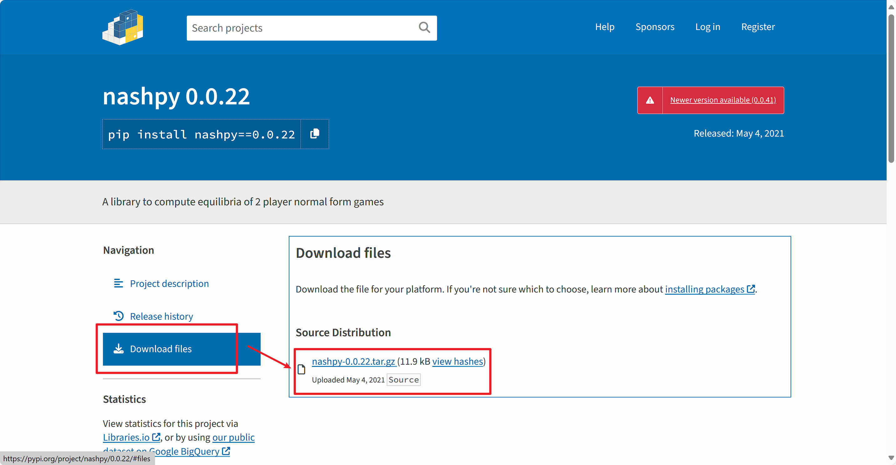
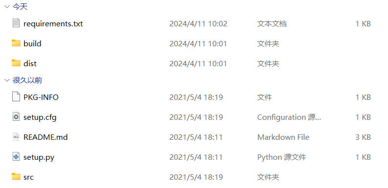

# 解决过程

安装`nashpy`包，在终端中输入代码

```python
pip install nashpy
```

报错。错误信息为

```python
metadata-generation-failed
```

附带说明内容为无法找到`xx/xx/requirement.txt`文件。顺着错误提示给出的路径寻找该文件，发现电脑中没有这个路径，并且每次安装提示的`xx/xx/...`路径不一样，无法本地新建`requirement.txt`文件。

再者，使用的镜像源同样无法成功安装`nashpy`，放弃网络安装`nashpy`的方法。

考虑本地安装`nashpy`。

进入安装`nashpy`的网址，[https://pypi.org/project/nashpy/](https://pypi.org/project/nashpy/)。

发现网络安装`nashpy`时自动安装的版本是`0.0.22`，没有下载该网址中最新的`nashpy`，寻找`0.0.22`版本的`nashpy`下载，如下图所示。


进入官网后，点击左侧的“Release history”，查看`nashpy`所有发行版本，进入如下图所示页面。


点击“0.0.22”，进入`0.0.22`版本的`nashpy`页面，如下图所示。



点击“Download files”，再点击`nashpy-0.0.22.tar.gz`下载。

`nashpy-0.0.22.tar.gz`下载完毕之后，需要解压。用“7z”解压软件解压该文件。需要解压两遍，第一次解压的是`.gz`，第二次解压的是`.tar`。解压完毕后，得到如下图所示文件。


回到终端，输入指令，让终端进入`nashpy-0.0.22.tar.gz`解压后的文件夹，输入指令

```python
python setup.py install
```

仍然报错，提示找不到`requirement.txt`。

解决方法是新建空白`requirement.txt`，在`requirement.txt`写入

```python
nashpy==0.0.22
```

再输入指令

```python
python setup.py install
```

即可成功安装`nashpy`。

> **另一种方法**
>
> 在这里，担心新建`requirement.txt`少了某些必要指令，我使用指令
>
> ```python
> pip freeze > requirements.txt
> ```
>
> 生成当前python环境中所有类包的`requirement.txt`文件，在最后一行写入
>
> ```python
> nashpy==0.0.22
> ```
>
> 随后输入指令
>
> ```python
> python setup.py install
> ```
>
> 进行安装。

`nashpy`安装完毕后，原有文件夹会多出几个文件，如下图所示。



最后，检查`nashpy`是否安装成功。在终端中输入指令

```python
pip list
```

显示如下页面说明安装成功。


# 总结

在这个过程中，掌握的新知识有

1. 如何查看终端提示信息；
2. 寻找可用于本地安装的python包；
3. 解压`.gz`和`.tar`文件；
4. 通过本地方式安装python包。