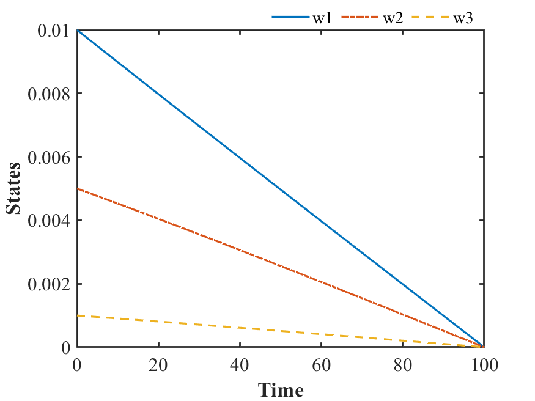
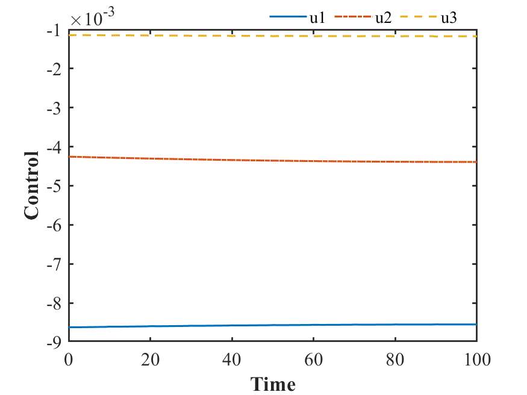
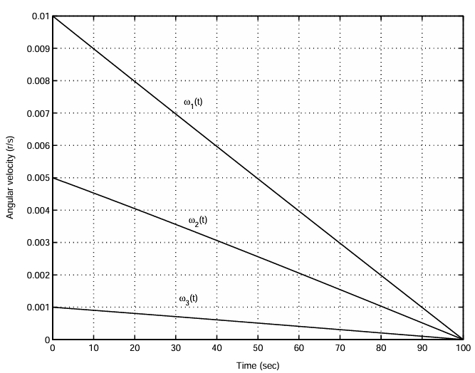
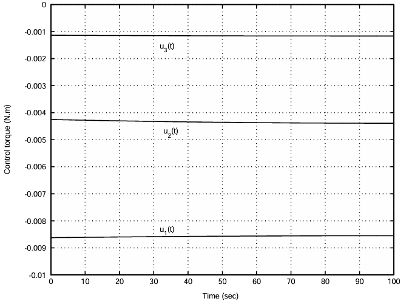

# 问题描述

例子出自论文 *Direct solution of nonlinear optimal control problems using quasilinearization and Chebyshev polynomials*（DOI：10.1016/S0016-0032(02)00028-5） Section 5.2. Example 2: Rigid asymmetric spacecraft

题目如下：

一个刚体非对称航天器控制问题，其状态方程为

$$
\left \{ \begin{matrix}
    \dot{\omega}_1 = -\frac{I_3-I_2}{I_1} \omega_2 \omega_3 + \frac{u_1}{I_1},  \\
    \dot{\omega}_2 = -\frac{I_1-I_3}{I_2} \omega_1 \omega_3 + \frac{u_2}{I_2},  \\
    \dot{\omega}_3 = -\frac{I_2-I_1}{I_3} \omega_1 \omega_2 + \frac{u_3}{I_3},
\end{matrix}
\right.
\tag{1}
$$

式中，$\omega_1$、$\omega_2$ 和 $\omega_3$ 为航天器的角速度。

控制量为 $u_1$、$u_2$、$u_3$，目标函数为

$$
J = 0.5 \int_{0}^{100}(u_1^2+u_2^2+u_3^2) \text{d}t.
\tag{2}
$$

其余参数为

$$
\begin{aligned}
    &\omega_1(0)=0.01 \ \text{r/s},\ \omega_2(0)=0.005 \ \text{r/s},\ \omega_3(0)=0.001 \ \text{r/s},    \\
    &\omega_1(t_f)=\omega_2(t_f)=\omega_3(t_f)=0 \ \text{r/s},  \\
    &I_1=86.24 \ \text{kg m}^2,\ I_2=85.07 \ \text{kg m}^2,\ I_3=113.59 \ \text{kg m}^2.
\end{aligned}
\tag{3}
$$

# GPOPS代码

## `main function`

首先设置GPOPS-II的参数。式$(3)$给出了所有用到的参数，按照式$(3)$写出代码即可。

```matlab
%%%%%%%%%%%%%%%%%%%%%%%%%%%%%%%%%%%%%%%%%%%%%%%%%%%%%%%%%%%%%%%%%%%%%%%%%%%
% 功能描述：刚体非对称航天器控制问题
% 文件名解释：mainSpacecraftOCP.m 中，main 代表 主函数，
%             Spacecraft 代表 航天器，
%             OCP 代表 最优控制问题
% 作者：Lei Lie
% 时间：2024/06/22
% 版本：1.0
% - 完成了代码框架的初始搭建
%%%%%%%%%%%%%%%%%%%%%%%%%%%%%%%%%%%%%%%%%%%%%%%%%%%%%%%%%%%%%%%%%%%%%%%%%%%
clc;clear;close all;
tic;
%% 01.初始参数设置
%-------------------------------------------------------------------------%
%----------------------- 设置问题的求解边界 ------------------------------%
%-------------------------------------------------------------------------%
% 设置时间
t0 = 0;
tf = 100;
% 设置状态量初值
w10 = .01;
w20 = .005;
w30 = .001;
% 设置状态量边界条件
w1_max = 1;
w1_min = 0;
w2_max = 1;
w2_min = 0;
w3_max = 1;
w3_min = 0;
% 设置控制量初值
u10 = -.009;
u20 = -.004;
u30 = -.001;
% 设置控制量边界条件
u1_max = 0;
u1_min = -.01;
u2_max = 0;
u2_min = -.01;
u3_max = 0;
u3_min = -.01;
% 设置静态参数
auxdata.I1 = 86.24;
auxdata.I2 = 85.07;
auxdata.I3 = 113.59;
% 设置不等式约束边界条件（路径约束）
path_max = .002;
path_min = 0;

%% 02.边界条件设置
%-------------------------------------------------------------------------%
%------------------------ 将求解边界设置于问题中 -------------------------%
%-------------------------------------------------------------------------%
bounds.phase.initialtime.lower  = t0; 
bounds.phase.initialtime.upper  = t0;
bounds.phase.finaltime.lower    = tf; 
bounds.phase.finaltime.upper    = tf;
bounds.phase.initialstate.lower = [w10 w20 w30]; 
bounds.phase.initialstate.upper = [w10 w20 w30];
bounds.phase.state.lower        = [w1_min w2_min w3_min]; 
bounds.phase.state.upper        = [w1_max w2_max w3_max];
bounds.phase.finalstate.lower   = [0 0 0];
bounds.phase.finalstate.upper   = [0 0 0];
bounds.phase.control.lower      = [u1_min u2_min u3_min]; 
bounds.phase.control.upper      = [u1_max u2_max u3_max];
bounds.phase.integral.lower     = 0; 
bounds.phase.integral.upper     = 10000;

%% 03.初值猜测
%-------------------------------------------------------------------------%
%------------------------------- 初值猜想 --------------------------------%
%-------------------------------------------------------------------------%
guess.phase.time     = [t0; tf]; 
guess.phase.state    = [[w10 w20 w30];[0 0 0]];
guess.phase.control  = [[u10 u20 u30];[u10 u20 u30]];
guess.phase.integral = 100;

%% 04.设置GPOPS求解器参数
%-------------------------------------------------------------------------%
%---------------------------- 设置求解器参数 -----------------------------%        
%-------------------------------------------------------------------------%
setup.name = 'Spacecraft-OCP';
setup.functions.continuous  = @socpContinuous;
setup.functions.endpoint   	= @socpEndpoint;
setup.bounds                = bounds;
setup.guess                 = guess;
setup.auxdata               = auxdata;
setup.nlp.solver            = 'ipopt';
setup.derivatives.supplier  = 'sparseCD';
setup.derivatives.derivativelevel = 'second';
setup.mesh.method           = 'hp1';
setup.mesh.tolerance        = 1e-6;
setup.mesh.maxiteration     = 45;
setup.mesh.colpointsmax     = 4;
setup.mesh.colpointsmin     = 10;
setup.mesh.phase.fraction   = 0.1*ones(1,10);
setup.mesh.phase.colpoints  = 4*ones(1,10);
setup.method = 'RPMintegration';

%% 05.求解
%-------------------------------------------------------------------------%
%----------------------- 使用 GPOPS2 求解最优控制问题 --------------------%
%-------------------------------------------------------------------------%
output = gpops2(setup);
solution = output.result.solution;
toc;
```

把结果画出来，代码如下。

```matlab
%% 06.画图
t = solution.phase.time(:,1);
w1 = solution.phase.state(:,1);
w2 = solution.phase.state(:,2);
w3 = solution.phase.state(:,3);
u1 = solution.phase.control(:,1);
u2 = solution.phase.control(:,2);
u3 = solution.phase.control(:,3);

figure('Color',[1,1,1]);
plot(t,w1,'-','LineWidth',1.5);hold on;
plot(t,w2,'-.','LineWidth',1.5);
plot(t,w3,'--','LineWidth',1.5);
xlabel('Time',...
       'FontWeight','bold');
ylabel('States',...
       'FontWeight','bold');
legend('w1','w2','w3',...
       'LineWidth',1,...
       'EdgeColor',[1,1,1],...
       'Orientation','horizontal',...
       'Position',[0.5,0.93,0.40,0.055]);
set(gca,'FontName','Times New Roman',...
        'FontSize',15,...
        'LineWidth',1.3);
print -dpng spacecraft_ocp_state.png

figure('Color',[1,1,1]);
plot(t,u1,'-','LineWidth',1.5);hold on;
plot(t,u2,'-.','LineWidth',1.5);
plot(t,u3,'--','LineWidth',1.5);
xlabel('Time',...
       'FontWeight','bold');
ylabel('Control',...
       'FontWeight','bold');
legend('u1','u2','u3',...
       'LineWidth',1,...
       'EdgeColor',[1,1,1],...
       'Orientation','horizontal',...
       'Position',[0.5,0.93,0.40,0.055]);
set(gca,'FontName','Times New Roman',...
        'FontSize',15,...
        'LineWidth',1.3);
print -dpng spacecraft_ocp_control.png
```

## `continuous function`

现在写动力学方程，再把式$(1)$重新写一遍，放在这里。
$$
\left \{ \begin{matrix}
    \dot{\omega}_1 = -\frac{I_3-I_2}{I_1} \omega_2 \omega_3 + \frac{u_1}{I_1},  \\
    \dot{\omega}_2 = -\frac{I_1-I_3}{I_2} \omega_1 \omega_3 + \frac{u_2}{I_2},  \\
    \dot{\omega}_3 = -\frac{I_2-I_1}{I_3} \omega_1 \omega_2 + \frac{u_3}{I_3},
\end{matrix}
\right.
$$
那么在代码中可以这么写：

```matlab
dw1 = -((I3-I2)/I1) .* w2 .* w3 + u1 ./ I1;
dw2 = -((I1-I3)/I2) .* w1 .* w3 + u2 ./ I2;
dw3 = -((I2-I1)/I2) .* w1 .* w2 + u3 ./ I3;
```

性能指标的形式为
$$
J = 0.5 \int_{0}^{100}(u_1^2+u_2^2+u_3^2) \text{d}t.
$$
对应的代码如下。

```matlab
phaseout.integrand = 0.5*(u1.^2 + u2.^2 + u3.^2);
```

那么，`continues function`的完整代码如下。

```matlab
function phaseout = socpContinuous(input)
    w1 = input.phase.state(:,1);
    w2 = input.phase.state(:,2);
    w3 = input.phase.state(:,3);
    u1 = input.phase.control(:,1);
    u2 = input.phase.control(:,2);
    u3 = input.phase.control(:,3);

    I1 = input.auxdata.I1;
    I2 = input.auxdata.I2;
    I3 = input.auxdata.I3;

    dw1 = -((I3-I2)/I1) .* w2 .* w3 + u1 ./ I1;
    dw2 = -((I1-I3)/I2) .* w1 .* w3 + u2 ./ I2;
    dw3 = -((I2-I1)/I2) .* w1 .* w2 + u3 ./ I3;

    phaseout.dynamics = [dw1 dw2 dw3];
    phaseout.integrand = 0.5*(u1.^2 + u2.^2 + u3.^2);
end
```

## `endpoint function`

此处代码很简单，只有2行。

```matlab
function output = socpEndpoint(input)
    J  = input.phase.integral;
    output.objective = J;
end
```

## 完整代码

```matlab
%%%%%%%%%%%%%%%%%%%%%%%%%%%%%%%%%%%%%%%%%%%%%%%%%%%%%%%%%%%%%%%%%%%%%%%%%%%
% 功能描述：刚体非对称航天器控制问题
% 文件名解释：mainSpacecraftOCP.m 中，main 代表 主函数，
%             Spacecraft 代表 航天器，
%             OCP 代表 最优控制问题
% 作者：Lei Lie
% 时间：2024/06/22
% 版本：1.0
% - 完成了代码框架的初始搭建
%%%%%%%%%%%%%%%%%%%%%%%%%%%%%%%%%%%%%%%%%%%%%%%%%%%%%%%%%%%%%%%%%%%%%%%%%%%
clc;clear;close all;
tic;
%% 01.初始参数设置
%-------------------------------------------------------------------------%
%----------------------- 设置问题的求解边界 ------------------------------%
%-------------------------------------------------------------------------%
% 设置时间
t0 = 0;
tf = 100;
% 设置状态量初值
w10 = .01;
w20 = .005;
w30 = .001;
% 设置状态量边界条件
w1_max = 1;
w1_min = 0;
w2_max = 1;
w2_min = 0;
w3_max = 1;
w3_min = 0;
% 设置控制量初值
u10 = -.009;
u20 = -.004;
u30 = -.001;
% 设置控制量边界条件
u1_max = 0;
u1_min = -.01;
u2_max = 0;
u2_min = -.01;
u3_max = 0;
u3_min = -.01;
% 设置静态参数
auxdata.I1 = 86.24;
auxdata.I2 = 85.07;
auxdata.I3 = 113.59;
% 设置不等式约束边界条件（路径约束）
path_max = .002;
path_min = 0;

%% 02.边界条件设置
%-------------------------------------------------------------------------%
%------------------------ 将求解边界设置于问题中 -------------------------%
%-------------------------------------------------------------------------%
bounds.phase.initialtime.lower  = t0; 
bounds.phase.initialtime.upper  = t0;
bounds.phase.finaltime.lower    = tf; 
bounds.phase.finaltime.upper    = tf;
bounds.phase.initialstate.lower = [w10 w20 w30]; 
bounds.phase.initialstate.upper = [w10 w20 w30];
bounds.phase.state.lower        = [w1_min w2_min w3_min]; 
bounds.phase.state.upper        = [w1_max w2_max w3_max];
bounds.phase.finalstate.lower   = [0 0 0];
bounds.phase.finalstate.upper   = [0 0 0];
bounds.phase.control.lower      = [u1_min u2_min u3_min]; 
bounds.phase.control.upper      = [u1_max u2_max u3_max];
bounds.phase.integral.lower     = 0; 
bounds.phase.integral.upper     = 10000;

%% 03.初值猜测
%-------------------------------------------------------------------------%
%------------------------------- 初值猜想 --------------------------------%
%-------------------------------------------------------------------------%
guess.phase.time     = [t0; tf]; 
guess.phase.state    = [[w10 w20 w30];[0 0 0]];
guess.phase.control  = [[u10 u20 u30];[u10 u20 u30]];
guess.phase.integral = 100;

%% 04.设置GPOPS求解器参数
%-------------------------------------------------------------------------%
%---------------------------- 设置求解器参数 -----------------------------%        
%-------------------------------------------------------------------------%
setup.name = 'Spacecraft-OCP';
setup.functions.continuous  = @socpContinuous;
setup.functions.endpoint   	= @socpEndpoint;
setup.bounds                = bounds;
setup.guess                 = guess;
setup.auxdata               = auxdata;
setup.nlp.solver            = 'ipopt';
setup.derivatives.supplier  = 'sparseCD';
setup.derivatives.derivativelevel = 'second';
setup.mesh.method           = 'hp1';
setup.mesh.tolerance        = 1e-6;
setup.mesh.maxiteration     = 45;
setup.mesh.colpointsmax     = 4;
setup.mesh.colpointsmin     = 10;
setup.mesh.phase.fraction   = 0.1*ones(1,10);
setup.mesh.phase.colpoints  = 4*ones(1,10);
setup.method = 'RPMintegration';

%% 05.求解
%-------------------------------------------------------------------------%
%----------------------- 使用 GPOPS2 求解最优控制问题 --------------------%
%-------------------------------------------------------------------------%
output = gpops2(setup);
solution = output.result.solution;
toc;

%% 06.画图
t = solution.phase.time(:,1);
w1 = solution.phase.state(:,1);
w2 = solution.phase.state(:,2);
w3 = solution.phase.state(:,3);
u1 = solution.phase.control(:,1);
u2 = solution.phase.control(:,2);
u3 = solution.phase.control(:,3);

figure('Color',[1,1,1]);
plot(t,w1,'-','LineWidth',1.5);hold on;
plot(t,w2,'-.','LineWidth',1.5);
plot(t,w3,'--','LineWidth',1.5);
xlabel('Time',...
       'FontWeight','bold');
ylabel('States',...
       'FontWeight','bold');
legend('w1','w2','w3',...
       'LineWidth',1,...
       'EdgeColor',[1,1,1],...
       'Orientation','horizontal',...
       'Position',[0.5,0.93,0.40,0.055]);
set(gca,'FontName','Times New Roman',...
        'FontSize',15,...
        'LineWidth',1.3);
print -dpng spacecraft_ocp_state.png

figure('Color',[1,1,1]);
plot(t,u1,'-','LineWidth',1.5);hold on;
plot(t,u2,'-.','LineWidth',1.5);
plot(t,u3,'--','LineWidth',1.5);
xlabel('Time',...
       'FontWeight','bold');
ylabel('Control',...
       'FontWeight','bold');
legend('u1','u2','u3',...
       'LineWidth',1,...
       'EdgeColor',[1,1,1],...
       'Orientation','horizontal',...
       'Position',[0.5,0.93,0.40,0.055]);
set(gca,'FontName','Times New Roman',...
        'FontSize',15,...
        'LineWidth',1.3);
print -dpng spacecraft_ocp_control.png

%% 函数模块部分
% ----------------------------------------------------------------------- %
% ------------------------- BEGIN: vsopcContinuous.m -------------------- %
% ----------------------------------------------------------------------- %
function phaseout = socpContinuous(input)
    w1 = input.phase.state(:,1);
    w2 = input.phase.state(:,2);
    w3 = input.phase.state(:,3);
    u1 = input.phase.control(:,1);
    u2 = input.phase.control(:,2);
    u3 = input.phase.control(:,3);

    I1 = input.auxdata.I1;
    I2 = input.auxdata.I2;
    I3 = input.auxdata.I3;

    dw1 = -((I3-I2)/I1) .* w2 .* w3 + u1 ./ I1;
    dw2 = -((I1-I3)/I2) .* w1 .* w3 + u2 ./ I2;
    dw3 = -((I2-I1)/I2) .* w1 .* w2 + u3 ./ I3;

    phaseout.dynamics = [dw1 dw2 dw3];
    phaseout.integrand = 0.5*(u1.^2 + u2.^2 + u3.^2);
end
% ----------------------------------------------------------------------- %
% -------------------------- END: vsopcContinuous.m --------------------- %
% ----------------------------------------------------------------------- %

% ----------------------------------------------------------------------- %
% -------------------------- BEGIN: vsopcEndpoint.m --------------------- %
% ----------------------------------------------------------------------- %
function output = socpEndpoint(input)
    J  = input.phase.integral;
    output.objective = J;
end
% ----------------------------------------------------------------------- %
% --------------------------- END: vsopcEndpoint.m ---------------------- %
% ----------------------------------------------------------------------- %

```

代码仿真结果

状态量：



控制量：



论文仿真结果：

状态量：



控制量：



# 最后

欢迎通过邮箱联系我：lordofdapanji@foxmail.com

来信请注明你的身份，否则恕不回信。