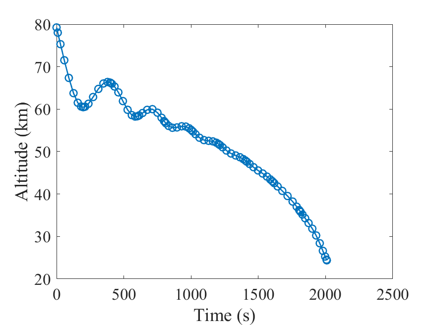
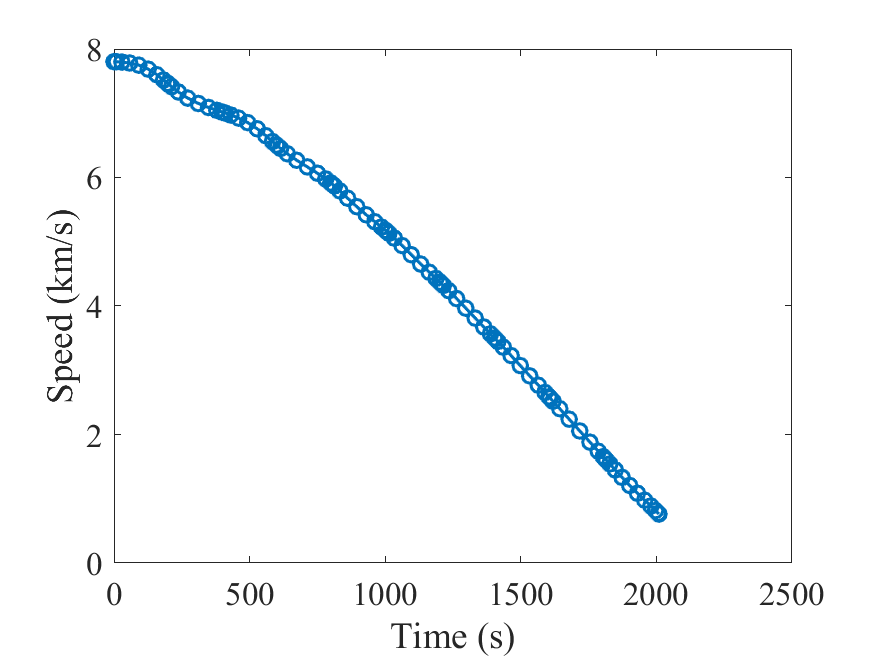
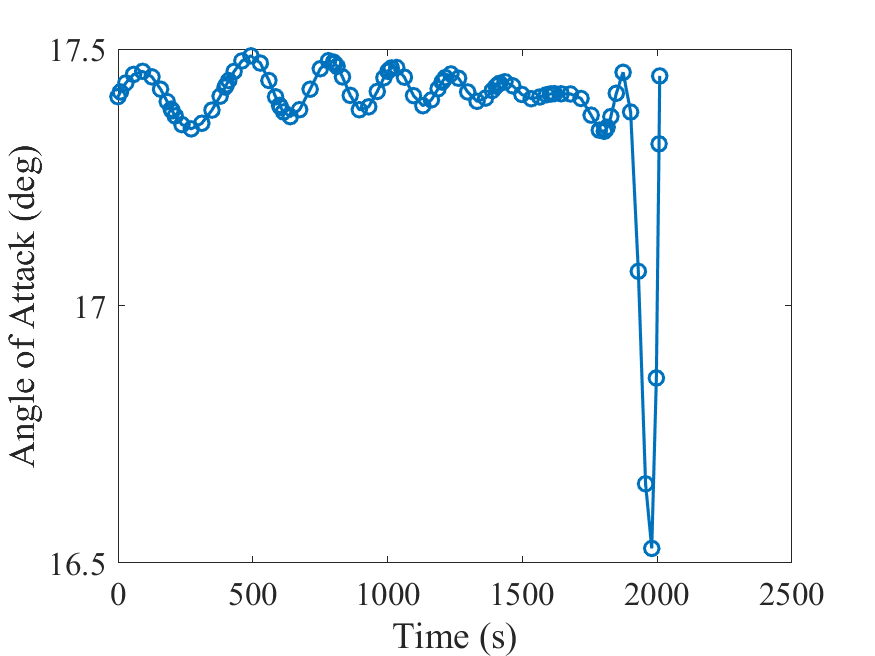
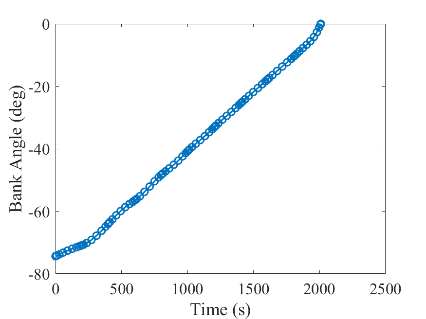

# 问题描述

考虑一类可复用火箭再入大气层最优轨迹规划问题，其动力学方程为

$$
\left \{
\begin{aligned}
       &\dot r = v \sin \gamma,  \\
       &\dot \theta = \frac{v \cos \gamma \sin \psi}{r \cos \phi}, \\
       &\dot \phi = \frac{v \cos \gamma \cos \psi}{r}, \\
       &\dot v = - \frac{F_d}{m}-F_g \sin \gamma, \\
       &\dot \gamma = \frac{F_l \cos \sigma}{m v} - (\frac{F_g}{v} - \frac{v}{r}) \cos \gamma, \\
       &\dot \psi = \frac{F_l \sin \sigma}{m v \cos \gamma} + \frac{v \cos r \sin \psi \tan \phi}{r},
\end{aligned} \right .
$$

边界条件为

$$
\left \{
\begin{array}{lcl}
       r(0) = 79248 + R_e \ \text{m}\ &,\ &r(t_f) = 79248 + R_e \ \text{m}, \\
       \theta(0) = 0 \ \text{deg}\ &,\ & \theta(t_f) = \text{Free}, \\
       \phi(0) = 0 \ \text{deg}\ &,\ & \phi(t_f) = \text{Free}, \\
       v(0) = 7803 \ \text{m/s}\ &,\ & v(t_f) = 762 \ \text{m/s}, \\
       \gamma(0) = -1 \ \text{deg}\ &,\ & \gamma(t_f) = -5 \ \text{deg}, \\
       \psi(0) = 90 \ \text{deg}\ &,\ & \psi(t_f) = \text{Free}.
\end{array} \right.
$$

性能指标为

$$
J = -\phi(t_f).
$$

> 参考文献： [1] Betts J T. Practical methods for optimal control and estimation using nonlinear programming[M]. Society for Industrial and Applied Mathematics, 247-252, 2010.

# GPOPS代码

## `main function`

虽然这个最优控制问题很复杂，不过不要着急，心里要有一个顺序，按照顺序一步一步写下去就行。

按照我的习惯，`main function`一般分成6个步骤，分别是：

1. 初始参数设置；
2. 边界条件设置；
3. 初值猜测；
4. 设置GPOPS求解器参数；
5. 求解；
6. 画图。

那么，一步一步地来写代码吧。

### 1. 初始参数设置

```matlab
%% 01.初始参数设置
%-------------------------------------------------------------------------%
%----------------------- 设置问题的求解边界 ------------------------------%
%-------------------------------------------------------------------------%
cft2m = 0.3048;
cft2km = cft2m/1000;
cslug2kg = 14.5939029;
%-------------------------------------%
%             Problem Setup           %
%-------------------------------------%
auxdata.Re = 20902900*cft2m;              % Equatorial Radius of Earth (m)
auxdata.S  = 2690*cft2m^2;                % Vehicle Reference Area (m^2)
auxdata.cl(1) = -0.2070;                  % Parameters for lift coefficient
auxdata.cl(2) = 1.6756;       
auxdata.cd(1) = 0.0785;       
auxdata.cd(2) = -0.3529;       
auxdata.cd(3) = 2.0400;
auxdata.b(1)  = 0.07854;      
auxdata.b(2)  = -0.061592;    
auxdata.b(3)  = 0.00621408;
auxdata.H     = 23800*cft2m;              % Density Scale Height (m)
auxdata.al(1) = -0.20704;    
auxdata.al(2) = 0.029244;
auxdata.rho0  = 0.002378*cslug2kg/cft2m^3;% Sea Level Atmospheric Density (slug/ft^3)
auxdata.mu    = 1.4076539e16*cft2m^3;     % Earth Gravitational Parameter (ft^^3/s^2) 
auxdata.mass  = 6309.433*cslug2kg;      

% 初始条件
t0 = 0;
alt0 = 260000*cft2m;
rad0 = alt0+auxdata.Re;
lon0 = 0;
lat0 = 0;
speed0 = 25600*cft2m;
fpa0   = -1*pi/180;
azi0   = 90*pi/180;

% 终端条件
altf = 80000*cft2m;
radf = altf+auxdata.Re;
speedf = 2500*cft2m;
fpaf   = -5*pi/180;
azif   = -90*pi/180;

%----------------------------------------------------%
% 时间、状态和控制量的上界和下界
%----------------------------------------------------%
tfMin = 0;            tfMax = 3000;
radMin = auxdata.Re;  radMax = rad0;
lonMin = -pi;         lonMax = -lonMin;
latMin = -70*pi/180;  latMax = -latMin;
speedMin = 10;        speedMax = 45000;
fpaMin = -80*pi/180;  fpaMax =  80*pi/180;
aziMin = -180*pi/180; aziMax =  180*pi/180;
aoaMin = -90*pi/180;  aoaMax = -aoaMin;
bankMin = -90*pi/180; bankMax =   1*pi/180;
```

### 2. 边界条件设置

```matlab
%-------------------------------------------------------------------------%
%------------------------ 将求解边界设置于问题中 -------------------------%
%-------------------------------------------------------------------------%
bounds.phase.initialtime.lower = t0;
bounds.phase.initialtime.upper = t0;
bounds.phase.finaltime.lower = tfMin;
bounds.phase.finaltime.upper = tfMax;
bounds.phase.initialstate.lower = [rad0, lon0, lat0, speed0, fpa0, azi0];
bounds.phase.initialstate.upper = [rad0, lon0, lat0, speed0, fpa0, azi0];
bounds.phase.state.lower = [radMin, lonMin, latMin, speedMin, fpaMin, aziMin];
bounds.phase.state.upper = [radMax, lonMax, latMax, speedMax, fpaMax, aziMax];
bounds.phase.finalstate.lower = [radf, lonMin, latMin, speedf, fpaf, aziMin];
bounds.phase.finalstate.upper = [radf, lonMax, latMax, speedf, fpaf, aziMax];
bounds.phase.control.lower = [aoaMin, bankMin];
bounds.phase.control.upper = [aoaMax, bankMax];
```

### 3. 初值猜测

```matlab
%-------------------------------------------------------------------------%
%------------------------------- 初值猜想 --------------------------------%
%-------------------------------------------------------------------------%
tGuess = [0; 1000];
radGuess = [rad0; radf];
lonGuess = [lon0; lon0+10*pi/180];
latGuess = [lat0; lat0+10*pi/180];
speedGuess = [speed0; speedf];
fpaGuess = [fpa0; fpaf];
aziGuess = [azi0; azif];
aoaGuess = [0; 0];
bankGuess = [0; 0];

guess.phase.state   = [radGuess, lonGuess, latGuess, speedGuess, fpaGuess, aziGuess];
guess.phase.control = [aoaGuess, bankGuess];
guess.phase.time    = tGuess;
```

### 4. 设置GPOPS求解器参数

```matlab
%-------------------------------------------------------------------------%
%---------------------------- 设置求解器参数 -----------------------------%        
%-------------------------------------------------------------------------%
meshphase.colpoints = 4*ones(1,10);
meshphase.fraction = 0.1*ones(1,10);

setup.name = 'Reusable-Launch-Vehicle-Entry-Problem';
setup.functions.continuous = @rlvEntryContinuous;
setup.functions.endpoint   = @rlvEntryEndpoint;
setup.auxdata = auxdata;
setup.mesh.phase = meshphase;
setup.bounds = bounds;
setup.guess = guess;
setup.nlp.solver = 'ipopt';
setup.derivatives.supplier = 'sparseCD';
setup.derivatives.derivativelevel = 'second';
setup.scales.method = 'automatic-bounds';
setup.mesh.method = 'hp1';
setup.mesh.tolerance = 1e-6;
setup.mesh.colpointsmin = 4;
setup.mesh.colpointsmax = 16;
```

### 5. 求解

```matlab
%-------------------------------------------------------------------------%
%----------------------- 使用 GPOPS2 求解最优控制问题 --------------------%
%-------------------------------------------------------------------------%
output = gpops2(setup);
solution = output.result.solution;
toc;

time = solution.phase(1).time;
altitude  = (solution.phase(1).state(:,1)-auxdata.Re)/1000;
longitude = solution.phase(1).state(:,2)*180/pi;
latitude  = solution.phase(1).state(:,3)*180/pi;
speed     = solution.phase(1).state(:,4)/1000;
fpa       = solution.phase(1).state(:,5)*180/pi;
azimuth   = solution.phase(1).state(:,6)*180/pi;
aoa       = solution.phase(1).control(:,1)*180/pi;
bank      = solution.phase(1).control(:,2)*180/pi;
```

### 6. 画图

```matlab
figure('Color',[1,1,1])
pp = plot(time,altitude,'-o', 'markersize', 7, 'linewidth', 1.5);
xl = xlabel('Time (s)');
yl = ylabel('Altitude (km)');
title('Altitude');
set(xl,'FontSize',18);
set(yl,'FontSize',18);
set(gca,'FontSize',16,'FontName','Times New Roman');
set(pp,'LineWidth',1.25);
print -dpng rlvAltitude.png

figure('Color',[1,1,1])
plot(longitude,latitude,'-o', 'markersize', 7, 'linewidth', 1.5);
xl = xlabel('Longitude (deg)');
yl = ylabel('Latitude (deg)');
title('Longitude and Latitude');
set(xl,'FontSize',18);
set(yl,'FontSize',18);
set(gca,'FontSize',16,'FontName','Times New Roman');
set(pp,'LineWidth',1.25);
print -dpng rlvLonLat.png

figure('Color',[1,1,1])
plot(time,speed,'-o', 'markersize', 7, 'linewidth', 1.5);
xl = xlabel('Time (s)');
yl = ylabel('Speed (km/s)');
title('Speed')
set(xl,'FontSize',18);
set(yl,'FontSize',18);
set(gca,'FontSize',16,'FontName','Times New Roman');
set(pp,'LineWidth',1.25);
print -dpng rlvSpeed.png

figure('Color',[1,1,1])
plot(time,fpa,'-o', 'markersize', 7, 'linewidth', 1.5);
yl = xlabel('Time (s)');
xl = ylabel('Flight Path Angle (deg)');
title('Flight Path Angle')
set(xl,'FontSize',18);
set(yl,'FontSize',18);
set(gca,'FontSize',16,'FontName','Times New Roman');
set(pp,'LineWidth',1.25);
print -dpng rlvFlightPathAngle.png

figure('Color',[1,1,1])
plot(time,azimuth,'-o', 'markersize', 7, 'linewidth', 1.5);
yl = xlabel('Time (s)');
xl = ylabel('Azimuth Angle (deg)');
set(xl,'FontSize',18);
set(yl,'FontSize',18);
set(gca,'FontSize',16,'FontName','Times New Roman');
set(pp,'LineWidth',1.25);
print -dpng rlvAzimuthAngle.png

figure('Color',[1,1,1])
plot(time,aoa,'-o', 'markersize', 7, 'linewidth', 1.5);
yl = xlabel('Time (s)');
xl = ylabel('Angle of Attack (deg)');
set(xl,'FontSize',18);
set(yl,'FontSize',18);
set(gca,'FontSize',16,'YTick',[16.5 17 17.5],'FontName','Times New Roman');
set(pp,'LineWidth',1.25);
print -dpng rlvAngleofAttack.png

figure('Color',[1,1,1])
plot(time,bank,'-o', 'markersize', 7, 'linewidth', 1.5);
yl = xlabel('Time (s)');
xl = ylabel('Bank Angle (deg)');
set(xl,'FontSize',18);
set(yl,'FontSize',18);
set(gca,'FontSize',16,'FontName','Times New Roman');
set(pp,'LineWidth',1.25);
print -dpng rlvBankAngle.png
```

## `continuous function`

写这部分代码的时候分成三步来写。

**第一步**，把所有要用的变量全部导入进来。

```matlab
function phaseout = rlvEntryContinuous(input)

rad = input.phase.state(:,1);
lon = input.phase.state(:,2);
lat = input.phase.state(:,3);
speed = input.phase.state(:,4);
fpa = input.phase.state(:,5);
azimuth = input.phase.state(:,6);
aoa = input.phase.control(:,1);
bank = input.phase.control(:,2);

cd0 = input.auxdata.cd(1);
cd1 = input.auxdata.cd(2);
cd2 = input.auxdata.cd(3);
cl0 = input.auxdata.cl(1);
cl1 = input.auxdata.cl(2);
mu  = input.auxdata.mu;
rho0 = input.auxdata.rho0;
H = input.auxdata.H;
S = input.auxdata.S;
mass = input.auxdata.mass;
altitude = rad - input.auxdata.Re;
```

**第二步**，计算在求解动力学方程时会用到的变量。

```matlab
CD = cd0+cd1*aoa+cd2*aoa.^2;

rho = rho0*exp(-altitude/H);
CL = cl0+cl1*aoa;
gravity = mu./rad.^2;
dynamic_pressure = 0.5*rho.*speed.^2;
D = dynamic_pressure.*S.*CD./mass;
L = dynamic_pressure.*S.*CL./mass;
slon = sin(lon);
clon = cos(lon);
slat = sin(lat);
clat = cos(lat);
tlat = tan(lat);
sfpa = sin(fpa);
cfpa = cos(fpa);
sazi = sin(azimuth);
cazi = cos(azimuth);
cbank = cos(bank);
sbank = sin(bank);
```

**第三步**，根据动力学方程写出代码。

重新复习一下动力学方程，为

$$
\left \{
\begin{aligned}
       &\dot r = v \sin \gamma,  \\
       &\dot \theta = \frac{v \cos \gamma \sin \psi}{r \cos \phi}, \\
       &\dot \phi = \frac{v \cos \gamma \cos \psi}{r}, \\
       &\dot v = - \frac{F_d}{m}-F_g \sin \gamma, \\
       &\dot \gamma = \frac{F_l \cos \sigma}{m v} - (\frac{F_g}{v} - \frac{v}{r}) \cos \gamma, \\
       &\dot \psi = \frac{F_l \sin \sigma}{m v \cos \gamma} + \frac{v \cos r \sin \psi \tan \phi}{r},
\end{aligned} \right .
$$

根据动力学方程，就可以对应地写出，代码如下。

```matlab
raddot   = speed.*sfpa;
londot   = speed.*cfpa.*sazi./(rad.*clat);
latdot   = speed.*cfpa.*cazi./rad;
speeddot = -D-gravity.*sfpa;
fpadot   = (L.*cbank-cfpa.*(gravity-speed.^2./rad))./speed;
azidot   = (L.*sbank./cfpa + speed.^2.*cfpa.*sazi.*tlat./rad)./speed;

phaseout.dynamics  = [raddot, londot, latdot, speeddot, fpadot, azidot];
end
```

## `endpoint function`

`endpoint function`按照性能指标函数写即可，性能指标为

$$
J = -\phi(t_f).
$$

那么，代码如下。

```matlab
% ----------------------------------------------------------------------- %
% ------------------------ BEGIN: rlvEntryEndpoint.m -------------------- %
% ----------------------------------------------------------------------- %
function output = rlvEntryEndpoint(input)
latf = input.phase.finalstate(3);
output.objective = -latf;
end
% ----------------------------------------------------------------------- %
% ------------------------- END: rlvEntryEndpoint.m --------------------- %
% ----------------------------------------------------------------------- %
```

## 完整代码

```matlab
%%%%%%%%%%%%%%%%%%%%%%%%%%%%%%%%%%%%%%%%%%%%%%%%%%%%%%%%%%%%%%%%%%%%%%%%%%%
% 功能描述：可复用火箭再入大气层最优轨迹规划问题
% 文件名解释：mainReentry.m 中，main 代表 主函数，
%             Re-entry 代表 再入航天器
% 作者：Lei Lie
% 时间：2024/06/24
% 版本：1.0
% - 完成了代码框架的初始搭建
%%%%%%%%%%%%%%%%%%%%%%%%%%%%%%%%%%%%%%%%%%%%%%%%%%%%%%%%%%%%%%%%%%%%%%%%%%%
clc;
clear;
close all;
tic;
%% 01.初始参数设置
%-------------------------------------------------------------------------%
%----------------------- 设置问题的求解边界 ------------------------------%
%-------------------------------------------------------------------------%
cft2m = 0.3048;
cft2km = cft2m/1000;
cslug2kg = 14.5939029;
%-------------------------------------%
%             Problem Setup           %
%-------------------------------------%
auxdata.Re = 20902900*cft2m;              % Equatorial Radius of Earth (m)
auxdata.S  = 2690*cft2m^2;                % Vehicle Reference Area (m^2)
auxdata.cl(1) = -0.2070;                  % Parameters for lift coefficient
auxdata.cl(2) = 1.6756;       
auxdata.cd(1) = 0.0785;       
auxdata.cd(2) = -0.3529;       
auxdata.cd(3) = 2.0400;
auxdata.b(1)  = 0.07854;      
auxdata.b(2)  = -0.061592;    
auxdata.b(3)  = 0.00621408;
auxdata.H     = 23800*cft2m;              % Density Scale Height (m)
auxdata.al(1) = -0.20704;    
auxdata.al(2) = 0.029244;
auxdata.rho0  = 0.002378*cslug2kg/cft2m^3;% Sea Level Atmospheric Density (slug/ft^3)
auxdata.mu    = 1.4076539e16*cft2m^3;     % Earth Gravitational Parameter (ft^^3/s^2) 
auxdata.mass  = 6309.433*cslug2kg;      

% 初始条件
t0 = 0;
alt0 = 260000*cft2m;
rad0 = alt0+auxdata.Re;
lon0 = 0;
lat0 = 0;
speed0 = 25600*cft2m;
fpa0   = -1*pi/180;
azi0   = 90*pi/180;

% 终端条件
altf = 80000*cft2m;
radf = altf+auxdata.Re;
speedf = 2500*cft2m;
fpaf   = -5*pi/180;
azif   = -90*pi/180;

%----------------------------------------------------%
% 时间、状态和控制量的上界和下界
%----------------------------------------------------%
tfMin = 0;            tfMax = 3000;
radMin = auxdata.Re;  radMax = rad0;
lonMin = -pi;         lonMax = -lonMin;
latMin = -70*pi/180;  latMax = -latMin;
speedMin = 10;        speedMax = 45000;
fpaMin = -80*pi/180;  fpaMax =  80*pi/180;
aziMin = -180*pi/180; aziMax =  180*pi/180;
aoaMin = -90*pi/180;  aoaMax = -aoaMin;
bankMin = -90*pi/180; bankMax =   1*pi/180;

%% 02.边界条件设置
%-------------------------------------------------------------------------%
%------------------------ 将求解边界设置于问题中 -------------------------%
%-------------------------------------------------------------------------%
bounds.phase.initialtime.lower = t0;
bounds.phase.initialtime.upper = t0;
bounds.phase.finaltime.lower = tfMin;
bounds.phase.finaltime.upper = tfMax;
bounds.phase.initialstate.lower = [rad0, lon0, lat0, speed0, fpa0, azi0];
bounds.phase.initialstate.upper = [rad0, lon0, lat0, speed0, fpa0, azi0];
bounds.phase.state.lower = [radMin, lonMin, latMin, speedMin, fpaMin, aziMin];
bounds.phase.state.upper = [radMax, lonMax, latMax, speedMax, fpaMax, aziMax];
bounds.phase.finalstate.lower = [radf, lonMin, latMin, speedf, fpaf, aziMin];
bounds.phase.finalstate.upper = [radf, lonMax, latMax, speedf, fpaf, aziMax];
bounds.phase.control.lower = [aoaMin, bankMin];
bounds.phase.control.upper = [aoaMax, bankMax];

%% 03.初值猜测
%-------------------------------------------------------------------------%
%------------------------------- 初值猜想 --------------------------------%
%-------------------------------------------------------------------------%
tGuess = [0; 1000];
radGuess = [rad0; radf];
lonGuess = [lon0; lon0+10*pi/180];
latGuess = [lat0; lat0+10*pi/180];
speedGuess = [speed0; speedf];
fpaGuess = [fpa0; fpaf];
aziGuess = [azi0; azif];
aoaGuess = [0; 0];
bankGuess = [0; 0];

guess.phase.state   = [radGuess, lonGuess, latGuess, speedGuess, fpaGuess, aziGuess];
guess.phase.control = [aoaGuess, bankGuess];
guess.phase.time    = tGuess;


%% 04.设置GPOPS求解器参数
%-------------------------------------------------------------------------%
%---------------------------- 设置求解器参数 -----------------------------%        
%-------------------------------------------------------------------------%
meshphase.colpoints = 4*ones(1,10);
meshphase.fraction = 0.1*ones(1,10);

setup.name = 'Reusable-Launch-Vehicle-Entry-Problem';
setup.functions.continuous = @rlvEntryContinuous;
setup.functions.endpoint   = @rlvEntryEndpoint;
setup.auxdata = auxdata;
setup.mesh.phase = meshphase;
setup.bounds = bounds;
setup.guess = guess;
setup.nlp.solver = 'ipopt';
setup.derivatives.supplier = 'sparseCD';
setup.derivatives.derivativelevel = 'second';
setup.scales.method = 'automatic-bounds';
setup.mesh.method = 'hp1';
setup.mesh.tolerance = 1e-6;
setup.mesh.colpointsmin = 4;
setup.mesh.colpointsmax = 16;


%% 05.求解
%-------------------------------------------------------------------------%
%----------------------- 使用 GPOPS2 求解最优控制问题 --------------------%
%-------------------------------------------------------------------------%
output = gpops2(setup);
solution = output.result.solution;
toc;

time = solution.phase(1).time;
altitude  = (solution.phase(1).state(:,1)-auxdata.Re)/1000;
longitude = solution.phase(1).state(:,2)*180/pi;
latitude  = solution.phase(1).state(:,3)*180/pi;
speed     = solution.phase(1).state(:,4)/1000;
fpa       = solution.phase(1).state(:,5)*180/pi;
azimuth   = solution.phase(1).state(:,6)*180/pi;
aoa       = solution.phase(1).control(:,1)*180/pi;
bank      = solution.phase(1).control(:,2)*180/pi;

%% 06.画图

figure('Color',[1,1,1])
pp = plot(time,altitude,'-o', 'markersize', 7, 'linewidth', 1.5);
xl = xlabel('Time (s)');
yl = ylabel('Altitude (km)');
title('Altitude');
set(xl,'FontSize',18);
set(yl,'FontSize',18);
set(gca,'FontSize',16,'FontName','Times New Roman');
set(pp,'LineWidth',1.25);
print -dpng rlvAltitude.png

figure('Color',[1,1,1])
plot(longitude,latitude,'-o', 'markersize', 7, 'linewidth', 1.5);
xl = xlabel('Longitude (deg)');
yl = ylabel('Latitude (deg)');
title('Longitude and Latitude');
set(xl,'FontSize',18);
set(yl,'FontSize',18);
set(gca,'FontSize',16,'FontName','Times New Roman');
set(pp,'LineWidth',1.25);
print -dpng rlvLonLat.png

figure('Color',[1,1,1])
plot(time,speed,'-o', 'markersize', 7, 'linewidth', 1.5);
xl = xlabel('Time (s)');
yl = ylabel('Speed (km/s)');
title('Speed')
set(xl,'FontSize',18);
set(yl,'FontSize',18);
set(gca,'FontSize',16,'FontName','Times New Roman');
set(pp,'LineWidth',1.25);
print -dpng rlvSpeed.png

figure('Color',[1,1,1])
plot(time,fpa,'-o', 'markersize', 7, 'linewidth', 1.5);
yl = xlabel('Time (s)');
xl = ylabel('Flight Path Angle (deg)');
title('Flight Path Angle')
set(xl,'FontSize',18);
set(yl,'FontSize',18);
set(gca,'FontSize',16,'FontName','Times New Roman');
set(pp,'LineWidth',1.25);
print -dpng rlvFlightPathAngle.png

figure('Color',[1,1,1])
plot(time,azimuth,'-o', 'markersize', 7, 'linewidth', 1.5);
yl = xlabel('Time (s)');
xl = ylabel('Azimuth Angle (deg)');
set(xl,'FontSize',18);
set(yl,'FontSize',18);
set(gca,'FontSize',16,'FontName','Times New Roman');
set(pp,'LineWidth',1.25);
print -dpng rlvAzimuthAngle.png

figure('Color',[1,1,1])
plot(time,aoa,'-o', 'markersize', 7, 'linewidth', 1.5);
yl = xlabel('Time (s)');
xl = ylabel('Angle of Attack (deg)');
set(xl,'FontSize',18);
set(yl,'FontSize',18);
set(gca,'FontSize',16,'YTick',[16.5 17 17.5],'FontName','Times New Roman');
set(pp,'LineWidth',1.25);
print -dpng rlvAngleofAttack.png

figure('Color',[1,1,1])
plot(time,bank,'-o', 'markersize', 7, 'linewidth', 1.5);
yl = xlabel('Time (s)');
xl = ylabel('Bank Angle (deg)');
set(xl,'FontSize',18);
set(yl,'FontSize',18);
set(gca,'FontSize',16,'FontName','Times New Roman');
set(pp,'LineWidth',1.25);
print -dpng rlvBankAngle.png

%% 函数模块部分
% ----------------------------------------------------------------------- %
% ----------------------- BEGIN: rlvEntryContinuous.m ------------------- %
% ----------------------------------------------------------------------- %
function phaseout = rlvEntryContinuous(input)

rad = input.phase.state(:,1);
lon = input.phase.state(:,2);
lat = input.phase.state(:,3);
speed = input.phase.state(:,4);
fpa = input.phase.state(:,5);
azimuth = input.phase.state(:,6);
aoa = input.phase.control(:,1);
bank = input.phase.control(:,2);

cd0 = input.auxdata.cd(1);
cd1 = input.auxdata.cd(2);
cd2 = input.auxdata.cd(3);
cl0 = input.auxdata.cl(1);
cl1 = input.auxdata.cl(2);
mu  = input.auxdata.mu;
rho0 = input.auxdata.rho0;
H = input.auxdata.H;
S = input.auxdata.S;
mass = input.auxdata.mass;
altitude = rad - input.auxdata.Re;

CD = cd0+cd1*aoa+cd2*aoa.^2;

rho = rho0*exp(-altitude/H);
CL = cl0+cl1*aoa;
gravity = mu./rad.^2;
dynamic_pressure = 0.5*rho.*speed.^2;
D = dynamic_pressure.*S.*CD./mass;
L = dynamic_pressure.*S.*CL./mass;
slon = sin(lon);
clon = cos(lon);
slat = sin(lat);
clat = cos(lat);
tlat = tan(lat);
sfpa = sin(fpa);
cfpa = cos(fpa);
sazi = sin(azimuth);
cazi = cos(azimuth);
cbank = cos(bank);
sbank = sin(bank);

raddot   = speed.*sfpa;
londot   = speed.*cfpa.*sazi./(rad.*clat);
latdot   = speed.*cfpa.*cazi./rad;
speeddot = -D-gravity.*sfpa;
fpadot   = (L.*cbank-cfpa.*(gravity-speed.^2./rad))./speed;
azidot   = (L.*sbank./cfpa + speed.^2.*cfpa.*sazi.*tlat./rad)./speed;

phaseout.dynamics  = [raddot, londot, latdot, speeddot, fpadot, azidot];
end
% ----------------------------------------------------------------------- %
% ------------------------ END: rlvEntryContinuous.m -------------------- %
% ----------------------------------------------------------------------- %

% ----------------------------------------------------------------------- %
% ------------------------ BEGIN: rlvEntryEndpoint.m -------------------- %
% ----------------------------------------------------------------------- %
function output = rlvEntryEndpoint(input)

latf = input.phase.finalstate(3);
output.objective = -latf;
end
% ----------------------------------------------------------------------- %
% ------------------------- END: rlvEntryEndpoint.m --------------------- %
% ----------------------------------------------------------------------- %
```

## 代码仿真结果

高度：



速度：



经纬度：


飞行路径角度：


攻角：



倾斜角：



# 最后

关于可复用火箭再入大气层的最优轨迹规划问题，没有写得很详细每个参数为什么这么取的原因，是我觉得现在大家都大概率不需要解决这个问题。所以诸如攻角、仰角、迎角之类的变量不去解释为什么要这么写。

**只是希望通过这样一系列的例子告诉大家GPOPS-II应该怎么使用的思路。**

> - 动力学方程应该怎么写？
> - 性能指标应该怎么写？
> - 约束应该怎么写？
> - 猜测应该怎么写？
> - 画图怎么画？

要被解决的问题是无限的，只有掌握了方法论，才能一法通时万法通。

欢迎通过邮箱联系我：lordofdapanji@foxmail.com

来信请注明你的身份，否则恕不回信。