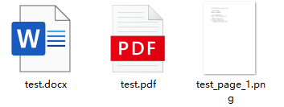

> 好朋友说要把word文档转成pdf和图片，我之前寻思这咋能自动化，查了一下python代码，发现还真能做。研究了怎么写代码，放在这里，以防忘记。

# 要求环境

- Python 版本：3.7.0
- `pywin32` 版本：305.1
- `PyMuPDF` 版本：1.22.5

上面的Python宏包版本一定要注意，尤其是Python版本，一开始用的是电脑base环境的Python，3.12.4，死活都运行不了，后来改成3.7.0版本的Python才行。

`pywin32`可以实现将word转换成pdf，`PyMuPDF`可以实现将pdf转换成图片。通过这俩Python包就可以实现word转换pdf和图片了。

我习惯用Miniconda管理Python环境，VSCode编辑Python代码。用Miniconda新建环境，用**管理员身份**打开Miniconda的`Anaconda Prompt (miniconda3) `，写如下代码：

```python
conda create -n xxx(你的环境名字) python==3.7(指定python版本，根据需要可以安装其他版本)
```

想在现有环境里改变Python版本的话，写下面的代码：

```python
pip install python==3.7
```

安装`pywin32`，代码如下：

```python
pip install pywin32
```

安装`PyMuPDF`，代码如下：

```python
pip install pymupdf
```

不用管大小写。

# 代码

代码放在这里：

```python
import os
import fitz  # PyMuPDF 
from win32com import client

# 转换doc为pdf
def doc2pdf(word_path, file_path):  
    # 检查 PDF 文件是否存在，如果存在则删除  
    if os.path.exists(file_path):  
        os.remove(file_path)  
        print(f"Deleted existing PDF file: {file_path}")  
      
    word = client.Dispatch("Word.Application")  # 打开word应用程序  
    doc = word.Documents.Open(word_path)        # 打开word文件  
    doc.SaveAs(file_path, 17)                   # 另存为后缀为".pdf"的文件，其中参数17表示为pdf，保存到pdf文件夹
    doc.Close()                                 # 关闭原来word文件  
    word.Quit()
    print(f"Saved {file_path}")  

# 转换docx为pdf
def docx2pdf(word_path, file_path):      
    # 检查 PDF 文件是否存在，如果存在则删除  
    if os.path.exists(file_path):  
        os.remove(file_path)
        print(f"Deleted existing PDF file: {file_path}")  
      
    word = client.Dispatch("Word.Application")  # 打开word应用程序  
    doc = word.Documents.Open(word_path)        # 打开word文件  
    doc.SaveAs(file_path, 17)                   # 另存为后缀为".pdf"的文件，其中参数17表示为pdf，保存到pdf文件夹
    doc.Close()                                 # 关闭原来word文件  
    word.Quit() 
    print(f"Saved {file_path}")  

def pdf2png(pdf_name, pdf_path, png_path):
    # 打开 PDF 文件  
    doc = fitz.open(pdf_path) 
    pdf_name_temp = "{}".format(pdf_name[:-4]) 
    
    # 遍历每一页并保存为图片  
    for page_num in range(len(doc)):  
        page = doc[page_num]  
        pix = page.get_pixmap(matrix=fitz.Matrix(2.0, 2.0), alpha=False)    # pdf 转换 png
        output = f"{png_path}/{pdf_name_temp}_page_{page_num + 1}.png"      # 指定保存名称和保存位置
        pix.save(output)                        # 保存到png文件夹
        print(f"Saved {output}")  
    
    # 关闭 PDF 文件  
    doc.close()

if __name__ == '__main__':
    # 指定文件路径
    current_path = os.getcwd()
    current_word_path = current_path + '/word'

    # 列出当前目录下的所有文件和文件夹  
    # for item in os.listdir(current_word_path):  
    #     print(item) 
    # 如果要改的话，把下面的代码放在这个循环里面，word_name代替item

    # 指定文件名称
    word_name = "test.docx"
    pdf_name = "test.pdf"
    # 将路径合并
    word_file = current_path + '/word/' + word_name
    pdf_file = current_path + '/pdf/' + pdf_name
    png_file = current_path + '/png'
    # word 转 pdf
    docx2pdf(word_file, pdf_file)
    # pdf 转 png
    pdf2png(pdf_name, pdf_file, png_file)
```

注释已经写好了，不再作过多解释。

根据自己需要修改`word_name`和`pdf_name`即可。

如果要实现多个word文件的格式更改的话，把第61行-第70行代码放在第57行代码下方（注意缩进！），再修改变量名，即可完成。

> 一开始想用`pdf2image`包来着，但也会一直报错，所以改用`PyMuPDF`将pdf转换成图片了。如果真的很想用`pdf2image`的话，记得还要安装下面两个包：
>
> - `pillow`；
>
> - `poppler`。
>
> `pillow`是图像处理用的包，`pdf2image`实际上是用`poppler`进行转换的，这俩缺一不可。我在自己的电脑上没做成，要是有做成的朋友欢迎交流。

# 结果

成功转换的效果图如下。




相应的代码放在[这里](https:\\luwin1127.github.io\assets\download\files-07-07\wordConvert.zip)。

全文完。