# 一、软件配置

说明本篇文章使用的配置：

1. MATLAB 2018b；
2. FlightGear 2020.3；
3. Windows 11。

MATLAB的安装不再赘述，网络上的教程很多。FlightGear请前往官网（[https://www.flightgear.org/](https://www.flightgear.org/)）下载，点击`Download`，找到Windows版本，选择`FlightGear 2020.3 For Windows`进行下载。至于使用Linux和Mac的朋友，自行选择对应系统的FlightGear下载即可。

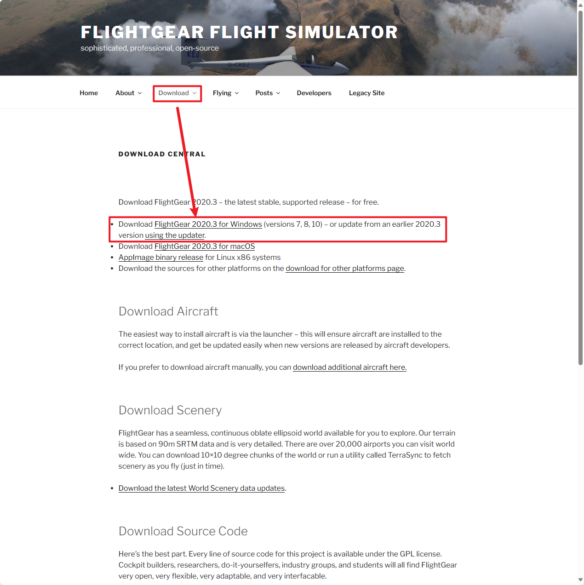

点击之后进入SourceForge，等待5秒钟之后自动下载。

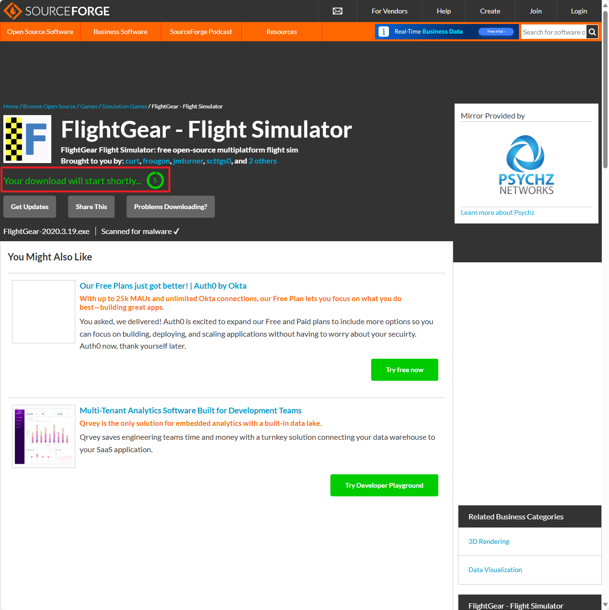

等`FlightGear-2020.3.19.exe`下载完毕后，双击该程序安装FlightGear，一路点击`Next`或者`Install`即可。


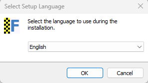

这里没有中文可以选，就用英文了。


这里记得选择接受该许可证。

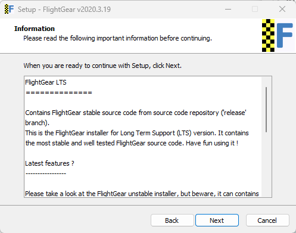

后面的步骤一直点击`Next`或者`Install`即可，注意安装FlightGear的安装路径，安装到一个自己记得住的位置。

至此，FlightGear安装完毕。

# 二、FlightGear+MATLAB联合仿真

## 第一步 复制文件

需要把MATLAB里面的`..\MATLAB R2018b\toolbox\aero\astdemos`文件夹全部复制一份到FlightGear里，FlightGear文件夹位置为`...\FlightGear 2020.3\data\Aircraft`里。

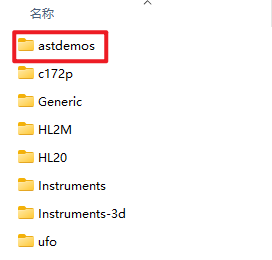

## 第二步 新建文件夹

（可选）为了查看方便，可以自己新建一个文件夹，我起名为`FlightGear_Simu`，大家按自己喜好取名就好。建一个新文件夹的目的是为了自己好找到MATLAB的demo，不然它藏在电脑的犄角旮旯里，很难找到。

## 第三步 打开demo

在MATLAB命令行里输入

```matlab
asbhl20
```

MATLAB里面有一个与FlightGear联合仿真的demo，用的是NASA HL20飞行器，我们只需要调用这个demo学习就好。上面的代码就是调出来这个demo的命令。

## 第四步 demo说明

输入指令之后，会在MATLAB里面弹出来下面这样的界面。


上方红框区域为`asbhl20`的文件，说明了demo所有使用到的文件。

下方红框区域告诉了我们这个demo的位置，找到这个文件夹的位置，即`../MATLAB\Projects\slexamples\asbhl202`。这里最后的`asbhl202`的第3个文件夹，因为之间我创建过2个相同的demo了。如果大家是第一次调用`asbhl20`demo的话，它的文件夹名字是`asbhl20`。所以如果看见和我不一样的文件夹名字，请不用疑惑。

把文件夹`../MATLAB\Projects\slexamples\asbhl202`所有文件复制到前述步骤中新建的文件夹`FlightGear_Simu`里。如下图所示。

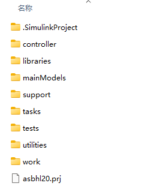

## 第五步 打开Simulink

打开`asbhl20.prj`，会弹出来下图所示的Simulink界面。


## 第六步 连接FlightGear

看见右上角红色边框的`FlightGear Install FlightGear`了么，现在要打开它，调出来下图所示界面。

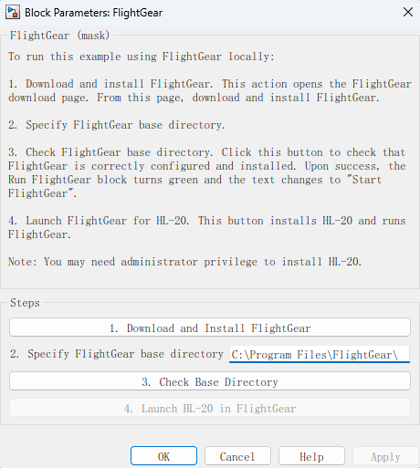


这个界面分成了4个step。

Step 1：下载并且安装FlightGear。这一步我们之前已经做过了，所以不用再做。

Step 2：设置FlightGear路径。把之前安装FlightGear的路径填进去即可。

Step 3：检查路径是否正确。设置好路径之后，点击这个按钮，它会自动检查路径有没有设置正确。设置正确了才能进行Step 4。

Step 4：打开FlightGear。这个Step可以不用做，等到下一步再打开。我们不要从这里打开FlightGear，因为有一些必要的参数还没有设置好，等把所有参数设置好之后，再打开FlightGear。

## 第七步 设置FlightGear

再回到Simulink界面。


注意到`FlightGear Install FlightGear`下面的`Viewer and Feedback`了么，点这个框里的下箭头。进入下图所示界面。


再点击红框内的模块，进入如下所示界面。

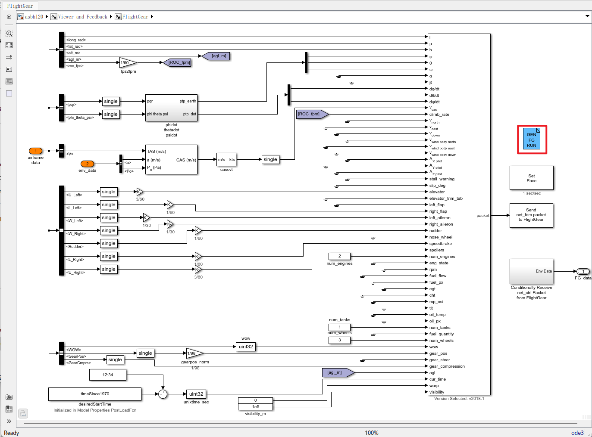

## 第八步 生成FlightGear连接文件

### FlightGear的设置

选中左上角的`GEN FG RUN`模块，双击这个模块，得到如下图所示的界面。

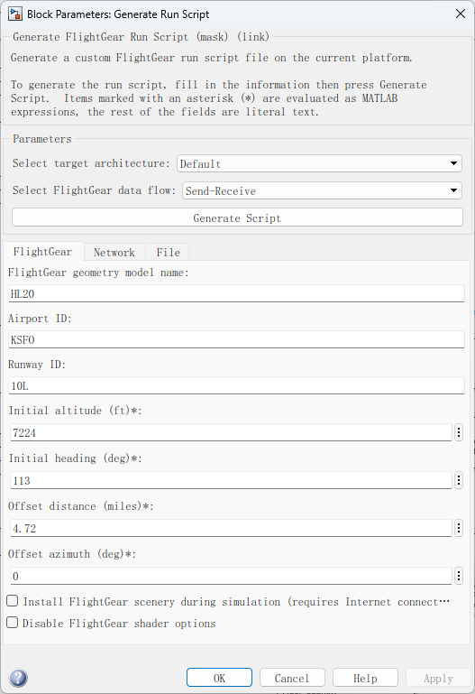

首先要设置的是FlightGear的基础参数，在`Parameters`区域里面，`Select target architecture`选择`default`选项，`Select FlightGear data flow`选择`Send-Recieve`选项。这里我觉得选择`Send`也可以，因为只有Simulink给FlightGear传输数据，FlightGear不会给Simulink传输数据，所以Simulink可以不用recieve数据。不过因为这是demo的缺省值，就不再动它了。

- `FlightGear geometry model name`：要使用的飞行器模型名字，需要和`xxx-set.xml`一致，demo这里就是需要与`HL20-set.xml`一致；
- `Airport ID`：机场编号，这里缺省值为`KSFO`机场；
- `Initial altitude`：初始高度，单位为英尺（ft）；
- `Initial heading`：初始朝向角，单位为度（deg）；
- `Offset distance`：偏移距离，单位为英里（miles）；
- `Offset azimuth`：偏移方位角，单位为度（deg）。

上述设置demo已经设置好了，不用更改任何设置。

> 值得一提的是，`Install FlightGear scenery during simulation (requires Internet connect...`这个选项最好勾选上。因为第一次打开FlightGear时，很有可能没有地景图片，导致启动FlightGear后显示不了地面。勾选这个选项之后，它会在第一次打开FlightGear的时候，自动下载地景。**这个选项要求具备必须的网络条件。**如果没有，请看第4.3节所述方法。

### Network的设置

再进入`Network`的设置，点击`Network`，得到下图所示界面。

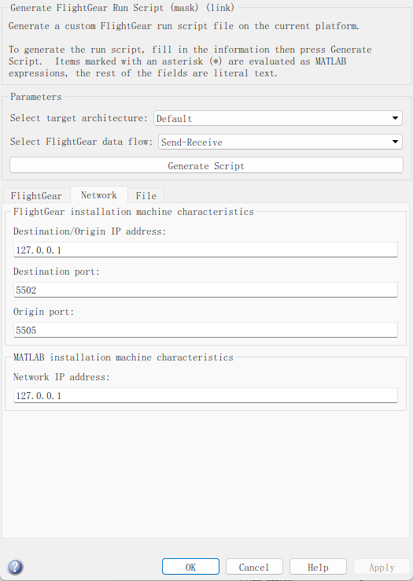

- `Destination address`：FlightGear所在计算机的IP地址，如果有多台计算机同时仿真，要填写FlightGear所在计算机的IP地址。
- `Origin IP address`：Simulink所在计算机的IP地址，缺省值为127.0.0.1，即FlightGear和Simulink都在一台计算机上运行。如果有多台计算机同时仿真，要填写Simulink所在计算机的IP地址。
- `Destination port`：UDP通信端口，即FlightGear监听的端口，用于接收来自Simulink的数据，需要与FlightGear配置中设置的端口一致，以便正确接收数据。从5501开始，这里设置的是5502。
- `Origin Port`：Simulink发送数据到FlightGear所使用的端口，Simulink一般会自动生成。

**上述端口必须确保没有被其他软件占用。**

### File的设置

最后进入`File`的设置，点击`File`，得到下图所示界面。


- `Output file name`：生成的FlightGear运行脚本的文件名，启动FlightGear模拟器的命令脚本，包含所有必要的初始参数和设置，可自己定义文件名。
- `FlightGear base directory`：指定FlightGear安装的基本目录，即FlightGear的主文件夹路径，在**第六步**已经设置完毕。

### 生成.bat文件

经过上面三部分的设置，最后需要生成.bat文件，用以启动FlightGear。点击上图中`Parameters`部分的`Generate Script`按钮，即可在`../FlightGear_Simu/work`（自己新建的文件夹，还记得之前的内容吗）里生成一个名为`runfg.bat`的批处理文件。

## 第九步 启动FlightGear

现在要启动FlightGear，假设刚才大家已经设置好了所有FlightGear参数，并且**没有关闭Simulink**。找到刚才生成的`runfg.bat`文件，双击，它会自动打开FlightGear，如下图所示。

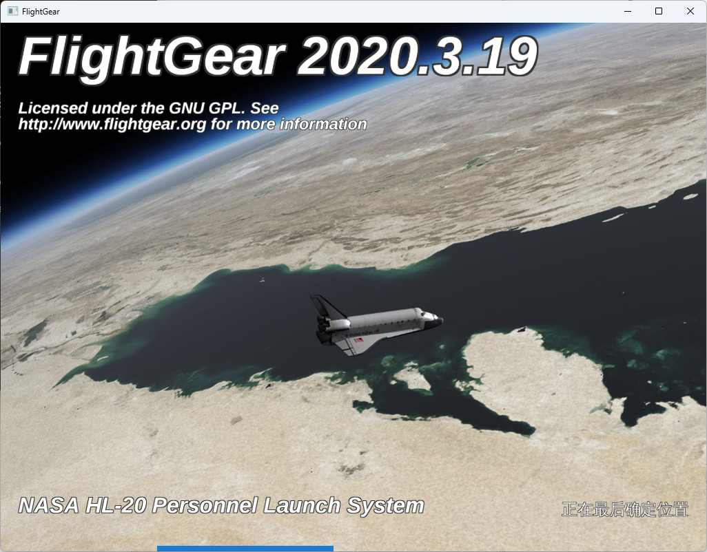

等待几秒钟后，进入FlightGear。


可以看见地面上已经有场景了，说明我们成功地下载好了地景。但是还没有显示飞行器，按`v`键转换视角，即可显示飞行器。

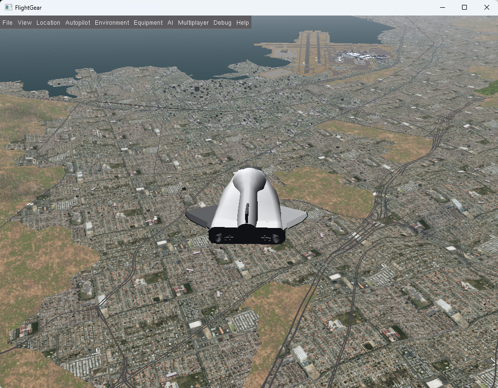

> 注意：假如按`v`键没有反应，很有可能因为计算机正在使用中文输入法，请切换到英文输入法再按`v`键切换视角。

## 第十步 FlightGear+MATLAB联合仿真

回到Simulink，点击运行。即可看见Simulink在运行的同时，FlightGear的场景也会随之变化，直至飞行器成功降落至机场。

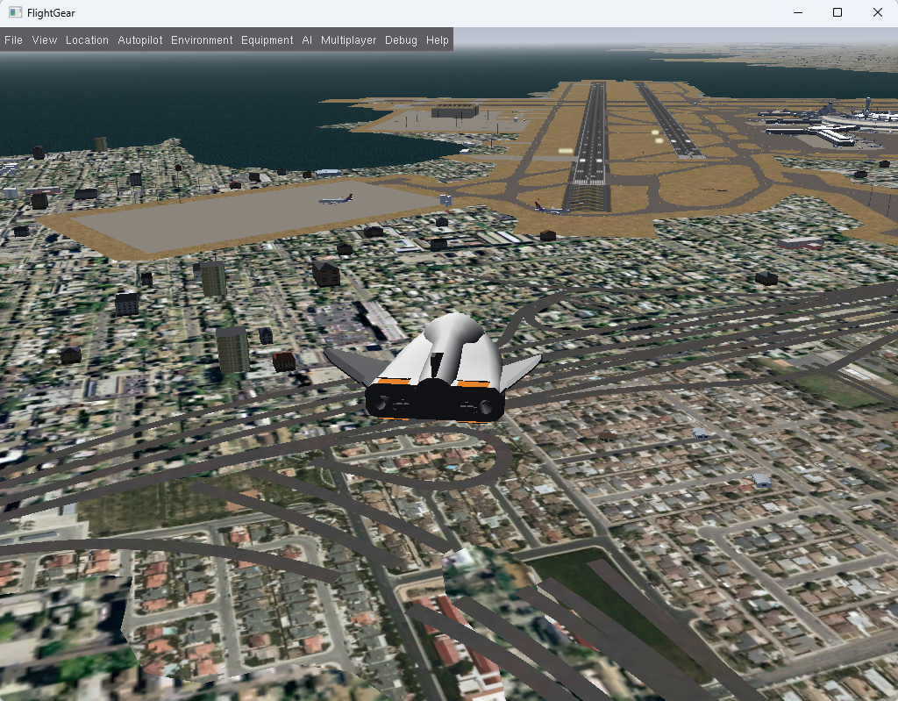

至此，大功告成。

# 三、飞行手柄的连接

我们使用的手柄是罗技X56，如下图所示。


左边是油门，右边是飞行摇杆。摇杆可实现六轴自由度。

在Simulink连接X56，要用到组件库中`Joystick Input`模块。

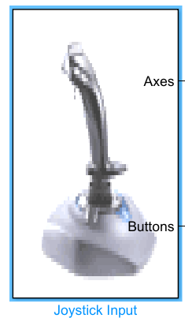

这里要使用的是飞行摇杆来控制飞行器姿态，所以只需要用到`Axes`的输出即可。`Axes`的输出是5维的，用`demux`分成5维即可。唯一需要提醒的就是，第1维控制的是俯仰角，第2维控制的滚转角，第5维控制的是偏航角，第3、4维没有用到。

至于`Buttons`的使用，可以从`Joystick Input`的`Buttons`接一个`display`，观察按下不同按钮的时候`display`里面的值怎么变化。之后可以用作标志位。

# 四、Notice

## 4.1 MATLAB与FlightGear的连接方式

MATLAB与FlightGear连接有2种方式。

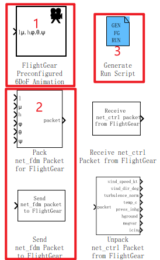

### 第1种方式

数字“1”红框中带有摄像机的模块是第1种。输入信息为经度、纬度、高度（前三者单位为度数）和三轴角速度（单位为弧度），数据类型均为`double`类型。我们一般得到的都是XYZ三维坐标，需要把该三维坐标转换为经纬度。

> `FlightGear Preconfigured 6DoF Animation`模块在Simulink中只能存在一个，因为模块里包含了一个`Set Pace`模块。有`FlightGear Preconfigured 6DoF Animation`模块，Simulink也只会生效一个 。

### 第2种方式

数字“2”红框中的`Pack net_fdm Packet for FlightGear`模块和`Send net_ctrl Packet from FlightGear`模块是第2种。输入信息为经度、纬度、高度和三轴角速度（单位皆为弧度），经度、纬度和高度的数据类型为`double`类型，三轴角速度的数据类型为`single`类型。注意数据类型之间的转换关系。

当然，也可以选择更多要输出到FlightGear里的数据，如下图所示。

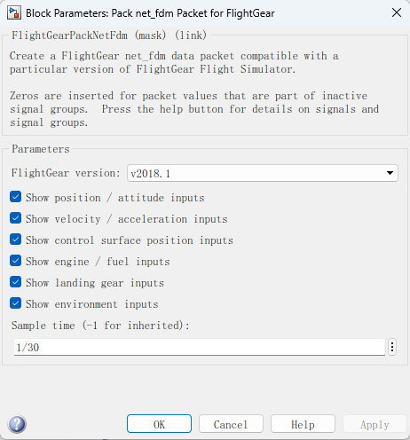

> 还要注意一点的就是，要输出到FLightGear的数据要先进入`Pack net_fdm Packet for FlightGear`模块，再从`Pack net_fdm Packet for FlightGear`的`packet`接口接到`Send net_ctrl Packet from FlightGear`模块里。
>
> 像这样。
>
> 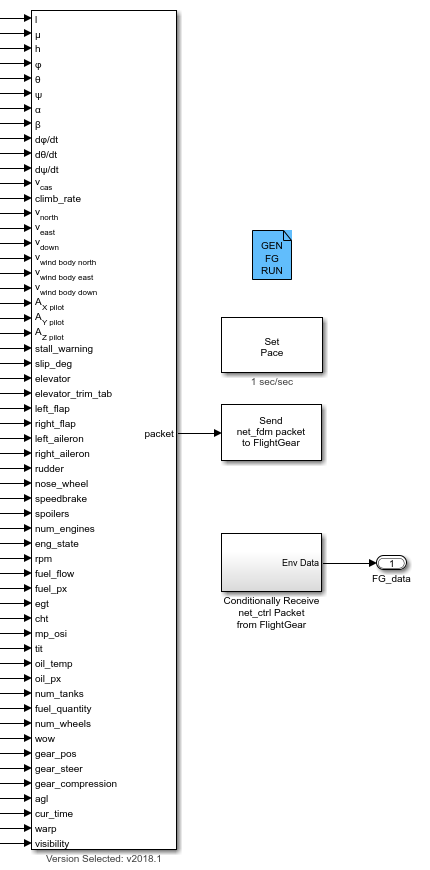

至于数字“3”红框中的`GEN FG RUN`模块则是不论用哪种方法，都需要配上的模块。

## 4.2 修改模型的方式

在`../FlightGear 2020.3\data\Aircraft`里会有HL20模型的出现。

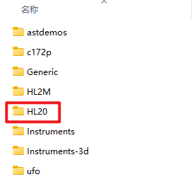

点进去会有一个`HL20-set.xml`文件，里面规定HL20模型的必需参数，要修改模型外观，就需要点开`HL20->Models->HL20.ac`，用`AC3D`软件打开这个.ac文件，按需修改即可。

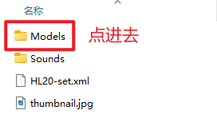


要记得把修改后的.ac文件修改名字，然后在`xxx-set.xml`里面把相应的名称换成修改后的名字。

举个例子，我要做个导弹的模型，那么可以拿`HL20.ac`作为母本，用AC3D打开它然后修改，修改完毕后保存为`Missle.ac`。随后，记得在`HL20-set.xml`里，把所有`HL20`全部替换为`Missle`。

至于文件夹里的`thumbnail.jpg`和`hl20_glass.png`是HL20飞机的纹理文件，可以不用理他。

## 4.3 地景地图的下载

 在官网（https://www.flightgear.org/）里选择`Download`，找到`Download Scenery`那一项，点进去。建议下载v1.0.1，占用的空间不大，足够使用。

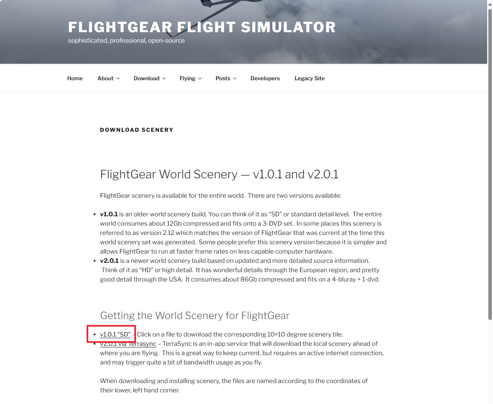

点击红框部分，进入到下面的界面。

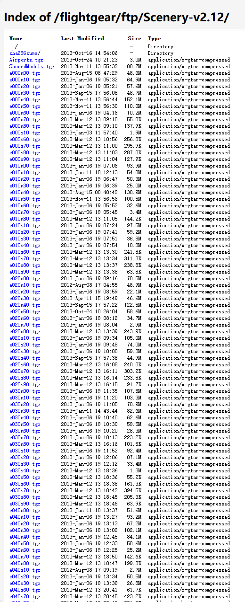

它是以经纬度为划分准则。

- “e”代表东经；
- “w”代表西经；
- “n”代表北纬；
- “s”代表南纬。

根据自己的需要，找到对应机场的经纬度，下载相应的地景包就好了。下好的文件是.tgz格式的，下载好之后，把它解压，再把解压后的文件放到`../FilghtGear 2020.3/data/Scenery/Terrain`里。像下面这这样子。


# 参考文章

[1] matlab与flightGear联合仿真. （https://blog.csdn.net/zhengluanfeng1985/article/details/104776644）

[2] 【Matlab】详解Simulink中的Joystick Input模块（介绍+测试+应用）. （https://blog.csdn.net/qq_40344790/article/details/118079923）
