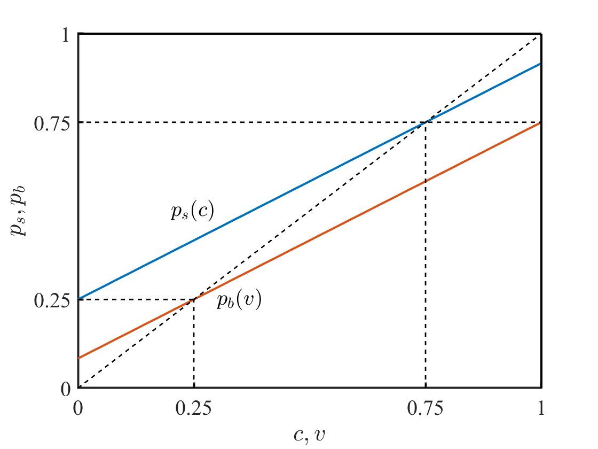
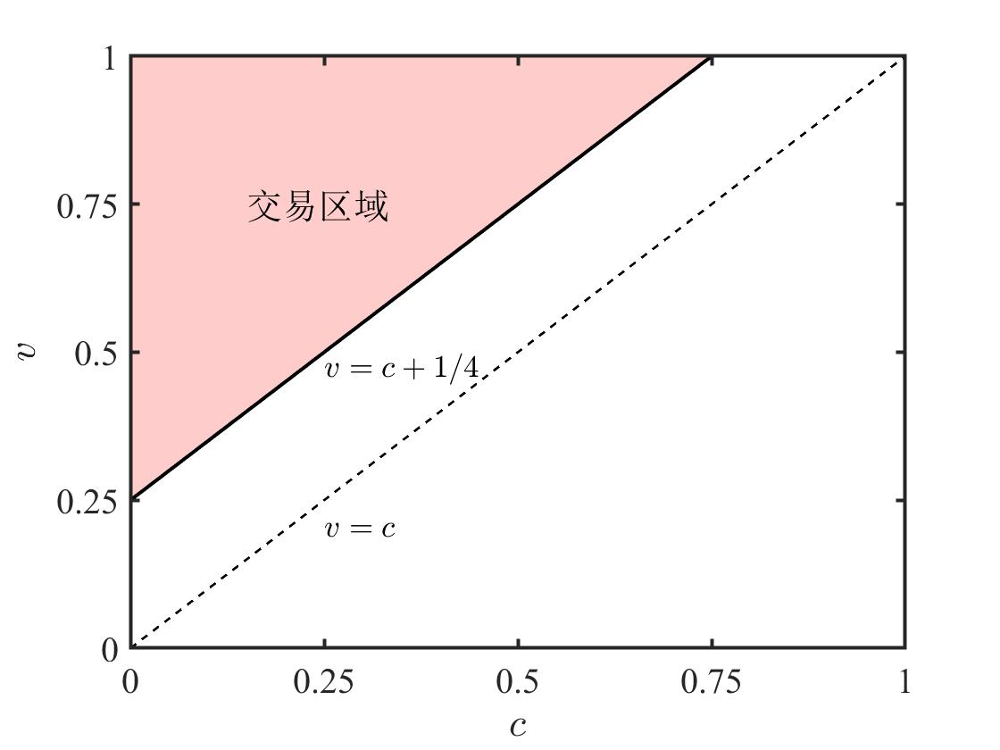

[TOC]


# 一、数学模型：双方叫价拍卖模型

考虑一类双方叫价拍卖（double auction），潜在的卖方和买方同时开价，卖方提出要价（asking price），买方提出出价（bidding price），拍卖商选择成交价格$p$清算市场。交易规则为

> 1. 所有要价低于$p$的卖方卖出，所有出价高于$p$的买方买入；
> 2. 在价格$p$下的总供给等于总需求。

查特金和萨缪尔逊（Chatterjee and Samuelson,1983）建立了一个简单双方叫价拍卖模型。

该模型中，有一个卖方和一个买方。卖方提供该商品的成本为$c$，或者说，该商品对卖方的价值为$c$；该商品对买方的价值为$v$。

> 注：$c \in [0,1]$，$v \in [0,1]$。

该模型的具体流程为

> 1. 同时地，卖方提出要价$p_s \in [0,1]$，买方提出出价$p_b \in [0,1]$；
>
> 2. 若$p_b \ge p_s$，双方在$p = (p_s+p_b)/2$上成交；卖方的博弈收益为$u_s = (p_s + p_b)/2 -c$，买方的博弈收益为$u_b = v - (p_b+p_s)$；
>
> 3. 若$p_b < p_s$，没有交易发生；卖方和买方的效用均为$0$。

# 二、问题描述：贝叶斯博弈模型

现在考虑不完全信息的情况，即

> 1. 只有卖方知道$c$（卖方提供该商品的成本）；
> 2. 只有买方知道$v$（该商品对买方的价值）；
> 3. $c$和$v$在$[0,1]$均匀分布，概率分布函数$f(x)=1/(b-a) \quad x \in [a,b]$为公共知识。

在该贝叶斯博弈中，卖方的策略（即要价）$p_s$是$c$的函数，为$p_s(c)$；买方的策略（即出价）$p_b$是$v$的函数，为$p_b(v)$。策略组合$(p_s^*(c),p_b^*(v))$是一个贝叶斯均衡（Bayesian Nash Equilibrium，BNE），假定下列两个条件成立：

1. **卖方最优**：对于所有的$c \in [0,1]$，$p_s^*(c)$是下列最优化问题的解，为
   $$
   \max_{p_s} u_s = \max_{p_s}\left [ \frac{1}{2}(p_s + \text{E}[p_b(v)|p_b(v) \ge p_s]) - c \right ]\cdot \text{Prob}\{ p_b(v) \ge p_s \}
   $$
   
   式中，$\text{E}[p_b(v)|p_b(v) \ge p_s]$为给定买方的出价**高于**卖方的要价的条件下，卖方预期**买方的出价**。
   
2. **买方最优**：对于所有的$v \in [0,1]$，$p_b^*(c)$是下列最优化问题的解，为

   $$
   \max_{p_b} u_b = \max_{p_b}\left [v- \frac{1}{2}(p_b + \text{E}[p_s(c)|p_b \ge p_s(c)])\right ]\cdot \text{Prob}\{ p_b \ge p_s(c) \}
   $$

   式中，$\text{E}[p_s(c)|p_b \ge p_s(c)])$为给定买方的出价**高于**卖方的要价的条件下，买方预期**卖方的要价**。

> **问题1**：为什么会有上述两个目标函数的形式？
>
> **回答**：见前文提到的模型流程，在$p_b \ge p_s$的条件下，双方在$p = (p_s+p_b)/2$上成交。卖方的博弈收益为$u_s = (p_s + p_b)/2 -c$，$p_s$是卖方可以确定的变量，那么$p_b$要满足$p_b \ge p_s$的条件，所以要计算$p_b$在$p_b \ge p_s$内的期望博弈收益，写为$\text{E}[p_b(v)|p_b(v) \ge p_s])$。
>
> 买方的博弈收益为$u_b = v - (p_b+p_s)$，$p_b$是买方可以确定的变量，那么$p_s$要满足$p_b \ge p_s$的条件所以要计算$p_s$在$p_b \ge p_s$内的期望博弈收益，写为$\text{E}[p_s(c)|p_b \ge p_s(c)]$。

# 三、理论方法：贝叶斯均衡的解法

该贝叶斯博弈有多种BNE，首先考虑一类线性策略均衡，表达式为

$$
\left \{\begin{aligned}
&p_s(c) = \alpha_s + \beta_s c, \\
&p_b(v) = \alpha_b + \beta_b c.
\end{aligned}\right.
$$

## 3.1 求解卖方的目标函数

先求解卖方的目标函数，为此，要先求解下面两个式子，分别是

$$
\text{Prob}\{p_b(v) \ge p_s \}
$$

和

$$
\text{E}[p_b(v)|p_b(v) \ge p_s]
$$

### 3.1.1 求解$\text{Prob}\{p_b(v) \ge p_s \}$

可以将买方出价$p_b(v)$大于等于卖方要价$p_s$的概率表示为

$$
\text{Prob}\{p_b(v) \ge p_s\} = \text{Prob}\{\alpha_b + \beta_b v \ge p_s\}.
$$

随后，解不等式$\alpha_b + \beta_b v \ge p_s$，为

$$
v \ge \frac{p_s - \alpha_b}{\beta_b}.
$$

由于$v$在$[0,1]$上均匀分布，因此$v$大于等于$\frac{p_s - \alpha_b}{\beta_b}$的概率为

$$
\text{Prob}\left\{v \ge \frac{p_s - \alpha_b}{\beta_b}\right\} = 1 - \frac{p_s - \alpha_b}{\beta_b},
$$

化简得到下式，为

$$
\text{Prob}\{p_b(v) \ge p_s\} = (\alpha_b + \beta_b - p_s) / \beta_b.
$$

### 3.1.2 求解$\text{E}[p_b(v)|p_b(v) \ge p_s]$

根据条件期望的定义（见附录），而且根据条件概率$p_b(v) \ge p_s$，得到积分上限为$\alpha_b+\beta_b$，积分下限为$p_s$，因为$p_b(v)$在$[\alpha_b, \alpha_b + \beta_b]$上均匀分布，得到


$$
\text{E}\{p_b(v) | p_b(v) \ge p_s\} = \frac{\int_{p_s}^{\alpha_b + \beta_b} x f(x) \text{d}x}{\text{Prob}\{p_b(v) \ge p_s\}},
$$

其中，$f(x)$是$p_b(v)$的概率密度函数。由于$p_b(v)$在$[\alpha_b, \alpha_b + \beta_b]$上均匀分布，因此$f(x) = \frac{1}{\beta_b}$。代入上式，为

$$
\text{E}\{p_b(v) | p_b(v) \ge p_s\} = \frac{\frac{1}{\beta_b} \int_{p_s}^{\alpha_b + \beta_b} x \text{d}x}{\text{Prob}\{p_b(v) \ge p_s\}},
$$

计算积分$\int_{p_s}^{\alpha_b + \beta_b} x \text{d}x$，为

$$
\int_{p_s}^{\alpha_b + \beta_b} x \text{d}x = \left. \frac{x^2}{2} \right|_{p_s}^{\alpha_b + \beta_b} = \frac{(\alpha_b + \beta_b)^2}{2} - \frac{p_s^2}{2},
$$

代入上式，为

$$
\text{E}\{p_b(v) | p_b(v) \ge p_s\} = \frac{\frac{1}{\beta_b} \left( \frac{(\alpha_b + \beta_b)^2}{2} - \frac{p_s^2}{2} \right)}{\frac{\alpha_b + \beta_b - p_s}{\beta_b}},
$$

化简为

$$
\text{E}\{p_b(v) | p_b(v) \ge p_s\} = \frac{(\alpha_b + \beta_b)^2 - p_s^2}{2(\alpha_b + \beta_b - p_s)},
$$

进一步得到

$$
\text{E}\{p_b(v) | p_b(v) \ge p_s\} = 0.5 (p_s + \alpha_b + \beta_b).
$$

### 3.1.3 求解卖方的目标函数

将得到的$\text{Prob}\{p_b(v) \ge p_s\} = (\alpha_b + \beta_b - p_s)/\beta_b$和$\text{E}\{p_b(v) | p_b(v) \ge p_s\} = 0.5 (p_s + \alpha_b + \beta_b)$代入卖方的目标函数，有

$$
\begin{aligned}
& \max_{p_s}\left [ \frac{1}{2}(p_s + \text{E}[p_b(v)|p_b(v) \ge p_s]) - c \right ]\cdot \text{Prob}\{ p_b(v) \ge p_s \}, \\
\Rightarrow & \max_{p_s}\left [ \frac{1}{2}(p_s +  \frac{1}{2} (p_s + \alpha_b + \beta_b)) - c \right ]\cdot (\alpha_b + \beta_b - p_s),	\\
\Rightarrow & \max_{p_s}\left [ \frac{1}{2}(p_s +  \frac{1}{2} p_s + \frac{1}{2} \alpha_b + \frac{1}{2} \beta_b) - c \right ]\cdot (\alpha_b + \beta_b - p_s),	\\
\Rightarrow & \max_{p_s}\left [\frac{3}{4} p_s + \frac{1}{4} \alpha_b + \frac{1}{4} \beta_b - c \right ]\cdot (\alpha_b + \beta_b - p_s),	\\
\end{aligned}
$$

对$p_s$求偏导，获得一阶最优化条件，为

$$
\begin{aligned}
\frac{\partial u_s}{\partial p_s} &= \frac{\partial \left [\frac{3}{4} p_s + \frac{1}{4} \alpha_b + \frac{1}{4} \beta_b - c \right ]\cdot (\alpha_b + \beta_b - p_s)}{\partial p_s},	\\
&= \frac{3}{4} \cdot \frac{\alpha_b + \beta_b - p_s}{\beta_b} - \frac{1}{\beta_b} (\frac{3}{4} p_s + \frac{1}{4} \alpha_b + \frac{1}{4} \beta_b - c),	\\
&= \frac{3}{4\beta_b} \cdot (\alpha_b + \beta_b - p_s) - \frac{3}{4\beta_b} (p_s + \frac{1}{3}\alpha_b + \frac{1}{3}\beta_b - \frac{4c}{3}),	\\
&= \frac{3}{4\beta_b} \cdot (\frac{2}{3}\alpha_b + \frac{2}{3}\beta_b - 2p_s + \frac{4c}{3}).
\end{aligned}
$$

令

$$
\frac{\partial u_s}{\partial p_s} = \frac{3}{4\beta_b} \cdot (\frac{2}{3}\alpha_b + \frac{2}{3}\beta_b - 2p_s + \frac{4c}{3}) = 0,
$$

前者不会为$0$，只能让后者为$0$，有

$$
\frac{2}{3}\alpha_b + \frac{2}{3}\beta_b - 2p_s + \frac{4c}{3} = 0,
$$

化简得到

$$
\boxed{p_s = \frac{1}{3}(\alpha_b + \beta_b) + \frac{2}{3}c.}
$$

## 3.2 求解买方的目标函数

再求解买方的目标函数，同样地，要先求解下面两个式子，分别是

$$
\text{Prob}\{p_b \ge p_s(c) \}
$$

和

$$
\text{E}[p_s(c)|p_b \ge p_s(c)]
$$

### 3.2.1 求解$\text{Prob}\{p_b \ge p_s(c) \}$

可以将买方出价$p_b$大于等于卖方要价$p_s(c)$的概率表示为

$$
\text{Prob}\{p_b \ge p_s(c)\} = \text{Prob}\{p_b \ge \alpha_s + \beta_s c\}.
$$

随后，解不等式$p_b \ge \alpha_s + \beta_s c$，为

$$
c \le \frac{p_b - \alpha_s}{\beta_s}.
$$

由于$c$在$[0,1]$上均匀分布，因此$c$小于等等于$\frac{p_b - \alpha_s}{\beta_s}$的概率为

$$
\text{Prob}\left\{c \le \frac{p_b - \alpha_s}{\beta_s}\right\} = \frac{p_b - \alpha_s}{\beta_s},
$$

化简得到下式，为

$$
\text{Prob}\{p_b \ge p_s(c) \} = (p_b - \alpha_s)/\beta_s.
$$

### 3.2.2 求解$\text{E}[p_s(c)|p_b \ge p_s(c)]$

根据条件期望的定义（见附录），而且根据条件概率$p_b \ge p_s(c)$，得到积分上限为$p_b$，积分下限为$\alpha_s$，因为$p_s(c)$在$[\alpha_s, \alpha_s + \beta_s]$上均匀分布，得到


$$
\text{E}[p_s(c)| p_b \ge p_s(c)] = \frac{\int_{\alpha_s}^{p_b} x f(x) \text{d}x}{\text{Prob}\{p_b \ge p_s(c)\}},
$$

其中，$f(x)$是$p_s(c)$的概率密度函数。由于$p_s(c)$在$[\alpha_s, \alpha_s + \beta_s]$上均匀分布，因此$f(x) = \frac{1}{\beta_s}$。代入上式，为

$$
\text{E}\{p_b(v) | p_b \ge p_s(c)\} = \frac{\frac{1}{\beta_s} \int_{\alpha_s}^{p_b} x \text{d}x}{\text{Prob}\{p_b \ge p_s(c)\}},
$$

计算积分$ \int_{\alpha_s}^{p_b} x \text{d}x$，为

$$
\int_{\alpha_s}^{p_b} x \text{d}x = \left. \frac{x^2}{2} \right|_{\alpha_s}^{p_b} = \frac{p_b^2-\alpha_s^2}{2},
$$

代入上式，为

$$
\text{E}\{p_b(v) | p_b \ge p_s(c)\} = \frac{\frac{1}{\beta_b} \left( \frac{p_b^2-\alpha_s^2}{2} \right)}{\frac{p_b - \alpha_s}{\beta_s}},
$$

化简为

$$
\text{E}\{p_b(v) | p_b \ge p_s(c)\} = \frac{(p_b - \alpha_s)(p_b + \alpha_s)}{2(p_b - \alpha_s)},
$$

进一步得到

$$
\text{E}\{p_b(v) | p_b \ge p_s(c)\} = 0.5 (p_b + \alpha_s).
$$

### 3.2.3 求解买方的目标函数

将得到的$\text{Prob}\{p_b \ge p_s(c) \} = (p_b - \alpha_s)/\beta_s$和$\text{E}\{p_b(v) | p_b \ge p_s(c)\} = 0.5 (p_b + \alpha_s)$代入卖方的目标函数，有

$$
\begin{aligned}
& \max_{p_b}\left [v- \frac{1}{2}(p_b + \text{E}[p_s(c)|p_b \ge p_s(c)])\right ]\cdot \text{Prob}\{ p_b \ge p_s(c) \}, \\
\Rightarrow & \max_{p_b}\left [v- \frac{1}{2}(p_b + \frac{1}{2} (p_b + \alpha_s))\right ]\cdot (p_b - \alpha_s)/\beta_s,	\\
\Rightarrow & \max_{p_b}\left [v- \frac{1}{2}(p_b + \frac{1}{2}p_b + \frac{1}{2}\alpha_s)\right ]\cdot (p_b - \alpha_s)/\beta_s,	\\
\Rightarrow & \max_{p_b}\left [v- \frac{1}{2}(\frac{3}{2}p_b + \frac{1}{2}\alpha_s)\right ]\cdot (p_b - \alpha_s)/\beta_s,	\\
\Rightarrow & \max_{p_b}\left [v- \frac{3}{4}p_b - \frac{1}{4}\alpha_s \right ]\cdot (p_b - \alpha_s)/\beta_s,	\\
\end{aligned}
$$

对$p_s$求偏导，获得一阶最优化条件，为

$$
\begin{aligned}
\frac{\partial u_b}{\partial p_b} &= \frac{\partial \left [v- \frac{3}{4}p_b - \frac{1}{4}\alpha_s \right ]\cdot (p_b - \alpha_s)/\beta_s}{\partial p_b},	\\
&= -\frac{3}{4} \frac{p_b-\alpha_b}{\beta_s} + \frac{1}{\beta_s}(v - \frac{3}{4}p_b - \frac{1}{4}\alpha_s), \\
&= \frac{3}{4 \beta_s}(\alpha_b-p_b) + \frac{3}{4\beta_s}(\frac{4}{3}v - p_b - \frac{1}{3}\alpha_s), \\
&= \frac{3}{4 \beta_s}(\frac{2}{3}\alpha_b - 2 p_b + \frac{4}{3}v)
\end{aligned}
$$

令

$$
\frac{\partial u_s}{\partial p_s} = \frac{3}{4 \beta_s}(\frac{2}{3}\alpha_b - 2 p_b + \frac{4}{3}v) = 0,
$$

前者不会为$0$，只能让后者为$0$，有

$$
\frac{2}{3}\alpha_b - 2 p_b + \frac{4}{3}v = 0,
$$

化简得到

$$
\boxed{p_b = \frac{1}{3}\alpha_s + \frac{2}{3}v.}
$$

## 3.3 求解BNE

重写一遍卖家和买家的一阶最优化条件，为

$$
\left \{\begin{aligned}
&p_s(c) = \frac{1}{3}(\alpha_b + \beta_b) + \frac{2}{3}c, \\
&p_b(v) = \frac{1}{3}\alpha_s + \frac{2}{3}v.
\end{aligned}\right.
$$

再列出$p_s(c)$和$p_b(v)$，方便对比，为

$$
\left \{\begin{aligned}
&p_s(c) = \alpha_s + \beta_s c, \\
&p_b(v) = \alpha_b + \beta_b v.
\end{aligned}\right.
$$

通过目测法，可以观察得到

$$
\left \{\begin{aligned}
\beta_s = \frac{2}{3},\\
\beta_b = \frac{2}{3}.
\end{aligned}\right.
$$


把$\beta_s$和$\beta_b$代入卖家和买家的一阶最优化条件，得到
$$
\left \{ \begin{aligned}
&\frac{1}{3}\alpha_s = \alpha_b,\\
&\frac{1}{3}(\alpha_b+\frac{2}{3}) = \alpha_s.
\end{aligned}\right.
$$

联立求解，得到

$$
\left \{\begin{aligned}
&\alpha_s = \frac{1}{4},\\
&\alpha_b = \frac{1}{12}.
\end{aligned}\right.
$$

那么，卖方和买方的BNE为

$$
\left \{\begin{aligned}
&p_s(c) = \frac{1}{4} + \frac{2}{3} c, \\
&p_b(v) = \frac{1}{12} + \frac{2}{3} v.
\end{aligned}\right.
$$


# 四、结果分析

## 4.1 卖方的策略

对于卖方而言，令要价小于成本，有

$$
\frac{1}{4} + \frac{2}{3}c < c \Rightarrow c > \frac{3}{4}
$$

意为当$c > 3/4$时，卖方的要价低于成本，这对卖方来说不划算。

买方的最高报价为$p_b(1) = 1/12+2/3= 3/4$，等于卖方的要价均衡点$p_s(3/4)=1/4+2/3\cdot 3/4=3/4$。也就是说，卖方在$c>3/4$给出要价，成本会比要价高，卖方不会这样行动，故买卖双方的最高要价/出价不会高于$3/4$。

所以，**卖方要价低于成本的情况不会出现**。

## 4.2 买方的策略

对于买方而言，令出价高于成本，有

$$
\frac{1}{12} + \frac{2}{3}v > v \Rightarrow v < \frac{1}{4}
$$

意为当$v < 1/4$时，买方的出价高于成本，这对买方来说不划算。

卖方的最低报价为$p_s(0) = 1/4$，等于买方的出价均衡点$p_b(1/4)=1/12+2/3\cdot 1/4=1/4$。也就是说，买方在$v<1/4$给出出价，成本会比出价低，买方不会这样行动，故买卖双方的最低要价/出价不会低于$1/4$。

所以，**买方出价高于成本的情况不会出现**。

## 4.3 BNE

在均衡情况下，当且仅当买方的出价大于等于卖方的要价时，即

$$
(p_s^*(c),p_b(v)) \le (p_s^*(c),p_b^*(v)) \le (p_s^*(c),p_b(v))
$$

写得更加清晰一些，为

$$
\begin{aligned}
& p_s^*(c) \le p_b^*(v) \\
\Rightarrow & \alpha_s + \beta_s c \le \alpha_b + \beta_s v \\
\Rightarrow & \frac{1}{4} + \frac{2}{3} c \le \frac{1}{12} + \frac{2}{3} c \\
\Rightarrow & c + \frac{1}{4} \le v
\end{aligned}
$$

满足上述条件，买卖双方才会发生交易。

那么，可以画出买卖双方的均衡线性策略图，如下图所示。



画出交易可行区域，如下图所示。



画图所用代码记录在下面，以防忘记。

```matlab
clc;clear;close all;
%% 参数设置
c = 0:1e-2:1;
v = 0:1e-2:1;

ps = 1/4 + 2/3 .* c;
pb = 1/12 + 2/3 .* v;

%% 画图--均衡线性策略
figure('color',[1,1,1]);
plot(c,ps,'LineWidth',1.5);hold on;box off;
plot(v,pb,'LineWidth',1.5);
text(0.2,0.5,'$p_s(c)$','Interpreter','Latex','FontSize',15)
text(0.3,0.25,'$p_b(v)$','Interpreter','Latex','FontSize',15)
plot([0 1],[0 1],'k--','LineWidth',1);
plot([0,1/4],[1/4,1/4],'k--','LineWidth',1);
plot([1/4,1/4],[0,1/4],'k--','LineWidth',1);
plot([0,1],[3/4,3/4],'k--','LineWidth',1);
plot([3/4,3/4],[0,3/4],'k--','LineWidth',1);
plot([0,1],[1,1],'LineWidth',1.5,'color','black');
plot([1,1],[1,0],'LineWidth',1.5,'color','black');
xlabel('$c,v$','Interpreter','Latex');
ylabel('$p_s,p_b$','Interpreter','Latex');
xticks([0 1/4 3/4 1]);
yticks([0 1/4 3/4 1]);
set(gca,'FontName','Times New Roman','FontSize',15,'LineWidth',1.5);

%% 画图--交易区域
v = c+1/4;
figure('color',[1,1,1]);
fill([0 0 3/4],[1/4 1 1],'r','edgecolor',[1,1,1],'FaceAlpha',0.2);hold on;box on;
plot(c,v,'k','LineWidth',1.5);
plot([0 1],[0 1],'k--','LineWidth',1);
xlabel('$v$','Interpreter','Latex');
ylabel('$c$','Interpreter','Latex');
xticks([0 1/4 1/2 3/4 1]);
yticks([0 1/4 1/2 3/4 1]);
axis([0 1 0 1])
set(gca,'FontName','Times New Roman','FontSize',15,'LineWidth',1.5);
text(0.15,0.75,'交易区域','FontSize',15)
text(0.25,0.47,'$v = c + 1/4$','Interpreter','Latex','FontSize',13)
text(0.25,0.2,'$v = c$','Interpreter','Latex','FontSize',13)
```

---

# 参考文献

[1] 张维迎. 博弈论与信息经济学 [M]. 上海: 上海人民出版社, 2013: 154-158.

# 附录

**条件期望的定义**：条件期望是概率论中的一个基本概念，它描述了在给定某些信息的情况下，一个随机变量的期望值。具体来说，设$X$和$Y$是两个随机变量，那么$X$在给定$Y=y$的条件下的期望值，记作$E[X|Y=y]$，定义为：$E[X|Y=y] = \sum_{x} x \cdot P(X=x|Y=y)$。对于连续随机变量，条件期望的定义类似，只是求和变成了积分：$E[X|Y=y] = \int_{-\infty}^{\infty} x \cdot f_{X|Y}(x|y) \text{d}x$。其中，$f_{X|Y}(x|y)$是$X$在给定$Y=y$的条件下的条件概率密度函数。