# 第1讲：概述

## 1 概念内涵

指挥控制(Command and Control，C2)的成效是战争胜负的决定因素，取得体系优势的关键在于指挥控制，战争中任何一项其他活动的重要程度都无法和指挥控制相提并论。

### 1.1 指挥控制的定义

- 中国：指挥员及其指挥机关对部队作战或其行动掌握和制约的活动。**强调指挥员与指挥机关的统一，以及对部队行动的掌控。**
- 美国：经授权的指挥官在执行使命过程中对配属人员行使职权，实施指导。**强调指挥员的职权，以及指挥员的权威。**
- 北约：经授权的指挥官对所分配的兵力行使其指挥与指导权力以完成赋予的使命。**强调权力以及完成使命任务。**

### 1.2 “指挥”与“控制”

- 指挥：解决的是作战当中评估判断、预测、构想、决策等问题，是一种创造性很强的活动。
- 控制：把决心变为现实、逐步实现目标的具体措施和过程，具有创造性，但更富事务性、规范性、程序性和可操作性。
- 如果把兵力比作**马**，指挥则比作**骑手**，控制则比作**挽具**。

### 1.3 相关概念

- 指挥：指挥员下达作战命令、决策和战术操作，包括指挥部队协调军事行动，确保任务的成功执行以及在战场上做出实时的决策等。
- 管理：规划、协调和监督资源和活动，以确保军队能够有效地执行任务并达到其目标。
- 组织：指部队的结构和构造，包括军队的层级、部门等。
- 领导：指在军队中具有权威和激励力的个体或团队，通过鼓励激励、示范和指导来引导他们的部下以实现共同的目标。

## 2 学习意义

### 2.1 学习目的

- 收获一套从观察判断到决策行动的理论框架。

  > 用于指导如何在动态变化条件下，带领团队高效完成使命任务。

- 收获一种军队指挥员的视角。

  > 可用于分析、认知不同领域中面向特定任务的团队组织与指挥领导的问题。

### 2.2 指挥控制的特点

与一般管理活动相比，指挥控制有以下三个特点：

- 群体性（体系性）：组织与组织的对抗，涵盖人、武器和系统，连接调用所有要素，涉及物理、信息、认知、社会等多域。
- 时效性：使命任务有严格的时效要求，必须在指定的时间内完成。
- 不确定性（对抗性）：面对动态变化的环境对手采取的争锋相对的行动。

### 2.3 课程定位

包括5个模块：

- 认识指挥控制：指挥控制的基本概念、主要只能、本质特征等。
- 如何进行组织：指挥控制的过程模型、指挥控制的模式、组织设计的要素与方法等。
- 如何认知态势：态势认知的概念、要素，态势认知相关的模型，从信息论、贝叶斯推断的角度理解态势认知。
- 如何高效决策：决策规划的概念、主要过程与内容，决策问题的分类与决策基本原理，从最优化、不确定性、博弈论等角度理解决策规划。
- 如何控制行动：行动控制的手段与方式，从反馈控制、自组织角度理解行动控制。

## 3 思考题

1. 请简述”指挥“与”控制“的关系。

> 指挥：
>
> - 上层的、宏观的定义。
> - 主要侧重于决策层面，通过对各种信息的综合分析和判断，制定作战任务、目标、战略方针等，为作战行动确定方向和目标，是一种创造性的活动，具有灵活性、策略性、艺术性，需要指挥员具备丰富的经验和卓越的指挥才能。
> - 比如说，指挥是在指挥所里，指挥员带着参谋来设计整个军事行动。
>
> 控制：
>
> - 下层的、微观的定义。
> - 侧重于执行层面，是对作战行动的实时管理和监控，更具事务性、规范性、程序性和可操作性，通过各种技术手段和管理措施，实现对作战行动的有效控制。
> - 比如说，发出指令后，调整整个行动与指挥目标一致的过程。
>
> 指挥与控制的关系：指挥与控制相互依存、相互制约，共同构成指挥控制系统的有机整体，指挥为控制提供目标和方向，控制为指挥提供执行保障和反馈依据，两者通过信息的不断交换和反馈，形成一个动态的闭环系统。比如说，因为不能完全设想行动中的外部变化，指挥需要根据控制过程中的反馈适时调整策略。

2. 请查阅资料找出其他国家对指挥控制的定义，它们的定义和中国的定义有什么异同？

> - **中国**：指挥员及其指挥机关对部队作战或其他行动进行掌握和制约的活动[^1]。
> - **美国**：
>   - 定义：经授权的指挥官在执行使命过程中对配属人员行使职权，实施指导[^2]。
>   - 异同：（1）相同点：都强调了指挥官在其中发挥的领导和决策作用，以及对作战任务的完成有明确的指向。（2）不同点：美国的定义更突出权威性，强调指挥官对部队行使权威和指导，注重自上而下的指挥层级和权力关系；而中国的定义强调指挥员及其指挥机关对部队作战或其他行动进行掌握和制约的活动。
> - **北约**：
>   - 定义：经授权的指挥官对所分配的兵力行使其指挥与指导权力以完成赋予的使命[^2]。
>   - 异同：（1）相同点：都认同指挥控制是指挥官对部队及其作战行动的指引和影响，目的是确保部队行动的协调一致，以达成作战目标。（2）不同点：北约的定义强调 “领导和影响”，比较注重指挥官的个人素质、领导魅力和决策能力等对部队的带动和感召作用，突出指挥官在战场态势理解和决策过程中的关键地位；而中国的定义更强调 “掌握和制约” 的过程，即通过一系列的手段和活动，如情报获取、指挥决策、兵力调配等，来实现对作战行动的有效管控，更侧重于整个指挥控制系统的运行和作用发挥。

3. 请举出几个工作生活中指挥控制的例子。

> 举办晚会，安排A、B、C人员做1、2、3件事情，叫做指挥。ABC人员分别在做123件事情时，实施的具体行动叫做控制。在这个过程中，根据实施行动的情况，反馈指挥人员，调整新的指挥策略，例如：事情1人手不够，需要调拨D、E人员援助，叫做指挥；A安排D、E人员做1-1、1-2件事情，叫做控制。

参考文献：

[^1]: 军事科学院.中国人民解放军军语[M]. 解放军战士出版社,1982.
[^2]: 孙强, 阳东升, 张维明. C2及其相关术语的理解与认识[J]. 火力与指挥控制, 2013, 38(12): 1-5+12.

# 第2讲：主要职能

## 1 概述

### 1.1 指挥员是做什么的

**态势认知**、**决策规划**、**行动控制**。三个核心功能相互关联、影响、支撑。

态势认知是基础，决策规划是作战体系的“大脑”，行动控制是“神经系统”。

指挥控制活动具体包括：

- 构造兵力编成
- 明确指挥控制关系
- 明确指挥编组

指挥控制主要职能：

- 组织设计：针对使命任务、战场环境和可用资源，建立指挥控制组织结构，明确任务分工与指挥控制关系，以有效完成使命任务。

  > 如战斗中的兵力编成、指挥编组，晚会、比赛等活动中的人员编组等。

- 态势认知：对战场状态和形势的认识，包括对战场态势元素的含义理解，以及对未来的改变进行预测，是指挥员对态势进行理解的过程。

  > 如中美博弈战略态势、抗击疫情态势等。

- 决策规划：在态势认知的基础上，确定意图、生成行动方案和计划，并对其效果、效率、代价、风险等进行评估的过程。目的是把有限的资源在正确的时间部署到正确的地点去执行正确的任务，**并在这一过程中实现预设目标的优化**。

  > 如诺曼底登陆中的战略决策与战术选择。

- 行动控制：对可用资源进行组织、协调、掌握、制约的活动，确保行动同步有序，保证行动目标、行动计划的完成。

  > 如人员调动、路线选择与调整等。

## 2 主要职能

### 2.1 态势认知

战场态势包括：敌、我、环境。

> 敌、我（作战态势）：作战各方部署和行动所形成的状态和形势，以及它们的变化发展趋势。
>
> 环境：战场环境的状态与变化发展趋势

> 此外，作战任务及其约束条件、时间与空间关系、机会与风险因素也是战场态势的重要组成部分。

态势有三个层面：

- 战略态势
- 战役态势
- 战术态势

### 2.2 决策规划

决策规划包括：作战决策、任务规划等。

（1）作战决策过程可以分为：筹划、计划两个过程。

- 筹划：从战争全局上进行的运筹谋划，生成决策的总体构想。“运筹帷幄之中决胜千里之外”，说的就是对军事谋略作通盘考虑和全面策划，可以决定千里之外的胜负。
- 计划：决策到行动的重要桥梁，是将作战决策进一步具体化，通盘考虑各参战力量的活动做出的具体安排。拿破仑指出“只有拟定出深思熟虑的计划，才有可能在战争中成功。”

（2）任务规划突出“筹划、计划”中的技术特性，强调过程的工程化、精确化和信息化，是作战决策的一种技术化体现。

### 2.3 行动控制

行动控制包括：作战目标控制、时机的控制、作战进程的控制、协同关系的控制。

- 作战目标控制：作战目标体现着作战行动所要达到的预定目的和企图。
- 时机的控制：是对战争时间、空间因素的充分把握与合理利用。
- 作战进程的控制：控制行动的节奏和速度，按作战计划完成特定作战任务
- 协同关系的控制：及时调整与各参战部队协同关系。

#### 2.3.1 基于计划的反馈式控制

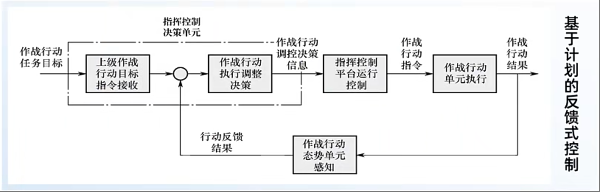

上述流程图为基于计划的反馈式控制，符合控制论的经典思想。

> [!tip]
>
> 例子：**诺曼底登陆**
> 盟军在行动前制定了详细的计划，但在执行过程中，他们不断根据天气、海况、敌方防御等实际情况进行反馈和调整。例如，面对德军的顽强抵抗，盟军不断调整登陆点和进攻策略，最终成功占领了诺曼底。

#### 2.3.2 基于任务的自主式控制

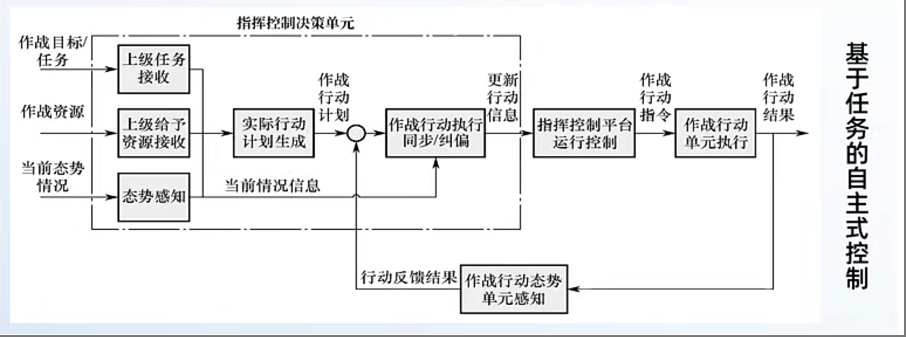

上述流程图为基于任务的自主式控制。强调下级指挥员在理解上级意图后，根据当前情况和可用资源，自我纠偏、自行同步，充分发挥一线自主性应对非预料情况。

> [!tip]
>
> 例子：胡家窝棚战役
>
> - 东北野战军指挥部适时下放指挥权，向各纵队下达指示：**哪里有敌人就往哪里打，哪里有枪声就往哪里追。**
> - 在混战中，廖耀湘的指挥部被打散，导致其兵团失去指挥最终被围歼。廖耀湘将这次战斗描述为“第一棒就打碎了辽西兵团的脑袋”。

### 2.4 组织设计

- 指挥控制组织：由指挥员可调用的各类兵力资源、指挥控制节点等实体，为完成特定使命任务而形成的有机整体，通常具备与使命任务和环境相匹配的兵力编成和指挥关系。

- 兵力编成：指任务部队的兵力组织构成，包括组成的力量和编组形式任务部队是指遂行作战、战备、训练、演习、执勤、施工等任务的部（分）队。

  > 兵力编成需要充分考虑作战任务、作战环境、作战目的、兵力规模等多种因素，通过合理的组织与调配，形成高效、灵活的作战力量。

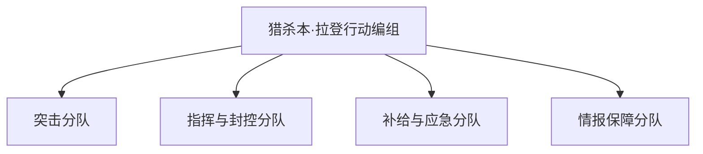

- 指挥关系：指挥关系明确了各级作战指挥机构之间、指挥与被指挥对象之间，按照指挥权限和职能划分的作用关系，是编制体制和指挥控制机制的综合体现。

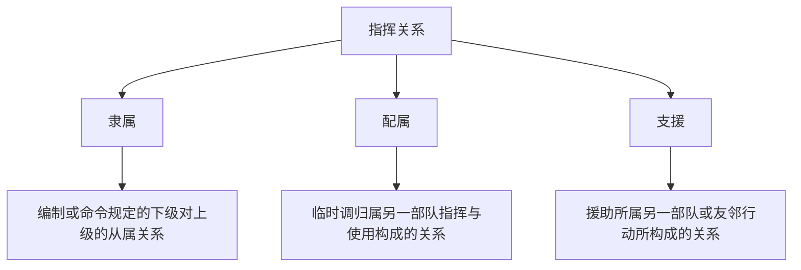

- 指挥控制组织设计：面向任务，进行兵力编组和任务分配，同时设计各指挥节点及其权责，确定指挥关系，以高效完成任务。设计方法包括两类：
  - 自顶向下：基于最优化方法，进行任务分解，并确定最佳的兵力编组和指挥关系。
  - 自底向上：基于规则，通过边缘自组涌现形成。

## 3 思考题

1. 请简述指挥控制的主要职能。
2. 请查阅毛主席关于指挥员职责的原文，理解其含义。
3. 请举出几个工作生活中“控制”“协同”和“协调”的例子。

# 第3讲：本质特征

## 1 出发点

出发点：强对抗中的**不确定性**。

不确定的来源：环境、资源、对手。

> 战争是典型的开放复杂巨系统，具有不确定性的突出特点，是其本质属性，不能完全消除，也不能完全准确的进行预测。

> [!tip]
>
> 例子：蟒蛇行动
> 美军动用了最先进的侦察手段，制定了详细的计划，但对敌情的误判恶劣天气、装备故障、机动延误、不可靠的卫星通信和敌我识别技术等情况，从始至终困扰着美军。
> “不确定性”并没有因为美军技术和装备先进而消失，也没有因为周密计划和预判而消除。

## 2 落脚点

落脚点：以**最小**的代价**高效**完成任务。

> 效果：作战效果、完成时间等。
>
> 代价：人员伤亡、物资消耗、附带损伤等。

> [!tip]
>
> 例子：诺曼底登陆
>
> - 情报收集和分析：盟军战前收集了大量敌防御体系、地形、天气等方面情报，为决策提供了重要依据。
> - 指定作战计划：盟军指挥官在制定作战计划时考虑了多个因素，包括登陆地点、时间、兵力部署、火力支援等。他们利用情报分析和模拟演练制定了详细的战术方案以最大程度地减少伤亡并确保登陆成功。
> - 协调与合作：为确保作战计划顺利执行，盟军设立指挥中心协调各部队行动，并不断进行大规模联合演习提高部队配合能力。

## 3 一对基本矛盾

- 对确定性的不懈追求——无法彻底消除的不确定性。
- 应对方式：预先计划、临机决策。以确定性来应对不确定性。

从信息的角度看“决策”。确定性取决于信息数量，任务越复杂，决策所需信息就越多-->处理时间越长，区分相关、重要、真实信息难度越大-->对指挥系统的能力提出了更高要求。

应对复杂性的另一条途径：

提高信息处理能力（集中） VS. 减少决策所需信息（分散）——集中与分散的统一。

- 集中：集中统一，自上而下。信息的集中带来了处理难度的增大，引发系统规模与成本的膨胀、边际效益递减，并带来额外的复杂度与脆弱性。
- 分散：敏捷分布，自下而上。可有效降低复杂性，但需要前提条件，如信任、主动、一致认知等。

自组织的科学机理：

核心观点为以不确定性来应对不确定性。

> [!TIP]
>
> 例子：复杂自适应系统
>
> 基于网络(数据+连接)赋能，让边缘能够互相连接和调用，通过大量个体的局部感知和互动，形成正反馈放大效应，从而实现能力涌现(群体智慧)，应对预料之外的变化。比如鸟群。

## 4 思考题

1. 请分析战争中的不确定性为什么无法完全消除？
2. 应对不确定性的基本方法有哪些？
3. 自组织的科学原理是什么？

# 第4讲：指挥控制过程模型

## 1 过程模型概述

指挥控制过程模型：尝试针对指挥控制过程建立合理的概念模型，以分析指挥控制的运作机制和指导指挥控制流程的优化设计。

## 2 OODA模型

能量机动理论：战机近距离狗斗的本质是动能与重力势能的转换效率。一架飞机的狗斗性能即其能力转换的能力，具体到飞机性能参数则由“单位重量剩余功率”（Specific Excess Power，SEP）表示。

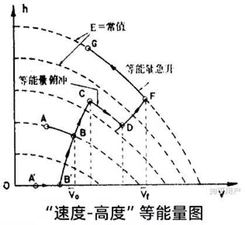

> [!IMPORTANT]
> 飞机能量高度变化率就等于SEP，也就是说战机每千克重量所具有的剩余功率，表示飞机获得补充能量的能力，反映飞机能量高度变化的快慢，即
> $$
> \frac{\Delta H_E}{\Delta t} = \frac{(T-D)}{G} \dot V = \text{SEP}
> $$
> 式中，$(T-D)$为剩余推力；$\text{SEP}$为剩余功率与重量的比值，单位是 $\rm m/s$。

**OODA环**：

- 观察（Observation）：采取一切可能的方式获取战场空间中的信息。
- 判断（Orientation）：利用知识和经验来理解获取的信息，形成态势感知。
- 决策（Decision）：根据任务目标和作战原则，选择行动方案。
- 行动（Action）：实施具体行动。

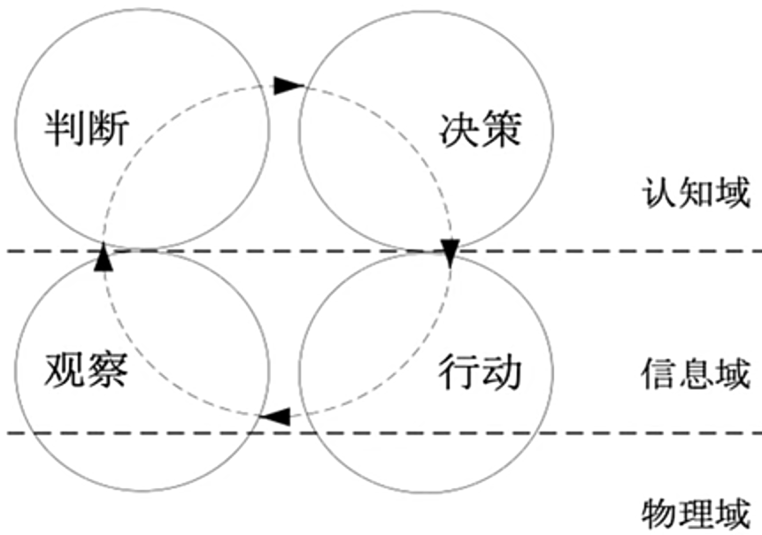

> [!TIP]
>
> 以空战为例：
>
> - 观察阶段：侦察、感知到敌机位置和状态等信息；
> - 判断阶段：指挥己方飞机锁定某敌机；
> - 决策阶段：决定将要采取的动作，如继续监视或进行拦截等；
> - 行动阶段：执行决策制定的具体动作，如发射导弹进行攻击。
>
> 执行行动后，决策者观察行动的效果，再次进入“观察-判断-决策-行动”的循环。

**模型局限**：

- 既不能描述一般的决策指定过程，也不能具体地运用于军事决策；
- 可能不适用于空战领域意外的指挥控制过程；
- 不一定适用于决策过程复杂的情况；
- 没有描述团队的协同与协作；
- 没有明确描述战场环境中的对手，或没有描述指挥控制的对抗性。

## 3 OODA模型应用

沙钢的**基于创新驱动的”观察-判断-决策-行动“循环高效工作法(OODA)探索与应用**

# 第5讲：指挥控制的模式

## 1 基本概念

指挥控制模式：遵循指挥控制过程、履行指挥控制职能的方式。

传统的指挥控制模式（集中控制）分类：

- 命令为主型：上级向下级，高度集中；
- 目标为主型：上级向下级，下级具备一定主动性和创造性；
- 使命为主型：上级向下级，下级可理解上级的意图及作战概念。

面向未来作战的指挥控制模式（分散控制）分类：

- 任务式指挥：自顶向下；
- 事件式指挥：自底向上，自组织形式；
- 自组织与他组织相结合：自组织，自我调节型。

## 2 三维度量模型

阿尔伯茨、海耶斯和北约SAS研究小组提出的三维度量模型：

- 决策分配：谁能做出行动决策；
- 交互方式：谁能和谁说话；
- 信息发布：谁知道什么。

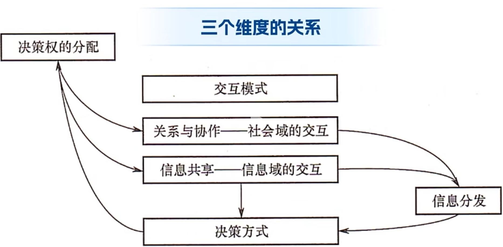

## 3 三维度量空间

- 决策分配：由集中变为分散
- 交互模式：由紧密约束变为不受约束
- 信息分发：由紧密控制变为广泛传播

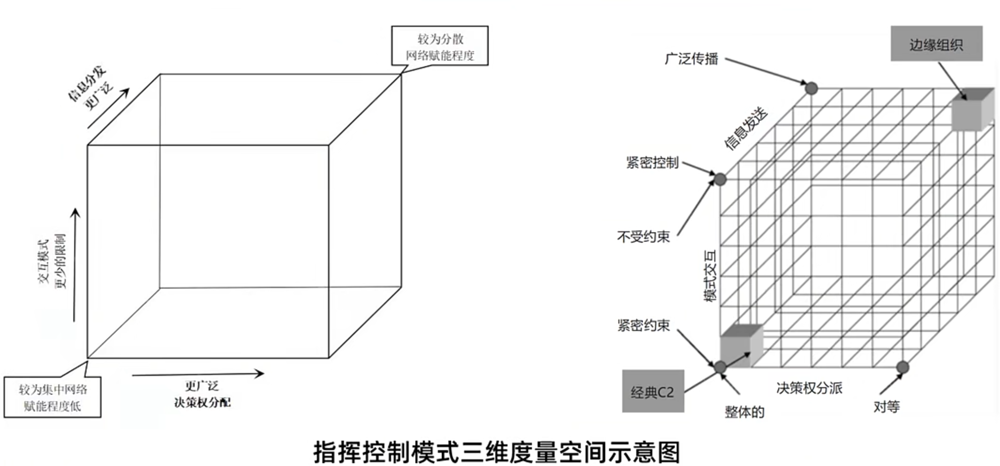

# 第6讲：指挥控制组织设计

## 1 基本概念

特征：

- 组织是一种社会实体；
- 组织具有可以设计的结构和协调作用；
- 组织是各类管理措施发挥作用的平台；
- 组织是特定群体为共同目标，按照特定原则，使相关资源有机组合并以特定结构运行的结合体。

指挥控制组织：是为了完成使命而存在的特殊组织，是实际环境中的实体在使命驱动下形成的有序行为和与之协调的结构关系。

- 其行为是完成使命的行动过程或任务流程；
- 结构关系是与有序行为匹配的实体间的交互关系；
- 目的是评价并改善组织效能。

## 2 设计要素

- 任务分解：是对指挥控制组织使命进行分解得到的基本的过程单元(或者子任务)的描述，其分解的粒度通常到战术层次的行动。
- 力量编成（人员、资源）：根据任务需求，将人员、装备（资源）进行分组，形成任务分配的基本单位，“沟通协调成本与组织规模的平方成正比”。
- 任务分配：将任务分配到不同的力量编成
- 力量部署：将编成后的不同群（队）部署到不同的位置（区域），以执行所分配的任务。
- 指挥关系：对隶属其指挥的部（分）队行使指挥权时形成的指挥与被指挥关系，包括直接指挥关系和间接指挥关系。
- 协作关系（行动过程/事件处理流程）：挥控制组织中各单元之间为完成共同任务或者达成共同目标所建立的行动上的协作联系。协作关系可分为固定协作关系和临时协作关系。
- 信息关系：指挥控制组织实体间的信息交互关系

重点记一下“力量编成”：

- 设计因素：人员专业、装备能力、训练水平、协作水平；
- 特点：可能将隶属于不同建制单位的人员、资源编入同一群（队）中。

## 3 设计过程

分为：

- 自顶向下的设计
- 自底向上的设计

# 第7讲：态势认知（一）

典型案例：2024年7月特朗普遇袭事件。

作为现场指挥官，如何处理当下态势：

- 感知当下：了解伤者情况、枪手位置、周围人群、现场制高点等；
- 理解现状：撤退路线、击毙枪手等；
- 预测未来：是否还有恐怖分子在场、评估对选举的影响。

总结：态势认知就是拨开战争的“迷雾”看“本质”。

> 战争迷雾：战争是充满不确实性的领域。战争中行动所依据的情况有四分之三好像隐藏在云雾里一样，是或多或少不确实的。——克劳塞维茨《战争论》

## 1 相关定义

态势：状态与趋势，包括人或事表现出的形态、环境或事物的发展状况和清醒等。分类为：

- 战略态势；
- 战役态势；
- 战术态势。

战场态势：战场中兵力分布及战场环境的当前状态和发展变化趋势。主要包括：

- 敌我态势；
- 战场环境；
- 作战任务；
- 时空关系；
- 机会风险。

## 2 态势认知的内容

态势认知：对战场态势元素的含义理解，以及对它们未来的改变进行预测。是指挥员对态势的内在理解的一个过程，是人类心智模型的一种体现。

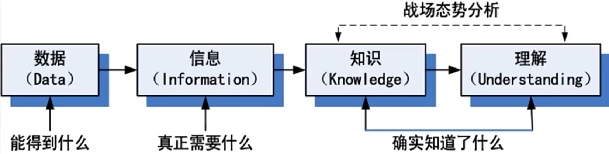

## 1.3 态势认知的过程

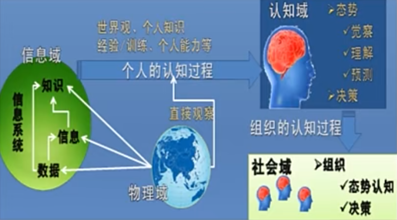

两类经典态势认知过程模型：

- 数据分析维度：JDL模型，侧重数据融合与处理的角度。
- 认知决策维度：SA模型，侧重决策者的认知角度。

### 3.1 JDL模型

由美国国防部实验室联合理事会（Joint Directors of Laboratories）提出，是一个通用的数据融合模型架构，描述了从对不同来源的数据进行处理、对目标进行估计、对目标间关系进行理解再到对整个流程进行评估和优化的全过程。

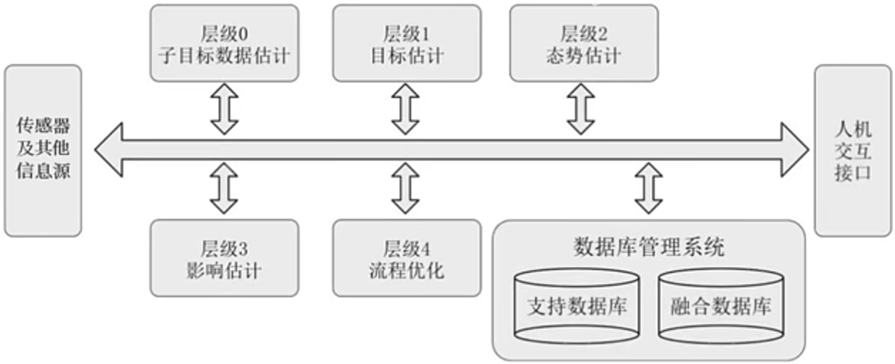

### 3.2 SA模型

由美国学者Endsley提出的一种针对动态决策过程的态势感知理论模型，从人因学的角度对态势感知过程进行了分析，认为注意力和工作负载是限制相关人员从环境中获取和理解信息从而感知态势的关键因素。

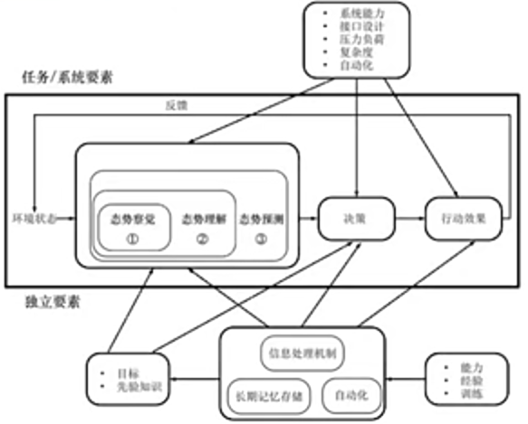

# 第8讲：态势认知（二）

态势认知的目标：拨开迷雾看本质，即如何减少或消除不确定性。

有两种思路：

1. 尽可能多收集有效信息。指导原理：信息论。说明了什么样的信息才是有效信息。
2. 尽可能准确地推断趋势。指导原理：机器学习推理。说明了如何**在不完全信息条件下**，提高决策的准确率。

本节主要讨论**信息论**。

## 1 信息论基本概念

信息量化的依据：将信息的量化度量和不确定性联系起来，提出了衡量信息的“砝码”——比特（bit）。

信息量：信息多少的量度。

通信的目的也就是要使接收者在接收到消息后，尽可能多地解除接收者对信源所存在的疑义（不确定度），因此这个被解除的不确定度实际上就是在通信中所要传送的信息量。

> [!tip]
>
> 例子：**过马路**
> 生活中看红绿灯觉得是否过马路，先要收集看到听到的各种信息，包括红绿灯信号，周边车辆行人的动态、天气情况、路面情况，综合起来有以下四种选择，等绿灯（占4/8）、跑过去（占2/8）、走过去（占1/8）、随大流闯红灯(占1/8)。试求此次过马路的信息熵。
>
> 解：
> $$
> \begin{bmatrix}X\\P(x)\end{bmatrix}=\begin{bmatrix}
> 红绿灯 & 周边动态 & 天气及路面 & 随大流 \\
> 1/2   & 1/4     & 1/8      & 1/8
> \end{bmatrix}
> $$
>
> $$
> \begin{aligned}
> H(X)=&-\sum_{i=1}^4 P(x_i)\log P(x_i)\\
> =&-\frac{1}{2}\log\frac{1}{2}-\frac{1}{4}\log\frac{1}{4}-\frac{1}{8}\log\frac{1}{8}-\frac{1}{8}\log\frac{1}{8}\\
> =&1.75(\text{bit})
> \end{aligned}
> $$
>
> 结论：过马路态势认知的信息熵为1.75比特

## 2 信息论与态势认知

解决的问题：什么样的信息组合对于指挥员认知态势最有效呢？——>满足信息的正交性原理：当两个不同维度的信息正交时，它们的共同作用能够最大程度地降低信息熵。

如何获取正交的信息？

1. 不同的信息要来自不同的信息源；
2. 信息源尽量覆盖不同的观测角度；
3. 多次重复观测有利于提高信息的置信度；
4. 多次重复侦察有利于提高信息的置信度。

# 第9讲：态势认知（三）

## 1 态势预测问题

定义：通过收集、整理、解析各种来源的情报数据，结合专业知识、实战经验，通过逻辑推理、模式识别、概率预测等技术手段，推断出敌方的意图、策略和可能的行动方案，以及应对策略。

途径：以人类大脑推理问题的过程为参考，从不同维度构建不同的推理模型，基于模型输出结果做出判断，推断成功与否，则有赖于模型能否规避影响判断的各种偏见和误判。

本质：是一个不确定性问题，需要在有限信息条件下，推断出准确率最高的结果。

有以下4钟机器学习推理方法：

1. 离散认知：符号主义推理，例如决策树、知识推理等。
2. 连续认知：
   - 频率主义推理：例如频率统计、支撑向量机等。
   - 贝叶斯主义推理：例如贝叶斯推理、概率图等。
   - 连接主义推理：神经网络、深度神经网络等。

## 2 符号主义推理

人类认知和思维的基本单元是符号，认知过程就是在符号表示上的一种运算。

推理过程：

- 如果规则前提中的所有子句被匹配成功，则执行这条规则；
- 将执行后所得的新事实存入事实库中；
- 再次寻找匹配的规则，，直至得出结论。

优点：

- 可解释；
- 逻辑严密。

缺点：

- 规则库完备性难以保证；
- 规则生成困难；
- 大规模规则推理效率提升困难。

## 3 频率主义推理

主要利用抽样数据，认为概率计算模型的参数是客观存在的，虽然未知，但是可以估计，因此通过抽样数据分析可以推断原因和结果之间的关联。

推理过程：

- 先建立无效模型，计算在此无效模型的前提下得到从实际数据中得来的参数可能性，加入这个可能性很小，我们就认为无效模型不成立，从而选择备择模型；
- 不断重复进行实验，认为模型的参数是客观存在的，不会改变，虽然未知，但是为固定值。
- 解释：一个时间在一段较长的时间内发生的频率。
- 数据源：主要利用抽样数据。

缺点：容易出现幸存者偏差问题。

> [!tip]
>
> 例子：二战美军轰炸机加强防御问题。
>
> 二战中美军研究幸存战机增强防护方案，统计学家沃德力排众议，纠正了美军原以为弹痕多就该增强装甲的幸存者偏差，提出应该增加弹痕少的地方防护水平。

## 4 贝叶斯主义推理

军事问题影响因素多，因果关系、相关关系复杂，而且试验次数有限，样本量极少，基于贝叶斯思维的试错法具有很好的指导意义。

思考方式：

- 用历史数据形成先验概率；
- 新的有意义的信息，更新整个模型；
- 形成后验概率；
- 利用计算出的后验概率更新先验概率信息，周而复始。

先验概率+优质信息，不断提升，最终演化成后验概率——>“吃一堑长一智”，避免“重蹈覆辙”。

> [!tip]
>
> 例子：1968年冷战时期搜索失联潜艇
>
> 以失联区域为中心，化为若干区域。以专家知识为先验概率。
>
> 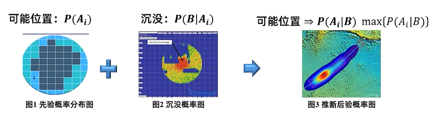

## 5 连接主义推理

连接主义推理：模仿神经系统中的信息处理方法，通过构建一些简单的神经元模型来实现智能的学习和决策，代表性模型为深度神经网络。在态势认知的数据融合、意图和行动研判、战场关系推理、演化趋势分析等广泛应用。

> [!tip]
>
> 例子：Palantir人工智能平台（AIP）演示了军队如何使用大模型进行态势研判域作战筹划。

# 第10讲：指挥决策（一）

## 1 什么是决策

定义：指个人或群体为实现预期的目的，制定各种行动方案并作出选择的过程。

> [!tip]
>
> 例子1：去饭店吃饭时决定点什么菜
>
> 例子2：一名军校本科学员在临近毕业时，决定先读研还是先工作
>
> 例子3：一支部队在进行渡海登岛作战时，如何选择登陆的地点和时机
>
> 例子4：一个国家在面临危机时，决定是否要发动或参与一场战争

## 2 什么是指挥决策

军事指挥决策：是为实现一定军事目的，制定各种候选军事行动方案并选择某种最优方案的过程。

分类：

- 战略决策：国家最高军事当局对军事战略行动的决策。特点：着眼全局，适用时间长，反馈时间长，范围广，原则化。
- 战役决策：战区、集团军等单位对所属部队战役行动的指挥决策。特点：需服从战略决策。
- 战术决策：师以下部队对战斗行动的指挥决策。特点：需服从战略战役决策，适用时间短，反馈时间短，范围窄，具体化。

## 3 理性决策方法

基于经济人假设，即假定决策主体是完全理性的，追求自身利益的最大化。

期望效用最大化原理：

决策者估计决策方案$x$得到结果$x_i$的概率为$P(x_i)$，总共有$n$种可能结果$\{i=1,2,\cdots,n\}$，那么方案的期望效用为
$$
\widehat{U}_x = \sum_{i=1}^n P(x_i) U(x_i)
$$
综上，一个理性决策者应该选择期望效用最大的方案$x^*$。其表达式为
$$
x^* = \mathop{\arg\max}_{x \in X} \widehat{U}_x = \mathop{\arg\max}_{x \in X}\sum_{i=1}^n P(x_i)U(x_i)
$$
固有决策流程：

1. 判断情况，确定目标
2. 明确决策标准，为标准分配权重
3. 拟制多个备选方案
4. 评估备选方案的综合得分
5. 根据得分排序选择最优方案
6. 执行最优方案
7. 评估决策效果

> [!tip]
>
> 例子：辽沈战役
>
> 1948年，东北战场，国军被压缩在沈阳、长春、锦州三个互不相连的地区内，物资供应匮乏。我军解放东北97%的土地和86%的人口，军事和经济实力均超过敌人，人民解放军在东北进行决战的条件已经成熟。
>
> **判断情况**：我军通过情报网络、侦察部队等多种手段，搜集了关于国民党军兵力部署、武器装备、作战计划、地形地貌等信息，判断敌军有4个兵团，共计14个军44个师55万人，已被分割在长春、沈阳、锦州3个地区内。
>
> **确定目标**：全歼国民党军在东北的主力，解放东北全境。
>
> **确定决策标准和权重**：辽沈战役的首要目标是以决战的态势将国民党军在东北地区就地全歼，截断其从东北撤退到华北的通道，不使其逃窜以影响其他战场的局势。其他决策标准还包括风险、预期投入兵力和部队伤亡等。
>
> **方案制定**：基于情报分析和目标设定，制定了多种作战方案，如先打锦州再攻长春，或先攻长春再南下作战等。
>
> **方案评估**：考虑风险、战略效果等多种因素对各种方案进行评估。先打锦州还是先取长春?
>
> **最优方案**：先攻下锦州，切断国民党军退路，再逐一消灭长春、沈阳之敌。辽沈战役的胜利为后续决战、解放全国奠定了坚实基础。

# 第11讲：指挥决策（二）

## 1 效用理论——认识自己

效用（utility）：经济学概念，消费者从所消费的商品种所获得的满足感程度。

- 满足程度越高，效用越大；
- 满足程度越低，效用越小。

为什么要使用效用？

效用可反映决策者对于风险的态度。不同的决策者因为个性、经验、价值观等的不同而对风险有不同的偏好，效用可以度量这种偏好。理论地说，该概念体现了决策者的主观心理感受，相同的结果或状态，对不同的决策主体的效用不同。

## 2 博弈原理——了解对手

**战争的本质是对抗。**

博弈论：又称对策论，是使用严谨的数学模型研究博弈参与者有利益冲突条件下的最优决策问题的理论，是研究竞争的逻辑和规律的数学分支。

博弈要素：

- 局中人：博弈参与者，也称玩家；
- 策略：局中人的决策选项及顺序，分为纯策略和混合策略；
- 收益：参与博弈的局中人使用各自的策略带来的收益；
- 信息/信念：局中人对局势和其他人情况的了解或认知；
- 理性：局中人是理性行事还是感情用事。

博弈思维：

1. 自己决策的前提是要考虑其他博弈参与者的策略——“想对方之所想”；
2. 如果有占优策略，利用占优策略简化博弈分析——“你有一个占优策略，则选择它;对方有占优策略，则提防它”；
3. 纳什均衡代表平衡状态，单方面改变是不明智的——“静观其变，谋而后动"。

## 3 多目标决策理论——权衡取舍

实际的军事决策问题本质上都是多目标决策问题。

特点：

- 目标不止一个：风险最小、收益最大等；
- 目标的性质不同，难以直接比较：例如，伤亡人数与缴获的装备数目。
- 目标定性与定量相结合：有些指标是明确的，有些是模糊的。
- 目标之间存在矛盾：一般情况下各方案在不同目标间难以同时达到最优。

多目标决策问题定义：

- 用$x$表示方案，对于$m$个目标，可用$m$个目标函数$f_1(x),f_2(x),f_3(x),\cdots,f_m(x)$表示；
- 表示方案$x$在各个指标上的评分；
- 决策任务是在一组方案集合$\{x\}$中，选择某个方案$x_i$，使得在$m$个目标都尽可能地好。

### 3.1 两步决策法

- 第一步：通过对候选方案进行相互对比，剔除支配方案；
- 第二步：在剩下地非支配方案中按照某些原则选择一个最优方案。

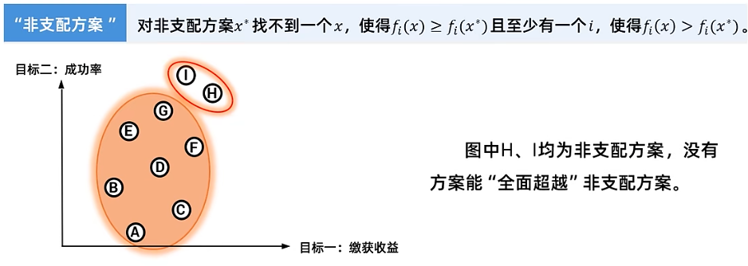

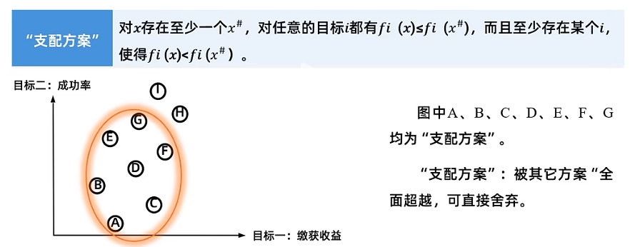

### 3.2 最优方案选择方法

#### 3.2.1 首要目标法

算法思想：优化首要目标，兼顾其他目标。

设有$m$个目标$f_1(x),f_2(x),\cdots,f_m(x),\ x \in R^n$均要求最优，但在这$m$个目标中，有一个是首要目标，例如为$f_1(x)$，并要求其为最大。在这种情况下，只要使其他目标值处于一定范围内，为
$$
f'_i \le f_i(x) \le f''_i,\ i=2,3,\cdots,m
$$
就可以把多目标决策问题转化为下列单目标决策问题，为
$$
\max_{x\in R'}f_1(x)\\
R'=\{x|f'_i \le f_i(x) \le f''_i,\ i=2,3,\cdots,m;x\in R\}
$$

#### 3.2.2 加权和法

算法思想：通过对目标加权，将多目标聚合为单目标。

设有$m$个目标$f_1(x),f_2(x),\cdots,f_m(x),\ x \in R^n$，则可以对目标$f_i(x)$分别给以权重系数$\lambda_i (i=1,2,\cdots,m)$，然后构成一个新目标函数，为
$$
\max F(x) = \sum_{i=1}^m \lambda_i f_i(x)
$$
计算所有方案的$F(x)$值，找到取最大值的方案，即为最优方案。

**难点**：权重系数的确定。

#### 3.2.3 理想点法

算法思想：选择距离“理想方案”最近的方案。

设有$m$个目标$f_1(x),f_2(x),\cdots,f_m(x),\ x \in R^n$，要求各方案目标值与规定的$m$个最优值$f_1^*,f_2^*,\cdots,f_m^*$的差距尽可能地小。可定义模，在该模意义下寻找尽可能接近理想值的点，为
$$
\min ||F(x)-F^*||
$$
通常可定义模为
$$
||F(x)-F^*|| = [\sum_{i=1}^m (f_i(x)-f_i^*)^p]^{1/p}
$$

#### 3.2.4 分层序列法

算法思想：根据目标优先级层层筛选，直到得到最优方案。

设有$m$个目标$f_1(x),f_2(x),\cdots,f_m(x),\ x \in R^n$，假设按照目标重要性排序标$f_1(x),f_2(x),\cdots,f_k(x)$，首先对目标$f_1(x)$求最优，找出所有最优解集合$R_1$，然后在$R_1$中找到第二个目标$f_2(x)$取得最优的解集合$R_2$，以此类推，在$R_{m-1}$中找到使得$f_m(x)$取值最优的解。
$$
\begin{aligned}
f_1(x^0) =& \max_{x \in R_0 \subset R} f_1(x) \\
f_2(x^0) =& \max_{x \in R_1 \subset R_0} f_2(x) \\
&\vdots	\\
f_m(x^0) =& \max_{x \in R_{m-1} \subset R_{m-2}} f_m(x)
\end{aligned}
$$
如果最优方案有多个，进而在这些方案中选出优先级第二高的目标上表现最佳的方案。如此层层筛选，得到最优方案。

# 第12讲：指挥决策（三）

# 第13讲：行动控制（一）

# 第14讲：行动控制（二）

# 第15讲：行动控制（三）
