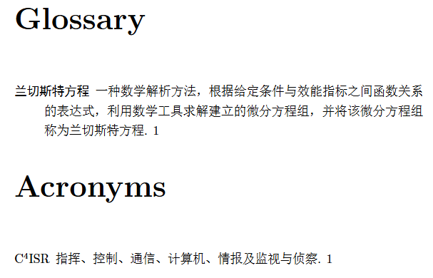
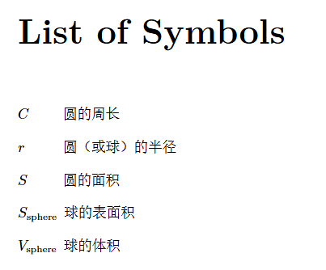

# 写在前面

使用LaTeX写作期刊论文，仅仅只需要注意正文、图、表及其相应的数学公式即可。但使用LaTeX进行学位论文的写作时，往往会遇见生成目录的问题。例如，要生成诸如：

> **目录**
>
> 第1章 xxx
>
> 1.1 xxx
>
> 1.1.1 xxx

> **插图目录**
>
> 图 1-1 xxx
>
> 图 1-2 xxx
>
> 图 1-3 xxx

> **附表目录**
>
> 表 1-1 xxx
>
> 表 1-2 xxx
>
> 表 1-3 xxx

原生LaTeX很难解决这个问题，因为它对英文写作适配更加友好。作为中文写作者的我们，势必要做一些修改才能写出满足学位论文要求的LaTeX文件。花了一点时间把图、表目录生成以及缩写表生成问题解决了，把解决后的代码记录在这里，以防忘记。

# 一、图、表目录

在.cls文件或.tex文件开头，给出如下代码。

```latex
\newcommand{\fSong}{\CJKfamily{song}}
\newcommand{\sRealHalfXiaosi}{\fontsize{12.5pt}{13pt}\selectfont}       % 半小四, 约1倍
\newcommand{\sNormalParagraph}{\fontsize{12pt}{20pt}\selectfont}        % 小四，1.67 倍
\newcommand{\nwpuChapterCname}[1]{第 #1 章}            % 目录章节中文标题
\titlecontents{chapter}[0pt]{\fSong\sRealHalfXiaosi\vspace{0.5em}}{
    \contentsmargin{0pt}\fSong\makebox[0pt][l]{\nwpuChapterCname{\thecontentslabel}}\hspace{3.5em}}{
    \contentsmargin{0pt}\fSong}{\titlerule*[.5pc]{.}\contentspage}[\vspace{0em}]
    
% 定义图目录和表目录的格式
\newcommand{\tableofcontentsNew}{                           %
    \sNormalParagraph                                       % 设置默认字体
    \phantomsection                                         % 用于超链接定位
    \addcontentsline{toc}{chapter}{\contentsname}           % 在总目录中添加目录条目
    \tableofcontents                                        % 调用原始的 \tableofcontents
    \cleardoublepage                                        % 插入双页结束符
}
\newcommand{\listoffiguresNew}{                             %
    \sNormalParagraph                                       % 设置默认字体
    \phantomsection                                         % 用于超链接定位
    \addcontentsline{toc}{chapter}{\listfigurename}         % 在总目录中添加图目录条目
    \begingroup                                             % 开始一个分组来局部改变命令
    \renewcommand{\numberline}[1]{图~##1\hspace*{1em}}      % 修改 \numberline，在编号前加上“图”
    \listoffigures                                          % 调用原始的 \listoffigures
    \endgroup                                               % 结束分组，恢复原来的 \numberline 定义
    \cleardoublepage                                        % 插入双页结束符
}
\newcommand{\listoftablesNew}{                               %
    \sNormalParagraph                                       % 设置默认字体
    \phantomsection                                         % 用于超链接定位
    \addcontentsline{toc}{chapter}{\listtablename}          % 在总目录中添加表目录条目
    \begingroup                                             % 开始一个分组来局部改变命令
    \renewcommand{\numberline}[1]{表~##1\hspace*{1em}}      % 修改 \numberline，在编号前加上“表”
    \listoftables                                           % 调用原始的 \listoftables
    \endgroup                                               % 结束分组，恢复原来的 \numberline 定义
    \cleardoublepage                                        % 插入双页结束符
}
```

随后，在正文`.tex`文件中，给出如下代码。

```latex
%%================================%%
%%              目录              %%
%%================================%%
\tableofcontentsNew

%%================================%%
%%         图目录与表目录          %%
%%================================%%
% 图目录
\listoffiguresNew

% 表目录
\listoftablesNew
```

即可得到下图所示目录。


# 二、缩略表

缩略表一般包括三个部分，缩写表、术语表和符号表。

## 2.1 缩写表和术语表设置

缩写表和术语表使用下述宏包。

```latex
\usepackage[acronym]{glossaries}
\makeglossaries
```

在`\begin{document}`前插入如下代码。

```latex
% 定义新格式——中文全称 (英文全称, 英文简称)
\newacronymstyle{desc-long-short-v2}
{
  \ifglshaslong{\glslabel}{\glsgenacfmt}{\glsgenentryfmt}
}
{
  \renewcommand*{\GenericAcronymFields}{description={\the\glslongtok}}
  \renewcommand*{\genacrfullformat}[2]{
   \protect\firstacronymfont{\glsentrydesc{##1}}##2\space
   (\glsentrylong{##1},\space\glsentryshort{##1})
  }
  \renewcommand*{\Genacrfullformat}[2]{
   \protect\firstacronymfont{\Glsentrylong{##1}}##2\space
   (\glsentryshort{##1})
  }
  \renewcommand*{\genplacrfullformat}[2]{
   \protect\firstacronymfont{\glsentrydescpl{##1}}##2\space
   (\glsentrylongpl{##1},\space\glsentryshortpl{##1})
  }
  \renewcommand*{\Genplacrfullformat}[2]{
   \protect\firstacronymfont{\Glsentrydescpl{##1}}##2\space
   (\glsentrylongpl{##1},\space\glsentryshortpl{##1})
  }
  \renewcommand*{\acronymentry}[1]{\acronymfont{\glsentryshort{##1}}}
  \renewcommand*{\acronymsort}[2]{##1}
  \renewcommand*{\acronymfont}[1]{##1}
  \renewcommand*{\firstacronymfont}[1]{\acronymfont{##1}}
  \renewcommand*{\acrpluralsuffix}{\glspluralsuffix}
}

% 导入缩写风格
\setacronymstyle{desc-long-short-v2}

% 定义缩略语
\newacronym[description=指挥、控制、通信、计算机、情报及监视与侦察]{c4isr}{$\rm C^4ISR$}{Command, Control, Communication, Computer, Intelligence, Surveillance, Reconnaissance}

% 定义术语
\newglossaryentry{Lan}{
	name = 兰切斯特方程,
	description = 一种数学解析方法，根据给定条件与效能指标之间函数关系的表达式，利用数学工具求解建立的微分方程组，并将该微分方程组称为兰切斯特方程
}
```

上述代码是为了符合中文学位论文中“中文全称 (英文全称, 英文简称)”的规范，单独进行了一番调整后给出的代码。

效果如下所示。




## 2.2 符号表

符号表使用下述宏包。

```latex
\usepackage[intoc,english]{nomencl}
\makenomenclature
```

在`\begin{document}`前插入如下代码。

```latex
\renewcommand{\nomname}{List of Symbols}

\nomenclature{$r$}{圆（或球）的半径}
\nomenclature{$C$}{圆的周长}
\nomenclature{$S$}{圆的面积}
\nomenclature{$S_{\text{sphere}}$}{球的表面积}
\nomenclature{$V_{\text{sphere}}$}{球的体积}
```

效果如下所示。



## 2.3 VsCode编译链设置

根据上面的代码，是没有办法成功编译的，需要在VsCode中设置编译链才可以完成编译。

- `makeglossaries`是编译缩写表和术语表所使用的工具；
- `makenomenclature`是编译符号表所使用的工具。

下面给出设置流程：

- 打开VsCode，按下`f1`，进入首选项`setting.json`

- 在`latex-workshop.latex.tools`中写入如下代码——**这一步是为了设置编译工具所需参数**

```latex
"latex-workshop.latex.tools": [
       {
           "name": "pdflatex",
           "command": "pdflatex",
           "args": [
               "-synctex=1",
               "-interaction=nonstopmode",
               "-file-line-error",
               "%DOCFILE%"
           ]
       },
       {
           "name": "xelatex",
           "command": "xelatex",
           "args": [
               "-synctex=1",
               "-interaction=nonstopmode",
               "-file-line-error",
               "%DOCFILE%"
           ]
       },
       {
           "name": "bibtex",
           "command": "bibtex",
           "args": [
               "%DOCFILE%"
           ]
       },
       // 编译latex中的缩略表
       {
           "name": "makeglossaries",
           "command": "makeglossaries",
           "args": [
               "%DOCFILE%"
           ]
       },
       // 编译latex中的符号表
       {
           "name": "makenomenclature",
           "command": "makeindex",
           "args": [
               "%DOCFILE%.nlo",
               "-s",
               "nomencl.ist",
               "-o",
               "%DOCFILE%.nls"
           ]
       },
   ],
```

- 在`latex-workshop.latex.recipes`中写入如下代码——**这一步是为了设置编译链**

```latex
"latex-workshop.latex.recipes": [
        // 编译latex中的缩略表
        {
            "name": "xe->glo->xe",
            "tools": [
                "xelatex",
                "makeglossaries",
                "xelatex"
            ]
        },
        {
            "name": "pdf->glo->pdf",
            "tools": [
                "pdflatex",
                "makeglossaries",
                "pdflatex"
            ]
        },
        // 编译latex中的符号表
        {
            "name": "xe->nom->xe",
            "tools": [
                "xelatex",
                "makenomenclature",
                "xelatex"
            ]
        },
        {
            "name": "pdf->nom->pdf",
            "tools": [
                "pdflatex",
                "makenomenclature",
                "pdflatex"
            ]
        },
    ],
```

- 选择对应编译链进行编译。

# 三、解决思路记录

## 3.1 图、表目录

1. 阅读LaTex手册，查看`tableofcontents`、`\listoffigures`和`listoftables`每个参数的意义；
2. 再查看`\renewcommand`和`\necommand`指令如何使用；
3. 按需修改代码。

## 3.2 缩略表

1. 阅读LaTex手册，查看`glossaries`和`nomenclature`每个参数的意义；
2. 查看`glossaries.sty`中关于`\newacronymstyle`的定义；
3. 按需修改`\newacronymstyle`，建立新格式`desc-long-short-v2`，此处参考文献[1]；
4. 学会`makeglossaries`和`makenomenclature`如何使用，此处参考文献[2,3]；
5. 在VsCode中设置编译工具和编译链。

## 3.3 总结

其实用Word会比LaTeX轻松太多，在易用性方面，Word占据很大优势；在排版质感上，还是LaTeX更胜一筹。所以鼓捣了半天LaTeX，就是为了达到Word的效果。

如果不geek的话，把Word熟练掌握，已经足够应对工作学习中99%的情况了。

# 参考文献

[1] https://www.wangfz.com/archives/65466

[2] https://tex.stackexchange.com/questions/577405/printnomenclature-doesnt-work

[3] https://blog.csdn.net/xovee/article/details/118604572
