[TOC]

# 写在前面

之前的博客文章“[图形用户界面（GUI）开发教程](https://leilie.top/2024-01-20/Study-GUI)”(https://leilie.top/2024-01-20/Study-GUI)里介绍了使用MATLAB设计GUI，但使用MATLAB设计GUI存在三个问题：

- 移植性差。比如开发这个GUI的版本是MATLAB 2018，那么在其他电脑上打开该程序将无法正常运行。一般都会在其他电脑上安装与开发该GUI的版本相同的MATLAB才能较好地避免该问题。
- 风格化差。使用MATLAB设计GUI时，可以自由发挥创意地设计界面的空间小，只能在MATLAB既有框架下进行设计，所以开发出来的GUI不符合现代审美。（补丁：我用的是MATLAB 2018版本，或许最新的MATLAB 2025已经很好地解决了这个问题？）
- 可读性差。GUI中各部件的逻辑均依赖回调函数实现，在复杂的GUI里，往往会迷失在浩如烟海的代码中；而且因为逻辑是依靠回调函数实现的，所以参数传递十分麻烦，增加了开发难度。

所以选择使用Python开发GUI。

为什么选择Python呢？因为我对于C/C++的使用不太熟练，用Python用的更加顺手。目前在想，现今阶段是不是精通MATLAB和Python就可以了（？）。科学计算的任务交给MATLAB，其他剩下的所有事情全部使用Python搞定。因为是个人开发者，对编译速度的要求不那么紧迫，加上Python的简便性，所以目前来说，使用Python已经足够满足我的需求。

再者写这篇博客的目的是防止自己忘记。或者说，很久之后因为某些需求得让我重新捡起来这项技能，因为有这些文章在，能够让我快速地回忆起以前掌握的知识。

所以，这篇博客的预备知识就是需要你已经掌握了如下技能：

- MATLAB GUI的设计，熟悉MATLAB GUI各个部件的功能；
- Python的安装和使用；
- Conda的安装和使用；
- VsCode的安装和使用。

那么开始这篇博客。

# 一、PyQt5的安装

## 1.1 使用Conda管理环境

### 1.1.1 新建环境

管理环境的方式有很多种，比如`venv`、`pyenv`、`conda`，我用conda来管理环境。因为conda可以创建独立的环境，并且给每个独立的环境安装不同的包。调出conda终端界面，新建环境，输入代码：

```powershell
conda create -n [your_env_name] python==3.12.1
```

这里我新建的环境名为`helloworld`，并且指定了python的版本是3.12.1，因为之前的项目里使用的是3.12.1，为了保证以前的代码不出错，所以延续了这个python版本。

创建好新环境后，使用下面代码查看环境是否创建成功，为

```powershell
conda env list
```

出现如下图所示的界面，即说明安装成功。


激活新创建的环境，代码为

```powershell
conda activate helloworld
```

### 1.1.2 `conda list`和`pip list`的区别

这里我遇见了一个问题。使用`pip list`查看该环境安装的包，发现了很多没有安装在这个环境里的包，在网络上搜索之后发现是电脑本地python安装的包污染了conda创建的新环境的`pip list`索引，实际上新环境里没有这些包的存在。

不过这个问题很影响查看新环境到底安装了哪些包。比如说，使用`pip list`查看安装的包，显示有`pandas`；再使用`conda list`查看安装的包，显示没有`pandas`。那么在写代码的时候，就很容易迷惑：到底`pandas`安装上没有？

在网络上查询了很多博客，解决无果，最后选择了掩耳盗铃，使用`conda list`来查看新环境的包。这种方式得到的环境所安装的包信息是最可信的。

### 1.1.3 `conda install`和`pip install`的区别

引申一下，这里就涉及到使用`conda install`安装python包和`pip install`安装python包的区别。

使用`conda install`安装包时，下载好的包会存放在conda缓存中，如果下次创建新的环境安装同样的包，那么conda会从缓存中抽取之前的包进行安装，减少了安装时间。包与包之间的依赖检查会更加严格。而且使用`pip install`没有这种特性。

> 参考文章：[conda install和pip install的区别](https://www.zhihu.com/question/395145313/answer/1230725052)(https://www.zhihu.com/question/395145313/answer/1230725052)

所以就目前经验而言，选择`pip install`更加符合我的需求。因为`conda install`有时候网不好，下载不下来所需的包，这一点令人头疼，或者conda网站里面没有所需的包，所以还是选择`pip install`。

## 1.2 安装PyQt5和Qt Designer

好了！开始安装PyQt5！

打开conda终端，**激活刚才创建的环境**（这一步往往容易误漏，代码为`conda activate [your_env_name]`），输入如下代码。

```powershell
pip install PyQt5
```

接下来安装的是`pyqt5_tool`。这一步有点复杂。如果python版本低于`3.9.x`，则可以使用如下代码进行安装。

```powershell
pip install pyqt5_tool 
```

上述操作会安装好一切所需的包。但是现在使用的python版本为3.12.1，不能这么安装，只能使用如下代码进行安装。

```powershell
pip install pyqt5designer
```

## 1.3 VsCode中配置Qt Designer

下载好`pyqt5designer`后，需要找到`Qt Designer`软件。我们要找到三个程序：

- `designer.exe`：Qt Designer的可执行文件；
- `pyuic5.exe`：把Qt Designer设计的`.ui`转换为`.py`；
- `pyrcc5.exe`：处理`.qrc`文件（Qt资源文件），把`.qrc`转换为`.py`。

随后，打开VsCode，在扩展里搜索`PYQT Integration`，点击安装。


再在VsCode里给PYQT Integration配置插件位置，首先安装“文件——首选项——设置”，在搜索栏写`pyqt`。按照下图所示的路径设置`designer.exe`、`pyuic5.exe`和`prrcc5.exe`的路径。


被码掉的部分是使用conda创建环境的位置，只需要记住这三个程序都在`/Scripts`文件夹里可以找到就行。

> 再解释一句，Qt一般有三种编写方式：
> 
> - Qt Creater：开发Qt的瑞士军刀，啥都能做，能编写C++、QML、qrc等内容；
> - Qt Design Studio：支持拖放 QML 元素，还能写 QML/JS/C++ 代码；
> - Qt Designer：设计Qt界面的乐高积木，控件可以像积木一样拖来拖去。


# 二、PyQt5的UI设计

那么，怎么在VsCode里使用pyqt5呢？下面分成三个部分说明。

## 2.1 `.ui`文件设计

在VsCode里单击右键，选中`PYQT: New Form`。

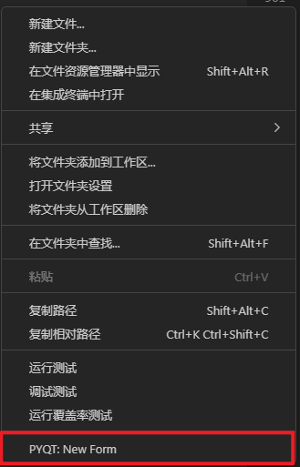

弹出下图所示的窗口。

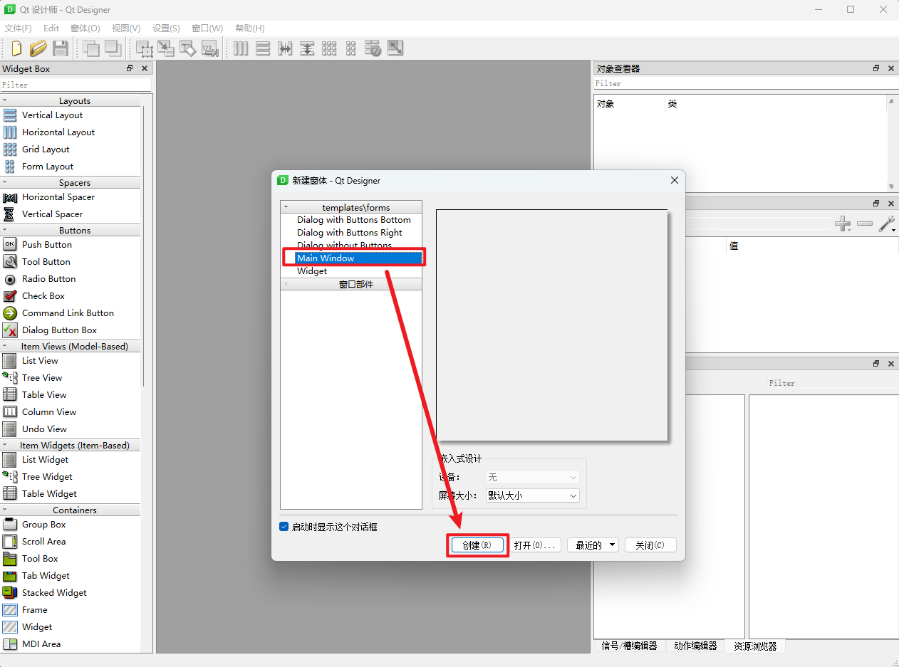

一般是选择`Main Window`，再点击创建。弹出下图窗口。

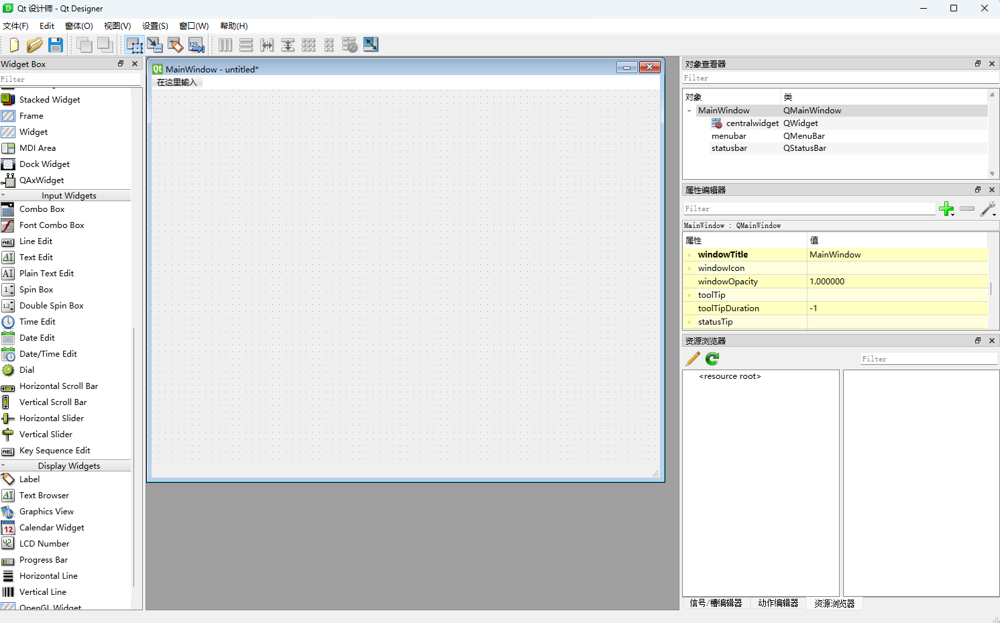

这个时候就可以从左边的控件库拖放一些控件到中间的界面中了。


>  **注意：**每个控件的用法，请参考文献[1,2]。此处不再赘述。

设计好`.ui`文件后，还需要将它转换成`.py`文件。保存好`.ui`文件，注意它的保存位置。回到VsCode，选中刚保存的`.ui`文件，先右键单击，再在菜单里选择`PYQT: Complie Form`。


那么就会得到一个新的文件，`UI_{your_ui_name}.py`，这个文件之后会在写界面逻辑的时候用到。

## 2.2 `.qrc`文件建立

`.qrc`是Qt里会用到的资源文件的集合。首先讲怎么新建qrc资源。右下角有个资源浏览器，先点“资源浏览器”，再点这个窗口左上角的铅笔。如下图所示。

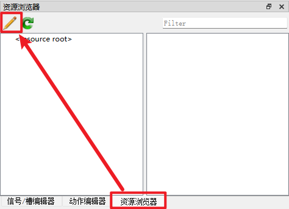

出来资源浏览器后，点击左边的“新建”。


建立好新的`.qrc`文件后，再点击下图红框所示的按钮，是为该新建`.qrc`文件建立分类。

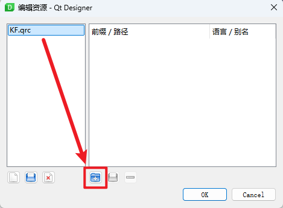

我自己可能会用到的资源都是图片，所以建立的分类前缀为“images”。

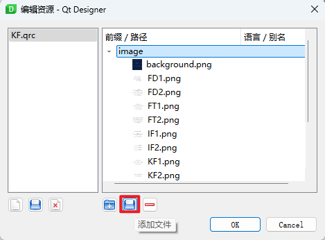

> **注意**：导入`.qrc`文件的过程，请见参考文献[1]。

同样地，也需要把该`.qrc`文件转换为`.py`文件。

回到VsCode，选中刚才建立的`.qrc`文件。先右键单击，再在菜单里选择`PYQT: Complie Resource`。


最后会在原文件夹生成一个`.py`文件。

这里要记住，如果`.ui`文件中导入了（即使不使用）`.qrc`文件，就必须要将该`.qrc`文件转换成`.py`，不然没法运行。如果没有没有在`.ui`文件里导入过`.qrc`文件，那么就不用管这个部分。

>这里注意，因为`.qrc`文件放在子文件夹`./asserts`里，生成的`Ui_xx.py`也在子文件夹>`./asserts`中，而主程序在上一级的主文件中。所以，导入`.qrc`文件的代码为
>
>```python
>import KF_rc
>```
>
>这里要改成从子文件夹导入，为（修改处：`.ui`转换后的`.py`文件）
>
>```python
>import asserts.KF_rc
>```

## 2.3 `qss`设计

qss是Qt的风格样式表，作用和css差不多，可以在菜鸟教程里看看css的教程 。

举个例子，先从左边控件库里选择“Push Button”，将按钮拖入窗口中，右键单击按钮，选择“修改样式表”，弹出来一个编辑样式表的框，如下图所示。


在框内输入如下代码。

```css
QPushButton {
    background-color:qlineargradient(spread:pad, x1:0, y1:0, x2:1, y2:0, 
    stop:0 #e66465, stop:1 #9198e5);
	color:rgb(227, 227, 227);
    padding: 4px;
    min-width: 65px;
    min-height: 12px;
	border-bottom-left-radius:20px;
	border-top-right-radius:20px;
	font-size: 16px;
}
 
QPushButton:hover {
    background-color: qlineargradient(spread:pad, x1:0, y1:0, x2:1, y2:0, 
    stop:0 #FF6465, stop:1 #9198FF);
	color:white;
}
QPushButton:pressed{
	background-color: rgb(65, 65, 65);
	color:white;
}
```

效果下图所示，首先是按钮没有被按下时的效果。

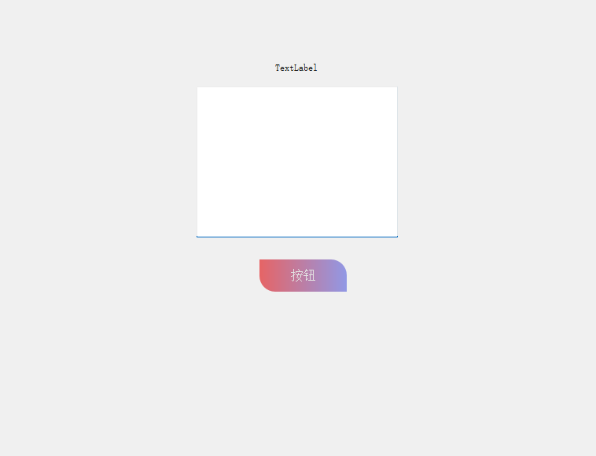

然后是按钮被按下时的效果，按下按钮后，改变按钮的背景色和文字的颜色。

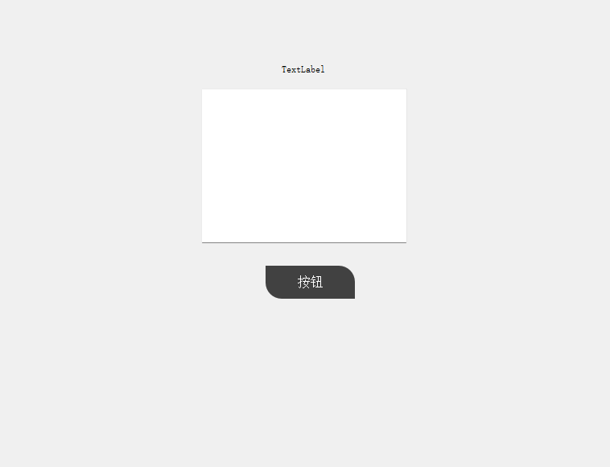

到这里，一个简单的ui界面已经设计完毕。

# 三、PyQt5的逻辑设计

## 3.1 新建.py逻辑文件

这里是拿使用卡尔曼滤波追踪匀速直线运动的导弹作为例子。

按照下图所示分为三个区域。


- 区域1：选择滤波模式、数据及图片保存模式，实现开始仿真和退出软件功能；
- 区域2：设置滤波参数；
- 区域3：显示对应滤波方法的原理公式。

这里首先把3个区域的初始框架搭建好，加上亿点细节，得到下图所示界面。

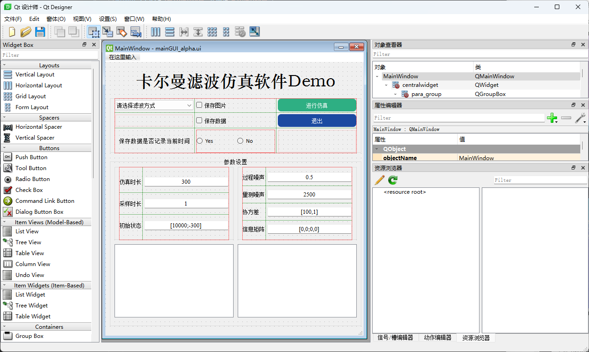

记得把所有控件的键名命名好，方便后面写逻辑的时候调用。

我给自己梳理的规则如下：（键名——控件类）

- xxx_lab——QLabel
- xxx_edit——QLineEdit
- xxx_grid——QGridLayout
- xxx_hbox——QHBoxLayout
- xxx_btn——QPushButton
- xxx_menu——QComboBox
- xxx_box——QCheckBox
- xxx_disp——QGraphicsView
- xxx_group——QGroupBox

这样在调用的时候，控件是什么类型一目了然，方便调用。

在写界面逻辑的时候，代码框架分成三个部分：

- Part 1：导入第三方包
- Part 2：建立主窗口类对象
- Part 3：主函数建立类对象实例并显示界面

```python
"""Part 1"""
import [pkgs]

"""Part 2"""
class MainApp(QMainWindow, UI_[your_ui_name]):
    def xxx:
        pass
    
"""Part 3"""
if __name__ == '__main__':
    pass
```

最重要的是`Part 2`部分，承担了界面逻辑的关键部分，下面针对本软件的界面逻辑进行详细讲解。

### 3.1.1 主窗口初始化

在构造类对象实例的时候，对主窗口进行初始化设置。

```python
def __init__(self):
        """主窗口初始化"""
        super().__init__()          # 调用父类的初始化方法
        self.setupUi(self)          # 加载UI设计
        self.init_ui()              # 初始化界面设置
        self.bind_events()          # 绑定UI事件处理函数
        self.init_flags()           # 初始化标志位变量
```

- `super().__init__() `调用 **父类**（`QMainWindow`）的初始化方法，确保主窗口的基本功能（如窗口显示、事件处理）正常启动。
- `setupUi(self)` 方法会初始化所有界面元素（如按钮、文本框、GroupBox 等）。而 `setupUi` 必须在父类（`QMainWindow`）的初始化完成后才能调用，否则会导致组件无法正确绑定到主窗口。

### 3.1.2 初始化界面

```python
def init_ui(self):
    """初始化界面显示设置"""
    self.setWindowTitle("卡尔曼滤波仿真软件Demo")  # 设置窗口标题
    self.update_graph_displays(0)       # 显示默认滤波方法对应的公式图
```

### 3.1.3 绑定ui事件处理机制

```python
def bind_events(self):
        """绑定UI元素事件到处理函数"""
        self.exit_btn.clicked.connect(self.close)                               # 退出按钮
        self.simu_btn.clicked.connect(self.run_simulation)                      # 仿真按钮
        self.method_menu.currentIndexChanged.connect(self.update_method_flag)   # 滤波方法选择
        self.save_fig_box.toggled.connect(self.update_save_fig_flag)            # 保存图表复选框
        self.save_data_box.toggled.connect(self.update_save_data_flag)          # 保存数据复选框
        self.yes_btn.toggled.connect(self.update_with_time_flag)                # 带时间戳单选按钮
        self.no_btn.toggled.connect(self.update_with_time_flag)                 # 不带时间戳单选按钮
```

上面`()`中的函数会在后面给出，是逻辑机制的关键部分。

### 3.1.4 初始化标志位

这个部分也可以放在`__init__()`里，写成函数更加符合模块化的要求。便于以后修改。

```python
def init_flags(self):
    """初始化控制标志位，存储UI选择状态"""
    self.method_flag = ""               # 当前选择的滤波方法
    self.save_fig_flag = False          # 是否保存图表
    self.save_data_flag = False         # 是否保存数据
    self.with_time_flag = False         # 是否在保存数据时添加时间戳
```

### 3.1.5 检查标志位状态

```python
def update_save_fig_flag(self, state):
    """更新保存图表标志位"""
    self.save_fig_flag = state

def update_save_data_flag(self, state):
    """更新保存数据标志位"""
    self.save_data_flag = state

def update_with_time_flag(self, state):
    """更新保存数据时是否添加时间戳标志位"""
    self.with_time_flag = self.yes_btn.isChecked()  # 根据Yes按钮状态更新标志
    
def update_method_flag(self, index):
    """更新滤波方法标志位并刷新公式图显示"""
    # 滤波方法索引到名称的映射
    method_map = {
        0: "请选择滤波方式",
        1: "信息滤波",
        2: "UD滤波",
        3: "遗忘滤波",
        4: "自适应遗忘滤波(1)",
        5: "自适应遗忘滤波(2)"
    }
    self.method_flag = method_map.get(index, "请选择滤波方式")  # 更新方法标志位
    self.update_graph_displays(index)             # 刷新公式图显示
    
def check_save_fig_warning(self, state):
    """检测保存图片复选框状态，显示提示"""
    if state == QtCore.Qt.Checked:  # 当勾选时
        msg = QMessageBox()
        msg.setIcon(QMessageBox.Warning)
        msg.setText("选择“保存图片”则仿真完毕之后不会展示结果。")
        msg.setWindowTitle("操作提示")
        msg.exec_()
```

### 3.1.6 读取数据输入

```python
def get_lineedit_values(self):
    """获取所有QLineEdit控件中的参数值"""
    return {
        "simu_time": self.simu_edit.text(),       # 仿真时长
        "sample_time": self.sample_edit.text(),   # 采样时长
        "init_state": self.init_edit.text(),      # 初始状态
        "process_noise": self.process_edit.text(),  # 过程噪声
        "P_matrix": self.P_edit.text(),           # 协方差矩阵
        "measure_noise": self.measure_edit.text(), # 量测噪声
        "info_matrix": self.info_edit.text()      # 信息矩阵
    }

def parse_numeric_params(self, params):
    """解析并验证数值参数，转换为指定数据类型"""
    errors = []
    parsed = {}

    # 解析整数
    for key in ["simu_time"]:
        try:
            parsed[key] = int(params[key])
        except ValueError:
            errors.append(f"{key}: 请输入有效整数")

    # 解析浮点数参数
    for key in ["sample_time", "process_noise", "measure_noise"]:
        try:
            parsed[key] = float(params[key])
        except ValueError:
            errors.append(f"{key}: 请输入有效的浮点数")

    # 解析初始状态 (2,) 数组
    try:
        # 处理类似 "[10000;-300]" 或 "[10000, -300]" 的输入格式
        values = params["init_state"].strip("[]").replace(";", ",").split(",")
        parsed["init_state"] = np.array([float(v.strip()) for v in values], dtype=float) # v.strip()用于移除字符串开头和结尾的特定字符
        if parsed["init_state"].shape != (2,):
            raise ValueError("需要包含两个元素的数组")
    except Exception as e:
        errors.append(f"init_state: {str(e)} (格式应为 [值1, 值2])")

    # 解析协方差矩阵 (2,) 数组
    try:
        # 处理类似 "[100,1]" 或 "[100;1]" 的输入格式
        values = params["P_matrix"].strip("[]").replace(";", ",").split(",")
        parsed["P_matrix"] = np.array([float(v.strip()) for v in values], dtype=float) # v.strip()用于移除字符串开头和结尾的特定字符
        if parsed["P_matrix"].shape != (2,):
            raise ValueError("需要包含两个元素的数组")
    except Exception as e:
        errors.append(f"P_matrix: {str(e)} (格式应为 [值1, 值2])")

    # 解析信息矩阵 (2,2) 数组
    try:
        # 处理类似 "[0,0;0,0]" 的输入格式
        rows = params["info_matrix"].strip("[]").split(";")
        parsed["info_matrix"] = np.array(
            [[float(v) for v in row.split(",")] for row in rows], 
            dtype=float
        )
        if parsed["info_matrix"].shape != (2, 2):
            raise ValueError("需要2x2的数组格式")
    except Exception as e:
        errors.append(f"info_matrix: {str(e)} (格式应为 [值1,值2;值3,值4])")

    return parsed, errors
```

### 3.1.7 根据不同的滤波方法显示不同的原理公式

```python
def update_graph_displays(self, index):
    """根据选择的滤波方法更新公式图显示"""
    # 滤波方法索引到公式图路径的映射
    image_paths = [
        ("./asserts/KF1.png", "./asserts/KF2.png"),    # 0: 卡尔曼滤波
        ("./asserts/IF1.png", "./asserts/IF2.png"),    # 1: 信息滤波
        ("./asserts/UD1.png", "./asserts/UD2.png"),    # 2: UD滤波
        ("./asserts/FD1.png", "./asserts/FD2.png"),    # 3: 遗忘滤波
        ("./asserts/FT1.png", "./asserts/FT2.png"),    # 4: 自适应遗忘滤波(1)
        ("./asserts/FT1.png", "./asserts/FT2.png"),    # 5: 自适应遗忘滤波(2)
    ]

    if 0 <= index < len(image_paths):  # 确保索引有效
        img1_path, img2_path = image_paths[index]
        self.display_image(self.eq1_disp, img1_path)  # 显示第一个公式图
        self.display_image(self.eq2_disp, img2_path)  # 显示第二个公式图

def display_image(self, graphics_view, image_path):
    """在指定的QGraphicsView中显示图片"""
    scene = QtWidgets.QGraphicsScene(graphics_view)  # 创建图形场景
    pixmap = QtGui.QPixmap(image_path)               # 加载图片

    # 缩放图片以适应视图大小，保持纵横比并平滑缩放
    scaled_pixmap = pixmap.scaled(
        graphics_view.size(),
        QtCore.Qt.KeepAspectRatio,
        QtCore.Qt.SmoothTransformation
    )

    scene.addPixmap(scaled_pixmap)  # 将缩放后的图片添加到场景
    graphics_view.setScene(scene)   # 设置视图的场景
    graphics_view.setAlignment(QtCore.Qt.AlignCenter)  # 图片居中显示
```

### 3.1.8 为程序设置icon

```python
def set_application_icon(self):
    """设置应用程序图标"""
    icon_path = os.path.join(os.path.dirname(os.path.abspath(__file__)), 'asserts', 'logo.ico')
    if os.path.exists(icon_path):
        self.setWindowIcon(QtGui.QIcon(icon_path))
        print(f"应用程序图标已设置: {icon_path}")
    else:
        print(f"警告: 图标文件不存在 - {icon_path}")
```

### 3.1.9 执行仿真

```python
def run_simulation(self):
    """执行仿真按钮点击事件处理"""
    # 收集标志位参数
    flags = {
        "method_flag": self.method_flag,
        "save_fig_flag": self.save_fig_flag,
        "save_data_flag": self.save_data_flag,
        "save_data_time_flag": self.with_time_flag
    }

    # 收集文本框参数
    params_txt = self.get_lineedit_values()

    # 解析数值参数
    params, errors = self.parse_numeric_params(params_txt)

    # 检查是否有解析错误
    if errors:
        error_msg = "参数解析错误:\n" + "\n".join(errors)
        QMessageBox.critical(self, "参数错误", error_msg)
        return

    # 打印所有参数（实际应用中可替换为仿真计算逻辑）
    # print("\n===== 仿真参数设置 =====")
    # print("滤波方法:", flags["method_flag"])
    # print("保存图表:", flags["save_fig_flag"])
    # print("保存数据:", flags["save_data_flag"])
    # print("数据带时间戳:", flags["save_data_time_flag"])

    # print("\n===== 仿真具体参数 =====")
    # print("仿真时长:", params["simu_time"])
    # print("采样时长:", params["sample_time"])
    # print("初始状态:\n", params["init_state"])
    # print("过程噪声:", params["process_noise"])
    # print("协方差矩阵:\n", params["P_matrix"])
    # print("量测噪声:", params["measure_noise"])
    # print("信息矩阵:\n", params["info_matrix"])

    print("===== 开始仿真计算 =====")

    # 仿真参数
    T = params["simu_time"]                 # 仿真时长
    Ts = params["sample_time"]              # 采样时长
    Q = params["process_noise"] * Ts        # 过程噪声
    R = params["measure_noise"]             # 量测噪声

    # 生成噪声序列
    W = np.sqrt(Q) * np.random.randn(1, T)
    V = np.sqrt(R) * np.random.randn(1, T)
    p0 = params["P_matrix"]                 # 初始协方差阵参数
    P0 = np.diag([p0[0], p0[1]])            # 初始协方差阵
    I0 = params["info_matrix"]              # 初始信息阵设置为0

    # 系统矩阵
    A = np.array([[0, 1], [0, 0]])          # 状态矩阵
    I = np.eye(2)                           # 单位阵
    Phi = I + A * Ts                        # 离散化
    H = np.array([[1, 0]])                  # 量测矩阵
    Gamma = np.array([[0], [1]])

    # 设置滤波维度
    nS = 2                                  # 状态维度
    nZ = 1                                  # 观测维度

    # 分配空间
    x_state = np.zeros((nS, T))             # 系统真实值
    z_mea = np.zeros((nZ, T))               # 系统观测值
    x_KF = np.zeros((nS, T))                # 卡尔曼滤波状态值

    # 赋初值
    x_state[:, 0] = params["init_state"]    # 系统状态初值
    z_mea[:, 0] = np.dot(H, x_state[:, 0])  # 系统观测初值
    x_KF[:, 0] = x_state[:, 0]              # 卡尔曼滤波器估计初值

    # 02 用模型模拟真实状态
    for t in range(1, T):
        x_state[:, t] = np.dot(Phi,x_state[:, t-1]) + np.dot(Gamma, W[0, t]).squeeze()
        z_mea[:, t] = np.dot(H, x_state[:, t]) + V[0, t]

    # 03-1 Kalman滤波
    if self.method_flag == '请选择滤波方式':
        mode = 'null'
        print("请先选择滤波方法！")
        QMessageBox.warning(self, "操作提示", "请先选择滤波方法！", QMessageBox.Ok)
        return  # 终止仿真流程

        # #下述代码为KF滤波方法
        # mode = 'null'
        # mode_str = 'KF'
        # P0_kf = P0.copy()  # 复制初始P0
        # for t in range(1, T):
        #     x_KF[:, t], P0_kf = KF(x_KF, P0_kf, z_mea, Phi, Gamma, H, Q, R, I, t)
        # # 画图
        # filter_plot(x_state, z_mea, x_KF, None, None, None, None, T, mode, self.save_fig_flag, mode_str)

    # 04-1 习题1：信息滤波
    elif self.method_flag == '信息滤波':
        mode = 'Problem 1'
        mode_str = 'IF'
        # 分配空间并赋予滤波器变量初值
        s_IF = np.zeros((nS, T))  # 信息滤波状态值
        x_IF = np.zeros((nS, T))
        s_IF[:, 0] = np.dot(I0, x_state[:, 0])  # 信息滤波器赋估计初值
        Phi_inv = np.linalg.pinv(Phi)  # 先求逆，减少计算量
        Q_inv = 1/Q
        R_inv = 1/R

        # 重新初始化I0为协方差阵的逆
        I0 = np.linalg.inv(P0.copy())

        for t in range(1, T):
            M_k_1 = np.dot(np.dot(Phi_inv.T, I0), Phi_inv)
            N_k_1 = np.dot(np.dot(np.dot(M_k_1, Gamma), np.linalg.pinv(np.dot(np.dot(Gamma.T, M_k_1), Gamma) + Q_inv)), Gamma.T)
            S_pre = np.dot((I - N_k_1), np.dot(Phi_inv.T, s_IF[:, t-1]))
            I_pre = np.dot((I - N_k_1), M_k_1)
            s_IF[:, t] = S_pre + np.dot(H.T, np.dot(R_inv, z_mea[:, t]))
            I0 = I_pre + np.dot(H.T, np.dot(R_inv, H))
            x_IF[:, t] = np.dot(np.linalg.pinv(I0), s_IF[:, t])

        # 画图
        filter_plot(x_state, z_mea, x_KF, x_IF, None, None, None, T, mode, self.save_fig_flag, mode_str)
        print("滤波方法:", flags["method_flag"])

    # 04-2 习题2：UD滤波
    elif self.method_flag == 'UD滤波':
        mode = 'Problem 2'
        mode_str = 'UD'
        # 分配空间并赋予滤波器变量初值
        x_UD = np.zeros((nS, T))  # UD滤波状态值
        x_UD[:, 0] = x_state[:, 0]  # UD滤波器赋估计初值
        P0_ud = np.diag([10**2, 1**2])  # 初始协方差阵

        for t in range(1, T):
            # 时间更新
            xUD_pre = np.dot(Phi, x_UD[:, t-1])
            U, D = udu(P0_ud)  # 将协方差阵作UD分解
            U, D = UD_update(U, D, Phi, Gamma, Q, H, R, 'T')  # 时间更新
            P_pre = np.dot(np.dot(U, np.diag(D.flatten())), U.T)

            # 量测更新
            K = np.dot(np.dot(P_pre, H.T), np.linalg.pinv(np.dot(np.dot(H, P_pre), H.T) + R))
            x_UD[:, t] = xUD_pre + np.dot(K, (z_mea[:, t] - np.dot(H, xUD_pre)))
            U, D = udu(P_pre)  # 将一步预测协方差阵作UD分解
            U, D = UD_update(U, D, Phi, Gamma, Q, H, R, 'M')  # 测量更新
            P0_ud = np.dot(np.dot(U, np.diag(D.flatten())), U.T)

        # 画图
        filter_plot(x_state, z_mea, x_KF, None, x_UD, None, None, T, mode, self.save_fig_flag, mode_str)
        print("滤波方法:", flags["method_flag"])


    # 04-3 习题3：遗忘滤波
    elif self.method_flag == '遗忘滤波':
        mode = 'Problem 3'
        mode_str = 'FD'
        # 根据题设条件，设置初始化参数
        a = 1  # 加速度(m/s^2)，减速机动，因为速度为负，所以这里符号为正
        acc = np.dot(np.array([0.5*Ts**2, Ts]), a)  # 构造矩阵
        t_100 = 100  # 时间(s)，导弹在第100秒时，减速机动
        t_200 = 200  # 时间(s)，导弹在第200秒后，停止减速机动，进入匀速运动

        # 根据题设条件，用模型模拟真实状态
        for t in range(1, T):
            if t < t_100 or t >= t_200:
                x_state[:, t] = np.dot(Phi, x_state[:, t-1]) + np.dot(Gamma, W[0, t]).squeeze()
            else:
                x_state[:, t] = np.dot(Phi, x_state[:, t-1]) + acc + np.dot(Gamma, W[0, t]).squeeze()
            z_mea[:, t] = np.dot(H, x_state[:, t]) + V[0, t]

        # 分配空间并赋予滤波器变量初值
        s = 1.1  # 渐消因子
        x_KF = np.zeros((nS, T))  # 卡尔曼滤波状态值
        x_KF[:, 0] = x_state[:, 0]  # 卡尔曼滤波器估计初值
        x_FD = np.zeros((nS, T))  # 遗忘滤波状态值
        x_FD[:, 0] = x_state[:, 0]  # 遗忘滤波器赋估计初值

        # 再做一次卡尔曼滤波
        P0_kf = np.diag([10**2, 1**2])  # 重新设置初始P0
        for t in range(1, T):
            x_KF[:, t], P0_kf = KF(x_KF, P0_kf, z_mea, Phi, Gamma, H, Q, R, I, t)

        # 遗忘滤波
        P0_fd = np.diag([10**2, 1**2])  # 重新设置初始P0
        for t in range(1, T):
            # 时间更新
            xFD_pre = np.dot(Phi, x_FD[:, t-1])
            P_pre = np.dot(np.dot(Phi, s * P0_fd), Phi.T) + np.dot(np.dot(Gamma, Q), Gamma.T)

            # 量测更新
            K = np.dot(np.dot(P_pre, H.T), np.linalg.pinv(np.dot(np.dot(H, P_pre), H.T) + R))
            x_FD[:, t] = xFD_pre + np.dot(K, (z_mea[:, t] - np.dot(H, xFD_pre)))
            P0_fd = np.dot((I - np.dot(K, H)), P_pre)

        # 画图
        filter_plot(x_state, z_mea, x_KF, None, None, x_FD, None, T, mode, self.save_fig_flag, mode_str)
        print("滤波方法:", flags["method_flag"])

    # 04-4-1 习题4（1）
    elif self.method_flag == '自适应遗忘滤波(1)':
        mode = 'Problem 4-1'
        mode_str = 'FT1'
        R_1s = 100  # 量测噪声方差为100m^2
        R_100s = 10000  # 量测噪声方差为10000m^2

        # 构造量测噪声序列
        V = np.zeros((1, T))
        V[0, :100] = np.sqrt(R_1s) * np.random.randn(100)  # 1-100s，方差为100m^2
        V[0, 100:] = np.sqrt(R_100s) * np.random.randn(T-100)  # 100s之后，方差为10000m^2

        # 根据题设条件，用模型模拟真实状态
        for t in range(1, T):
            if t == 150:  # 在150s时出现量测故障导致雷达输出为0
                z_mea[:, t] = 0
            else:
                z_mea[:, t] = np.dot(H, x_state[:, t]) + V[0, t]

        # 再做一次卡尔曼滤波
        P0_kf = np.diag([10**2, 1**2])  # 重新设置初始P0
        for t in range(1, T):
            # 时间更新
            xKF_pre = np.dot(Phi, x_KF[:, t-1])
            P_pre = np.dot(np.dot(Phi, P0_kf), Phi.T) + np.dot(np.dot(Gamma, Q), Gamma.T)

            # 量测更新
            K = np.dot(np.dot(P_pre, H.T), np.linalg.pinv(np.dot(np.dot(H, P_pre), H.T) + R_1s))
            x_KF[:, t] = xKF_pre + np.dot(K, (z_mea[:, t] - np.dot(H, xKF_pre)))
            P0_kf = np.dot((I - np.dot(K, H)), P_pre)

        # 分配空间并赋予滤波器变量初值
        x_fault = np.zeros((nS, T))  # 自适应遗忘滤波状态值
        x_fault[:, 0] = x_state[:, 0]  # 自适应遗忘滤波器赋估计初值
        beta = np.zeros(T)
        beta[0] = 1
        b = 0.999  # 渐消因子
        C = np.dot(np.dot(H, (np.dot(np.dot(Phi, P0), Phi.T) + np.dot(np.dot(Gamma, Q), Gamma.T))), H.T) + R  # 新息序列方差阵
        zNew = 15

        # 量测噪声方差自适应滤波处理
        for t in range(1, T):
            # 时间更新
            xFault_pre = np.dot(Phi, x_fault[:, t-1])  # 状态一步预测
            P_pre = np.dot(np.dot(Phi, P0), Phi.T) + np.dot(np.dot(Gamma, Q), Gamma.T)  # 协方差一步预测

            # 量测更新
            beta[t] = beta[t-1] / (beta[t-1] + b)  # 更新新息序列方差阵的系数
            C = (1 - beta[t]) * C + beta[t] * (zNew * zNew)

            if abs(np.trace(C) / np.trace(np.dot(np.dot(H, P_pre), H.T) + R_1s)) > 2:  # 量测故障检测与隔离
                x_fault[:, t] = xFault_pre  # 无需量测更新，估计值用时间更新值代替
                P0 = P_pre
            else:
                alpha = np.trace(C - np.dot(np.dot(H, P_pre), H.T)) / np.trace(np.array([[R_1s]])) # 将 R_1s 转换为 1x1 矩阵
                K = np.dot(np.dot(P_pre, H.T), np.linalg.pinv(np.dot(np.dot(H, P_pre), H.T) + alpha * R_1s))
                zNew = z_mea[:, t] - np.dot(H, xFault_pre)
                x_fault[:, t] = xFault_pre + np.dot(K, zNew)
                P0 = np.dot((I - np.dot(K, H)), P_pre)

        # 画图
        filter_plot(x_state, z_mea, x_KF, None, None, None, x_fault, T, mode, self.save_fig_flag, mode_str)
        print("滤波方法:", flags["method_flag"])

    # 04-4-2 习题4（2）
    elif self.method_flag == '自适应遗忘滤波(2)':
        mode = 'Problem 4-2'
        mode_str = 'FT2'
        R_1s = 100  # 量测噪声方差为100m^2
        R_100s = 10  # 量测噪声方差为10m^2

        # 构造量测噪声序列
        V = np.zeros((1, T))
        V[0, :100] = np.sqrt(R_1s) * np.random.randn(100)  # 1-100s，方差为100m^2
        V[0, 100:] = np.sqrt(R_100s) * np.random.randn(T-100)  # 100s之后，方差为10m^2

        # 根据题设条件，用模型模拟真实状态
        for t in range(1, T):
            z_mea[:, t] = np.dot(H, x_state[:, t]) + V[0, t]

        # 再做一次卡尔曼滤波
        P0_kf = np.diag([10**2, 1**2])  # 重新设置初始P0
        for t in range(1, T):
            # 时间更新
            xKF_pre = np.dot(Phi, x_KF[:, t-1])
            P_pre = np.dot(np.dot(Phi, P0_kf), Phi.T) + np.dot(np.dot(Gamma, Q), Gamma.T)

            # 量测更新
            K = np.dot(np.dot(P_pre, H.T), np.linalg.pinv(np.dot(np.dot(H, P_pre), H.T) + R_1s))
            x_KF[:, t] = xKF_pre + np.dot(K, (z_mea[:, t] - np.dot(H, xKF_pre)))
            P0_kf = np.dot((I - np.dot(K, H)), P_pre)

        # 分配空间并赋予滤波器变量初值
        x_fault = np.zeros((nS, T))  # 自适应遗忘滤波状态值
        x_fault[:, 0] = x_state[:, 0]  # 自适应遗忘滤波器赋估计初值
        beta = np.zeros(T)
        beta[0] = 1
        b = 0.999  # 渐消因子
        C = np.dot(np.dot(H, (np.dot(np.dot(Phi, P0), Phi.T) + np.dot(np.dot(Gamma, Q), Gamma.T))), H.T) + R  # 新息序列方差阵
        zNew = 15

        # 量测噪声方差自适应滤波处理
        for t in range(1, T):
            # 时间更新
            xFault_pre = np.dot(Phi, x_fault[:, t-1])  # 状态一步预测
            P_pre = np.dot(np.dot(Phi, P0), Phi.T) + np.dot(np.dot(Gamma, Q), Gamma.T)  # 协方差一步预测

            # 量测更新
            beta[t] = beta[t-1] / (beta[t-1] + b)  # 更新新息序列方差阵的系数
            C = (1 - beta[t]) * C + beta[t] * (zNew * zNew)

            if abs(np.trace(C) / np.trace(np.dot(np.dot(H, P_pre), H.T) + R_1s)) > 2:  # 量测故障检测与隔离
                x_fault[:, t] = xFault_pre  # 无需量测更新，估计值用时间更新值代替
                P0 = P_pre
            else:
                alpha = np.trace(C - np.dot(np.dot(H, P_pre), H.T)) / np.trace(np.array([[R_1s]])) # 将 R_1s 转换为 1x1 矩阵
                K = np.dot(np.dot(P_pre, H.T), np.linalg.pinv(np.dot(np.dot(H, P_pre), H.T) + alpha * R_1s))
                zNew = z_mea[:, t] - np.dot(H, xFault_pre)
                x_fault[:, t] = xFault_pre + np.dot(K, zNew)
                P0 = np.dot((I - np.dot(K, H)), P_pre)

        # 画图
        filter_plot(x_state, z_mea, x_KF, None, None, None, x_fault, T, mode, self.save_fig_flag, mode_str)
        print("滤波方法:", flags["method_flag"])
```

### 3.1.10 保存数据

```python
# 保存数据
if self.save_data_flag:
    data_to_save = {
        'x_state': x_state,
        'z_mea': z_mea,
        'xKF': x_KF,
        'mode': mode,
        'T': T,
        'Ts': Ts,
        'Q': Q,
        'R': R
    }

    if mode == 'Problem 1':
        data_to_save['xIF'] = x_IF
    elif mode == 'Problem 2':
        data_to_save['xUD'] = x_UD
    elif mode == 'Problem 3':
        data_to_save['xFD'] = x_FD
    elif mode in ['Problem 4-1', 'Problem 4-2']:
        data_to_save['xFault'] = x_fault

    if self.with_time_flag:
        # 获取当前日期
        now = datetime.now()
        date_str = now.strftime("%Y%m%d")
        save_path = f'./data/{mode_str}_{date_str}.pkl'
    else:
        save_path = f'./data/{mode_str}.pkl'

    # 使用pickle保存数据
    with open(save_path, 'wb') as f:
        pickle.dump(data_to_save, f, protocol=pickle.HIGHEST_PROTOCOL)

    print(f"仿真结果已保存至: ./figures/")
    print(f"数据已保存至: {save_path}")
print("===== 仿真计算结束 =====")
```

这个部分写在`run_simulation()`里。

### 3.1.11 分辨率自适应

不同屏幕分辨率下，界面大小也会有所不同。我自己使用的屏幕是一块2k屏幕，在这块屏幕上开发完毕后。再在笔记本电脑屏幕上打开，界面就会崩坏。如下图所示。

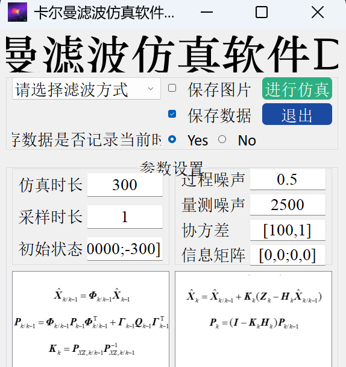

这样是不行的，因为不能只在自己特定的屏幕上显示正常，以后还要放在其他电脑上运行，无法预知对方的屏幕分辨率。所以需要分辨率自适应变化的功能，在主程序里写入如下代码。

```python
QtCore.QCoreApplication.setAttribute(QtCore.Qt.AA_EnableHighDpiScaling)
```

再者，加上上面的代码之后，控件的分辨率自适应问题解决了，但是字体的分辨率自适应问题还没有解决。字体变得特别特别小，几乎看不见。

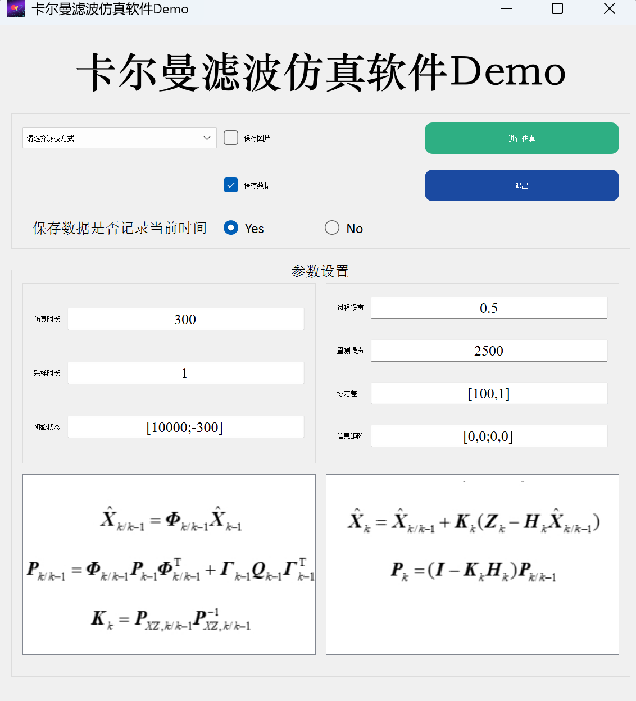

所以还要加上这一段代码。

```python
screen = app.primaryScreen()    # 返回当前主显示器的信息
scale_factor = screen.logicalDotsPerInch() / 96  # 96dpi为标准缩放（100%），结果如1.75（175%缩放）
font = QtGui.QFont()            # 创建默认字体
font.setPointSize(int(10 * scale_factor))  # 原字体10pt，乘以缩放因子
app.setFont(font)
```

## 3.2 最终成品

最后，整个界面如下图所示。

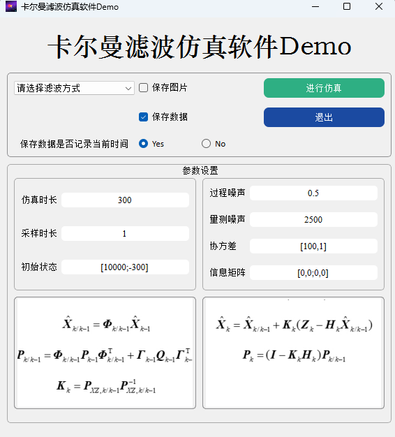

主程序代码如下。

```python
import sys
import os
import numpy as np
# 导入PyQt5所需模块
from PyQt5 import QtCore, QtGui, QtWidgets
from PyQt5.QtWidgets import QApplication, QMainWindow, QMessageBox
from Ui_mainGUI_alpha import Ui_MainWindow
# 导入PyQt风格模块

# 导入方法
from user_function.KF import KF
from user_function.UD_update import UD_update
from user_function.udu import udu
from user_function.filter_plot import filter_plot
# 导入保存数据所需模块
import pickle
import numpy as np
from datetime import datetime

class MainApp(QMainWindow, Ui_MainWindow):
    def __init__(self):
        """主窗口初始化"""
        super().__init__()          # 调用父类的初始化方法
        self.setupUi(self)          # 加载UI设计
        self.init_ui()              # 初始化界面设置
        self.bind_events()          # 绑定UI事件处理函数
        self.init_flags()           # 初始化标志位变量
        
        # 设置图形显示区域无边框和滚动条
        self.eq1_disp.setVerticalScrollBarPolicy(QtCore.Qt.ScrollBarAlwaysOff)
        self.eq1_disp.setHorizontalScrollBarPolicy(QtCore.Qt.ScrollBarAlwaysOff)
        self.eq2_disp.setVerticalScrollBarPolicy(QtCore.Qt.ScrollBarAlwaysOff)
        self.eq2_disp.setHorizontalScrollBarPolicy(QtCore.Qt.ScrollBarAlwaysOff)
        
        # 设置默认选中状态
        self.yes_btn.setChecked(True)       # 默认选择"带时间戳"选项
        self.save_fig_box.setChecked(False)  # 默认选择"保存图片"选项
        self.save_data_box.setChecked(True) # 默认选择"保存数据"选项

        # 初始化下拉菜单栏状态
        self.method_menu.currentIndexChanged.emit(0)  # 触发索引0的变化（默认选项）
        
        # 设置应用程序图标
        self.set_application_icon()

        # 绑定保存图片复选框的状态变更事件
        self.save_fig_box.stateChanged.connect(self.check_save_fig_warning)

    def init_ui(self):
        """初始化界面显示设置"""
        self.setWindowTitle("卡尔曼滤波仿真软件Demo")  # 设置窗口标题
        self.update_graph_displays(0)       # 显示默认滤波方法对应的公式图

    def init_flags(self):
        """初始化控制标志位，存储UI选择状态"""
        self.method_flag = ""               # 当前选择的滤波方法
        self.save_fig_flag = False          # 是否保存图表
        self.save_data_flag = False         # 是否保存数据
        self.with_time_flag = False         # 是否在保存数据时添加时间戳

    def bind_events(self):
        """绑定UI元素事件到处理函数"""
        self.exit_btn.clicked.connect(self.close)                               # 退出按钮
        self.simu_btn.clicked.connect(self.run_simulation)                      # 仿真按钮
        self.method_menu.currentIndexChanged.connect(self.update_method_flag)   # 滤波方法选择
        self.save_fig_box.toggled.connect(self.update_save_fig_flag)            # 保存图表复选框
        self.save_data_box.toggled.connect(self.update_save_data_flag)          # 保存数据复选框
        self.yes_btn.toggled.connect(self.update_with_time_flag)                # 带时间戳单选按钮
        self.no_btn.toggled.connect(self.update_with_time_flag)                 # 不带时间戳单选按钮

    def set_application_icon(self):
        """设置应用程序图标"""
        icon_path = os.path.join(os.path.dirname(os.path.abspath(__file__)), 'asserts', 'logo.ico')
        if os.path.exists(icon_path):
            self.setWindowIcon(QtGui.QIcon(icon_path))
            print(f"应用程序图标已设置: {icon_path}")
        else:
            print(f"警告: 图标文件不存在 - {icon_path}")

    def check_save_fig_warning(self, state):
        """检测保存图片复选框状态，显示提示"""
        if state == QtCore.Qt.Checked:  # 当勾选时
            msg = QMessageBox()
            msg.setIcon(QMessageBox.Warning)
            msg.setText("选择“保存图片”则仿真完毕之后不会展示结果。")
            msg.setWindowTitle("操作提示")
            msg.exec_()

    def update_method_flag(self, index):
        """更新滤波方法标志位并刷新公式图显示"""
        # 滤波方法索引到名称的映射
        method_map = {
            0: "请选择滤波方式",
            1: "信息滤波",
            2: "UD滤波",
            3: "遗忘滤波",
            4: "自适应遗忘滤波(1)",
            5: "自适应遗忘滤波(2)"
        }
        self.method_flag = method_map.get(index, "请选择滤波方式")  # 更新方法标志位
        self.update_graph_displays(index)             # 刷新公式图显示

    def update_save_fig_flag(self, state):
        """更新保存图表标志位"""
        self.save_fig_flag = state

    def update_save_data_flag(self, state):
        """更新保存数据标志位"""
        self.save_data_flag = state

    def update_with_time_flag(self, state):
        """更新保存数据时是否添加时间戳标志位"""
        self.with_time_flag = self.yes_btn.isChecked()  # 根据Yes按钮状态更新标志

    def update_graph_displays(self, index):
        """根据选择的滤波方法更新公式图显示"""
        # 滤波方法索引到公式图路径的映射
        image_paths = [
            ("./asserts/KF1.png", "./asserts/KF2.png"),    # 0: 卡尔曼滤波
            ("./asserts/IF1.png", "./asserts/IF2.png"),    # 1: 信息滤波
            ("./asserts/UD1.png", "./asserts/UD2.png"),    # 2: UD滤波
            ("./asserts/FD1.png", "./asserts/FD2.png"),    # 3: 遗忘滤波
            ("./asserts/FT1.png", "./asserts/FT2.png"),    # 4: 自适应遗忘滤波(1)
            ("./asserts/FT1.png", "./asserts/FT2.png"),    # 5: 自适应遗忘滤波(2)
        ]
        
        if 0 <= index < len(image_paths):  # 确保索引有效
            img1_path, img2_path = image_paths[index]
            self.display_image(self.eq1_disp, img1_path)  # 显示第一个公式图
            self.display_image(self.eq2_disp, img2_path)  # 显示第二个公式图

    def display_image(self, graphics_view, image_path):
        """在指定的QGraphicsView中显示图片"""
        scene = QtWidgets.QGraphicsScene(graphics_view)  # 创建图形场景
        pixmap = QtGui.QPixmap(image_path)               # 加载图片
        
        # 缩放图片以适应视图大小，保持纵横比并平滑缩放
        scaled_pixmap = pixmap.scaled(
            graphics_view.size(),
            QtCore.Qt.KeepAspectRatio,
            QtCore.Qt.SmoothTransformation
        )
        
        scene.addPixmap(scaled_pixmap)  # 将缩放后的图片添加到场景
        graphics_view.setScene(scene)   # 设置视图的场景
        graphics_view.setAlignment(QtCore.Qt.AlignCenter)  # 图片居中显示

    def get_lineedit_values(self):
        """获取所有QLineEdit控件中的参数值"""
        return {
            "simu_time": self.simu_edit.text(),       # 仿真时长
            "sample_time": self.sample_edit.text(),   # 采样时长
            "init_state": self.init_edit.text(),      # 初始状态
            "process_noise": self.process_edit.text(),  # 过程噪声
            "P_matrix": self.P_edit.text(),           # 协方差矩阵
            "measure_noise": self.measure_edit.text(), # 量测噪声
            "info_matrix": self.info_edit.text()      # 信息矩阵
        }

    def parse_numeric_params(self, params):
        """解析并验证数值参数，转换为指定数据类型"""
        errors = []
        parsed = {}

        # 解析整数
        for key in ["simu_time"]:
            try:
                parsed[key] = int(params[key])
            except ValueError:
                errors.append(f"{key}: 请输入有效整数")
        
        # 解析浮点数参数
        for key in ["sample_time", "process_noise", "measure_noise"]:
            try:
                parsed[key] = float(params[key])
            except ValueError:
                errors.append(f"{key}: 请输入有效的浮点数")
        
        # 解析初始状态 (2,) 数组
        try:
            # 处理类似 "[10000;-300]" 或 "[10000, -300]" 的输入格式
            values = params["init_state"].strip("[]").replace(";", ",").split(",")
            parsed["init_state"] = np.array([float(v.strip()) for v in values], dtype=float) # v.strip()用于移除字符串开头和结尾的特定字符
            if parsed["init_state"].shape != (2,):
                raise ValueError("需要包含两个元素的数组")
        except Exception as e:
            errors.append(f"init_state: {str(e)} (格式应为 [值1, 值2])")
        
        # 解析协方差矩阵 (2,) 数组
        try:
            # 处理类似 "[100,1]" 或 "[100;1]" 的输入格式
            values = params["P_matrix"].strip("[]").replace(";", ",").split(",")
            parsed["P_matrix"] = np.array([float(v.strip()) for v in values], dtype=float) # v.strip()用于移除字符串开头和结尾的特定字符
            if parsed["P_matrix"].shape != (2,):
                raise ValueError("需要包含两个元素的数组")
        except Exception as e:
            errors.append(f"P_matrix: {str(e)} (格式应为 [值1, 值2])")
        
        # 解析信息矩阵 (2,2) 数组
        try:
            # 处理类似 "[0,0;0,0]" 的输入格式
            rows = params["info_matrix"].strip("[]").split(";")
            parsed["info_matrix"] = np.array(
                [[float(v) for v in row.split(",")] for row in rows], 
                dtype=float
            )
            if parsed["info_matrix"].shape != (2, 2):
                raise ValueError("需要2x2的数组格式")
        except Exception as e:
            errors.append(f"info_matrix: {str(e)} (格式应为 [值1,值2;值3,值4])")
        
        return parsed, errors

    def run_simulation(self):
        """执行仿真按钮点击事件处理"""
        # 收集标志位参数
        flags = {
            "method_flag": self.method_flag,
            "save_fig_flag": self.save_fig_flag,
            "save_data_flag": self.save_data_flag,
            "save_data_time_flag": self.with_time_flag
        }
        
        # 收集文本框参数
        params_txt = self.get_lineedit_values()
        
        # 解析数值参数
        params, errors = self.parse_numeric_params(params_txt)
        
        # 检查是否有解析错误
        if errors:
            error_msg = "参数解析错误:\n" + "\n".join(errors)
            QMessageBox.critical(self, "参数错误", error_msg)
            return
        
        # 打印所有参数（实际应用中可替换为仿真计算逻辑）
        # print("\n===== 仿真参数设置 =====")
        # print("滤波方法:", flags["method_flag"])
        # print("保存图表:", flags["save_fig_flag"])
        # print("保存数据:", flags["save_data_flag"])
        # print("数据带时间戳:", flags["save_data_time_flag"])
        
        # print("\n===== 仿真具体参数 =====")
        # print("仿真时长:", params["simu_time"])
        # print("采样时长:", params["sample_time"])
        # print("初始状态:\n", params["init_state"])
        # print("过程噪声:", params["process_noise"])
        # print("协方差矩阵:\n", params["P_matrix"])
        # print("量测噪声:", params["measure_noise"])
        # print("信息矩阵:\n", params["info_matrix"])
        
        print("===== 开始仿真计算 =====")

        # 仿真参数
        T = params["simu_time"]                 # 仿真时长
        Ts = params["sample_time"]              # 采样时长
        Q = params["process_noise"] * Ts        # 过程噪声
        R = params["measure_noise"]             # 量测噪声

        # 生成噪声序列
        W = np.sqrt(Q) * np.random.randn(1, T)
        V = np.sqrt(R) * np.random.randn(1, T)
        p0 = params["P_matrix"]                 # 初始协方差阵参数
        P0 = np.diag([p0[0], p0[1]])            # 初始协方差阵
        I0 = params["info_matrix"]              # 初始信息阵设置为0

        # 系统矩阵
        A = np.array([[0, 1], [0, 0]])          # 状态矩阵
        I = np.eye(2)                           # 单位阵
        Phi = I + A * Ts                        # 离散化
        H = np.array([[1, 0]])                  # 量测矩阵
        Gamma = np.array([[0], [1]])

        # 设置滤波维度
        nS = 2                                  # 状态维度
        nZ = 1                                  # 观测维度

        # 分配空间
        x_state = np.zeros((nS, T))             # 系统真实值
        z_mea = np.zeros((nZ, T))               # 系统观测值
        x_KF = np.zeros((nS, T))                # 卡尔曼滤波状态值

        # 赋初值
        x_state[:, 0] = params["init_state"]    # 系统状态初值
        z_mea[:, 0] = np.dot(H, x_state[:, 0])  # 系统观测初值
        x_KF[:, 0] = x_state[:, 0]              # 卡尔曼滤波器估计初值

        # 02 用模型模拟真实状态
        for t in range(1, T):
            x_state[:, t] = np.dot(Phi,x_state[:, t-1]) + np.dot(Gamma, W[0, t]).squeeze()
            z_mea[:, t] = np.dot(H, x_state[:, t]) + V[0, t]

        # 03-1 Kalman滤波
        if self.method_flag == '请选择滤波方式':
            mode = 'null'
            print("请先选择滤波方法！")
            QMessageBox.warning(self, "操作提示", "请先选择滤波方法！", QMessageBox.Ok)
            return  # 终止仿真流程
        
            # #下述代码为KF滤波方法
            # mode = 'null'
            # mode_str = 'KF'
            # P0_kf = P0.copy()  # 复制初始P0
            # for t in range(1, T):
            #     x_KF[:, t], P0_kf = KF(x_KF, P0_kf, z_mea, Phi, Gamma, H, Q, R, I, t)
            # # 画图
            # filter_plot(x_state, z_mea, x_KF, None, None, None, None, T, mode, self.save_fig_flag, mode_str)

        # 04-1 习题1：信息滤波
        elif self.method_flag == '信息滤波':
            mode = 'Problem 1'
            mode_str = 'IF'
            # 分配空间并赋予滤波器变量初值
            s_IF = np.zeros((nS, T))  # 信息滤波状态值
            x_IF = np.zeros((nS, T))
            s_IF[:, 0] = np.dot(I0, x_state[:, 0])  # 信息滤波器赋估计初值
            Phi_inv = np.linalg.pinv(Phi)  # 先求逆，减少计算量
            Q_inv = 1/Q
            R_inv = 1/R

            # 重新初始化I0为协方差阵的逆
            I0 = np.linalg.inv(P0.copy())
            
            for t in range(1, T):
                M_k_1 = np.dot(np.dot(Phi_inv.T, I0), Phi_inv)
                N_k_1 = np.dot(np.dot(np.dot(M_k_1, Gamma), np.linalg.pinv(np.dot(np.dot(Gamma.T, M_k_1), Gamma) + Q_inv)), Gamma.T)
                S_pre = np.dot((I - N_k_1), np.dot(Phi_inv.T, s_IF[:, t-1]))
                I_pre = np.dot((I - N_k_1), M_k_1)
                s_IF[:, t] = S_pre + np.dot(H.T, np.dot(R_inv, z_mea[:, t]))
                I0 = I_pre + np.dot(H.T, np.dot(R_inv, H))
                x_IF[:, t] = np.dot(np.linalg.pinv(I0), s_IF[:, t])
            
            # 画图
            filter_plot(x_state, z_mea, x_KF, x_IF, None, None, None, T, mode, self.save_fig_flag, mode_str)
            print("滤波方法:", flags["method_flag"])

        # 04-2 习题2：UD滤波
        elif self.method_flag == 'UD滤波':
            mode = 'Problem 2'
            mode_str = 'UD'
            # 分配空间并赋予滤波器变量初值
            x_UD = np.zeros((nS, T))  # UD滤波状态值
            x_UD[:, 0] = x_state[:, 0]  # UD滤波器赋估计初值
            P0_ud = np.diag([10**2, 1**2])  # 初始协方差阵
            
            for t in range(1, T):
                # 时间更新
                xUD_pre = np.dot(Phi, x_UD[:, t-1])
                U, D = udu(P0_ud)  # 将协方差阵作UD分解
                U, D = UD_update(U, D, Phi, Gamma, Q, H, R, 'T')  # 时间更新
                P_pre = np.dot(np.dot(U, np.diag(D.flatten())), U.T)
                
                # 量测更新
                K = np.dot(np.dot(P_pre, H.T), np.linalg.pinv(np.dot(np.dot(H, P_pre), H.T) + R))
                x_UD[:, t] = xUD_pre + np.dot(K, (z_mea[:, t] - np.dot(H, xUD_pre)))
                U, D = udu(P_pre)  # 将一步预测协方差阵作UD分解
                U, D = UD_update(U, D, Phi, Gamma, Q, H, R, 'M')  # 测量更新
                P0_ud = np.dot(np.dot(U, np.diag(D.flatten())), U.T)
            
            # 画图
            filter_plot(x_state, z_mea, x_KF, None, x_UD, None, None, T, mode, self.save_fig_flag, mode_str)
            print("滤波方法:", flags["method_flag"])

        
        # 04-3 习题3：遗忘滤波
        elif self.method_flag == '遗忘滤波':
            mode = 'Problem 3'
            mode_str = 'FD'
            # 根据题设条件，设置初始化参数
            a = 1  # 加速度(m/s^2)，减速机动，因为速度为负，所以这里符号为正
            acc = np.dot(np.array([0.5*Ts**2, Ts]), a)  # 构造矩阵
            t_100 = 100  # 时间(s)，导弹在第100秒时，减速机动
            t_200 = 200  # 时间(s)，导弹在第200秒后，停止减速机动，进入匀速运动
            
            # 根据题设条件，用模型模拟真实状态
            for t in range(1, T):
                if t < t_100 or t >= t_200:
                    x_state[:, t] = np.dot(Phi, x_state[:, t-1]) + np.dot(Gamma, W[0, t]).squeeze()
                else:
                    x_state[:, t] = np.dot(Phi, x_state[:, t-1]) + acc + np.dot(Gamma, W[0, t]).squeeze()
                z_mea[:, t] = np.dot(H, x_state[:, t]) + V[0, t]
            
            # 分配空间并赋予滤波器变量初值
            s = 1.1  # 渐消因子
            x_KF = np.zeros((nS, T))  # 卡尔曼滤波状态值
            x_KF[:, 0] = x_state[:, 0]  # 卡尔曼滤波器估计初值
            x_FD = np.zeros((nS, T))  # 遗忘滤波状态值
            x_FD[:, 0] = x_state[:, 0]  # 遗忘滤波器赋估计初值
            
            # 再做一次卡尔曼滤波
            P0_kf = np.diag([10**2, 1**2])  # 重新设置初始P0
            for t in range(1, T):
                x_KF[:, t], P0_kf = KF(x_KF, P0_kf, z_mea, Phi, Gamma, H, Q, R, I, t)
            
            # 遗忘滤波
            P0_fd = np.diag([10**2, 1**2])  # 重新设置初始P0
            for t in range(1, T):
                # 时间更新
                xFD_pre = np.dot(Phi, x_FD[:, t-1])
                P_pre = np.dot(np.dot(Phi, s * P0_fd), Phi.T) + np.dot(np.dot(Gamma, Q), Gamma.T)
                
                # 量测更新
                K = np.dot(np.dot(P_pre, H.T), np.linalg.pinv(np.dot(np.dot(H, P_pre), H.T) + R))
                x_FD[:, t] = xFD_pre + np.dot(K, (z_mea[:, t] - np.dot(H, xFD_pre)))
                P0_fd = np.dot((I - np.dot(K, H)), P_pre)
            
            # 画图
            filter_plot(x_state, z_mea, x_KF, None, None, x_FD, None, T, mode, self.save_fig_flag, mode_str)
            print("滤波方法:", flags["method_flag"])

        # 04-4-1 习题4（1）
        elif self.method_flag == '自适应遗忘滤波(1)':
            mode = 'Problem 4-1'
            mode_str = 'FT1'
            R_1s = 100  # 量测噪声方差为100m^2
            R_100s = 10000  # 量测噪声方差为10000m^2
            
            # 构造量测噪声序列
            V = np.zeros((1, T))
            V[0, :100] = np.sqrt(R_1s) * np.random.randn(100)  # 1-100s，方差为100m^2
            V[0, 100:] = np.sqrt(R_100s) * np.random.randn(T-100)  # 100s之后，方差为10000m^2
            
            # 根据题设条件，用模型模拟真实状态
            for t in range(1, T):
                if t == 150:  # 在150s时出现量测故障导致雷达输出为0
                    z_mea[:, t] = 0
                else:
                    z_mea[:, t] = np.dot(H, x_state[:, t]) + V[0, t]
            
            # 再做一次卡尔曼滤波
            P0_kf = np.diag([10**2, 1**2])  # 重新设置初始P0
            for t in range(1, T):
                # 时间更新
                xKF_pre = np.dot(Phi, x_KF[:, t-1])
                P_pre = np.dot(np.dot(Phi, P0_kf), Phi.T) + np.dot(np.dot(Gamma, Q), Gamma.T)
                
                # 量测更新
                K = np.dot(np.dot(P_pre, H.T), np.linalg.pinv(np.dot(np.dot(H, P_pre), H.T) + R_1s))
                x_KF[:, t] = xKF_pre + np.dot(K, (z_mea[:, t] - np.dot(H, xKF_pre)))
                P0_kf = np.dot((I - np.dot(K, H)), P_pre)
            
            # 分配空间并赋予滤波器变量初值
            x_fault = np.zeros((nS, T))  # 自适应遗忘滤波状态值
            x_fault[:, 0] = x_state[:, 0]  # 自适应遗忘滤波器赋估计初值
            beta = np.zeros(T)
            beta[0] = 1
            b = 0.999  # 渐消因子
            C = np.dot(np.dot(H, (np.dot(np.dot(Phi, P0), Phi.T) + np.dot(np.dot(Gamma, Q), Gamma.T))), H.T) + R  # 新息序列方差阵
            zNew = 15
            
            # 量测噪声方差自适应滤波处理
            for t in range(1, T):
                # 时间更新
                xFault_pre = np.dot(Phi, x_fault[:, t-1])  # 状态一步预测
                P_pre = np.dot(np.dot(Phi, P0), Phi.T) + np.dot(np.dot(Gamma, Q), Gamma.T)  # 协方差一步预测
                
                # 量测更新
                beta[t] = beta[t-1] / (beta[t-1] + b)  # 更新新息序列方差阵的系数
                C = (1 - beta[t]) * C + beta[t] * (zNew * zNew)
                
                if abs(np.trace(C) / np.trace(np.dot(np.dot(H, P_pre), H.T) + R_1s)) > 2:  # 量测故障检测与隔离
                    x_fault[:, t] = xFault_pre  # 无需量测更新，估计值用时间更新值代替
                    P0 = P_pre
                else:
                    alpha = np.trace(C - np.dot(np.dot(H, P_pre), H.T)) / np.trace(np.array([[R_1s]])) # 将 R_1s 转换为 1x1 矩阵
                    K = np.dot(np.dot(P_pre, H.T), np.linalg.pinv(np.dot(np.dot(H, P_pre), H.T) + alpha * R_1s))
                    zNew = z_mea[:, t] - np.dot(H, xFault_pre)
                    x_fault[:, t] = xFault_pre + np.dot(K, zNew)
                    P0 = np.dot((I - np.dot(K, H)), P_pre)
            
            # 画图
            filter_plot(x_state, z_mea, x_KF, None, None, None, x_fault, T, mode, self.save_fig_flag, mode_str)
            print("滤波方法:", flags["method_flag"])

        # 04-4-2 习题4（2）
        elif self.method_flag == '自适应遗忘滤波(2)':
            mode = 'Problem 4-2'
            mode_str = 'FT2'
            R_1s = 100  # 量测噪声方差为100m^2
            R_100s = 10  # 量测噪声方差为10m^2
            
            # 构造量测噪声序列
            V = np.zeros((1, T))
            V[0, :100] = np.sqrt(R_1s) * np.random.randn(100)  # 1-100s，方差为100m^2
            V[0, 100:] = np.sqrt(R_100s) * np.random.randn(T-100)  # 100s之后，方差为10m^2
            
            # 根据题设条件，用模型模拟真实状态
            for t in range(1, T):
                z_mea[:, t] = np.dot(H, x_state[:, t]) + V[0, t]
            
            # 再做一次卡尔曼滤波
            P0_kf = np.diag([10**2, 1**2])  # 重新设置初始P0
            for t in range(1, T):
                # 时间更新
                xKF_pre = np.dot(Phi, x_KF[:, t-1])
                P_pre = np.dot(np.dot(Phi, P0_kf), Phi.T) + np.dot(np.dot(Gamma, Q), Gamma.T)
                
                # 量测更新
                K = np.dot(np.dot(P_pre, H.T), np.linalg.pinv(np.dot(np.dot(H, P_pre), H.T) + R_1s))
                x_KF[:, t] = xKF_pre + np.dot(K, (z_mea[:, t] - np.dot(H, xKF_pre)))
                P0_kf = np.dot((I - np.dot(K, H)), P_pre)
            
            # 分配空间并赋予滤波器变量初值
            x_fault = np.zeros((nS, T))  # 自适应遗忘滤波状态值
            x_fault[:, 0] = x_state[:, 0]  # 自适应遗忘滤波器赋估计初值
            beta = np.zeros(T)
            beta[0] = 1
            b = 0.999  # 渐消因子
            C = np.dot(np.dot(H, (np.dot(np.dot(Phi, P0), Phi.T) + np.dot(np.dot(Gamma, Q), Gamma.T))), H.T) + R  # 新息序列方差阵
            zNew = 15
            
            # 量测噪声方差自适应滤波处理
            for t in range(1, T):
                # 时间更新
                xFault_pre = np.dot(Phi, x_fault[:, t-1])  # 状态一步预测
                P_pre = np.dot(np.dot(Phi, P0), Phi.T) + np.dot(np.dot(Gamma, Q), Gamma.T)  # 协方差一步预测
                
                # 量测更新
                beta[t] = beta[t-1] / (beta[t-1] + b)  # 更新新息序列方差阵的系数
                C = (1 - beta[t]) * C + beta[t] * (zNew * zNew)
                
                if abs(np.trace(C) / np.trace(np.dot(np.dot(H, P_pre), H.T) + R_1s)) > 2:  # 量测故障检测与隔离
                    x_fault[:, t] = xFault_pre  # 无需量测更新，估计值用时间更新值代替
                    P0 = P_pre
                else:
                    alpha = np.trace(C - np.dot(np.dot(H, P_pre), H.T)) / np.trace(np.array([[R_1s]])) # 将 R_1s 转换为 1x1 矩阵
                    K = np.dot(np.dot(P_pre, H.T), np.linalg.pinv(np.dot(np.dot(H, P_pre), H.T) + alpha * R_1s))
                    zNew = z_mea[:, t] - np.dot(H, xFault_pre)
                    x_fault[:, t] = xFault_pre + np.dot(K, zNew)
                    P0 = np.dot((I - np.dot(K, H)), P_pre)
            
            # 画图
            filter_plot(x_state, z_mea, x_KF, None, None, None, x_fault, T, mode, self.save_fig_flag, mode_str)
            print("滤波方法:", flags["method_flag"])

        # 保存数据
        if self.save_data_flag:
            data_to_save = {
                'x_state': x_state,
                'z_mea': z_mea,
                'xKF': x_KF,
                'mode': mode,
                'T': T,
                'Ts': Ts,
                'Q': Q,
                'R': R
            }
            
            if mode == 'Problem 1':
                data_to_save['xIF'] = x_IF
            elif mode == 'Problem 2':
                data_to_save['xUD'] = x_UD
            elif mode == 'Problem 3':
                data_to_save['xFD'] = x_FD
            elif mode in ['Problem 4-1', 'Problem 4-2']:
                data_to_save['xFault'] = x_fault
            
            if self.with_time_flag:
                # 获取当前日期
                now = datetime.now()
                date_str = now.strftime("%Y%m%d")
                save_path = f'./data/{mode_str}_{date_str}.pkl'
            else:
                save_path = f'./data/{mode_str}.pkl'
            
            # 使用pickle保存数据
            with open(save_path, 'wb') as f:
                pickle.dump(data_to_save, f, protocol=pickle.HIGHEST_PROTOCOL)

            print(f"仿真结果已保存至: ./figures/")
            print(f"数据已保存至: {save_path}")
        print("===== 仿真计算结束 =====")

if __name__ == '__main__':
    # NOTICE：01必须放在02前面
    # 01-高分辨率屏幕控件自适应调整
    QtCore.QCoreApplication.setAttribute(QtCore.Qt.AA_EnableHighDpiScaling) # 原有控件缩放，参考：https://zhuanlan.zhihu.com/p/401503085

    # 02-应用程序初始化
    app = QApplication(sys.argv)
    
    # 03-高分辨率屏幕字体自适应调整
    screen = app.primaryScreen()    # 返回当前主显示器的信息
    scale_factor = screen.logicalDotsPerInch() / 96  # 96dpi为标准缩放（100%），结果如1.75（175%缩放）
    font = QtGui.QFont()            # 创建默认字体
    font.setPointSize(int(10 * scale_factor))  # 原字体10pt，乘以缩放因子
    app.setFont(font)

    # 04-创建并显示应用窗口
    window = MainApp()
    window.show()
    sys.exit(app.exec_())
```


# 四、总结

代码我放在了`Github`上，网址是：https://github.com/luwin1127/PyQt-main-GUI-KF.git。也打包了一个`.exe`文件，解压就可以用。


点击上图中红框的位置。进入下一个页面之后，选择`v0.1.1-release.zip`下载。 


---

不足的地方：

- 没有使用`.qrc`文件，因为还没学会；
- 编辑`qss`会让GUI更好看，使用了qt-material，不好看；
- 使用`pyinstaller`打包程序占用空间很大；
- 考虑使用`Qt Fluent Design`把各个控件美化一下。

# 参考文献

[1] [图形用户界面（GUI）开发教程](https://leilie.top/2024-01-20/Study-GUI)[EB/OL]. (2024-01-20)[2025-05-30]https://leilie.top/2024-01-20/Study-GUI

[2] 王硕, 孙洋洋. PyQt5快速开发与实战电子书 [M]. 北京: 电子工业出版社, 2017.