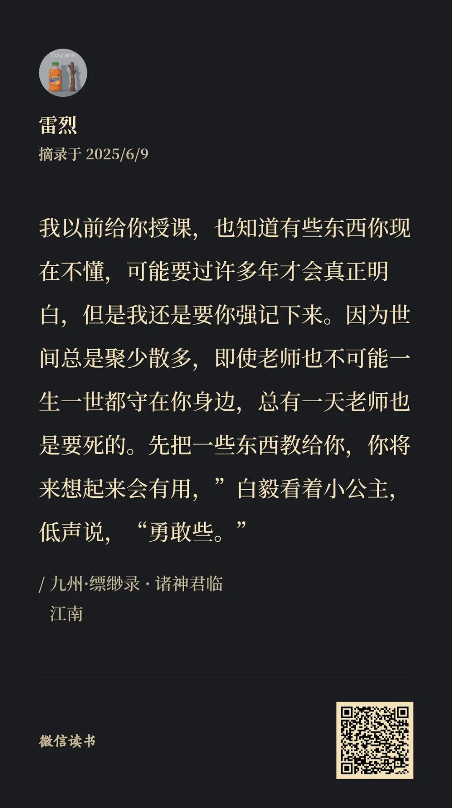

按照既定计划地进行了下一步。完事儿了给舅舅打了一个电话，报告了一下近况，以免舅舅担心。电话里舅舅说，现在就对我有一个要求，就是健健康康地活着，不要有负担，家人最关心的是这个。

随后我说，要是一切顺利，我就可以回家工作了。

舅舅说，那这样的话我就多了一个儿子啦。

我就在小说里或者网络上看见过家人会对ta们这么说，轮到现实的我自己听到这样的话，内心反而有一层隔膜。可能是不配得感作祟。内心的隔膜让我心里不敢有太多的触动。但这样的话确实很让人触动，家人的关切总是实实在在的，没有杂质的。也有可能是读博期间让我损失了太多心情波动。还有一种可能是男人之间无需多言的铁骨硬汉柔情。

好吧，之所以记录下来，是因为我还不能体会到舅舅的情感，也许等我再长大一点就懂了。不过还是先记下来，就像书里面说的一样：

说起来亲情确实是一种很奇妙的事情。可能很多年都不联系，一旦有困难，想要求得帮助，亲人又是值得无条件信赖的存在。只是要劝慰自己，不论以后要经历什么，能够拥有这样的亲情，也是一件十分十分幸运的事情。或许在未来的某一天，某一段更加难以为继的时刻里，想到这些事情，那就成为了内心世界的锚点。