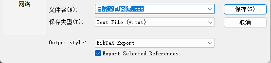

# 一、自动处理`.bib`文件中的`key`值

常用的文献管理软件有两个，一个是EndNote，另一个是Zotero。我自己最经常使用的是EndNote。

因为写论文是使用LaTex，所以导入文献的方式有两种，一种是在谷歌学术上找到对应的`.bib`文件，另一种是从EndNote导出对应的`.bib`文件。

从谷歌学术导出的`.bib`文件自然是符合要求的，`key`值写法值得称赞，信息量很大，格式为{第一作者的姓}{文献年份}{论文关键词}，足以说明这篇文献的主要信息。写法如下：

```bibtex
@article{cooke2016potential,
  title={The potential of cross-stream aligned sub-arrays to increase tidal turbine efficiency},
  author={Cooke, SC and Willden, RHJ and Byrne, BW},
  journal={Renewable Energy},
  volume={97},
  pages={284--292},
  year={2016},
  publisher={Elsevier}
}
```

从EndNote导出的bib文件，`key`值是随机数组成的，无法从`key`值很快地判断出这篇文献的作者及领域。写法如下：

```bibtex
@article{RN2181,
   author = {Cooke, S. C. and Willden, R. H. J. and Byrne, B. W.},
   title = {The potential of cross-stream aligned sub-arrays to increase tidal turbine efficiency},
   journal = {Renewable Energy},
   volume = {97},
   pages = {284-292},
   ISSN = {0960-1481},
   DOI = {10.1016/j.renene.2016.05.087},
   url = {<Go to ISI>://WOS:000380600500027},
   year = {2016},
   type = {Journal Article}
}
```

写期刊论文或者会议论文的时候，一般来说，所引用的文献数量最多不超过50个。每一篇文献都从谷歌学术里找到对应的bib文件也是可容许的操作量。如果文献数量变成100个，200个，甚至更多呢？那么再用谷歌学术一个个地导出bib文件就太费时间了。

所以考虑使用python工具自动化地处理这件事情。

第一步，先从EndNote导出文献。选中要导出的文献，按照“File->Export”，再在output syle里选择“BibTex Export”，导出bib文件。



第二步，新建python代码，代码如下：

```python
import re

def modify_bibtex_key(bibtex_entry):
    """处理单个 BibTeX 条目，生成新的 key 值"""
    # 提取作者信息
    author_match = re.search(r'author\s*=\s*{(.*?)}', bibtex_entry, re.DOTALL)
    first_author = "unknown"
    if author_match:
        author_list = author_match.group(1).split(' and ')
        if author_list:
            # 提取第一作者的姓氏
            first_author_name = author_list[0].strip()
            # 处理姓氏在前的情况 (如 "Doe, John")
            if ',' in first_author_name:
                first_author = first_author_name.split(',')[0].strip().lower()
            else:
                # 处理名字在前的情况 (如 "John Doe")
                first_author = first_author_name.split()[-1].strip().lower()

    # 提取年份
    year_match = re.search(r'year\s*=\s*{(.*?)}', bibtex_entry)
    year = "0000"
    if year_match:
        year = year_match.group(1).strip().lower()
        # 确保年份是 4 位数字
        year = year[:4]

    # 提取标题的第一个英文单词
    title_match = re.search(r'title\s*=\s*{(.*?)}', bibtex_entry, re.DOTALL)
    first_word = "unknown"
    if title_match:
        title = title_match.group(1).strip()
        # 处理标题中的特殊情况，如单引号开头
        if title.startswith("'"):
            title = title[1:]
        # 提取第一个英文单词
        words = re.findall(r'\b\w+\b', title)
        if words:
            first_word = words[0].lower()
        # 修改标题，使其只有首字母大写
        title = title.capitalize()
        bibtex_entry = re.sub(r'title\s*=\s*\{(.*?)\}', f'title = {{{title}}}', bibtex_entry, count=1)

    # 生成新的 key
    new_key = f"{first_author}{year}{first_word}"

    # 提取文献类型
    entry_type_match = re.match(r'@(\w+)\s*\{', bibtex_entry)
    entry_type = entry_type_match.group(1) if entry_type_match else "article"

    # 替换旧 key 为新 key
    new_entry = re.sub(r'@\w+\s*\{\s*[^,]+,', f'@{entry_type}{{{new_key},', bibtex_entry, count=1)

    return new_entry

def process_multiple_entries(bibtex_content):
    """处理包含多个条目的 BibTeX 内容"""
    # 分割各个 BibTeX 条目
    entries = re.split(r'(?=^@\w+\{)', bibtex_content, flags=re.M)
    # 过滤空字符串
    entries = [entry.strip() for entry in entries if entry.strip()]

    modified_entries = []
    for entry in entries:
        if entry.startswith('@'):
            modified_entry = modify_bibtex_key(entry)
            modified_entries.append(modified_entry)

    # 合并所有修改后的条目
    return '\n\n'.join(modified_entries)

# 多个 BibTeX 条目的示例
original_entries = """
put the bibtex code here.
e.g.
@article{RN1903,
   author = {Aliaga, Walter and Bhaya, Amit and Kaszkurewicz, Eugenius},
   title = {Dynamics of Duopoly Models with Undecided Clients under Decentralized Affine Feedback Advertising Policies},
   journal = {Complexity},
   volume = {2020},
   ISSN = {1076-2787},
   DOI = {10.1155/2020/5371492},
   url = {<Go to ISI>://WOS:000508435000003},
   year = {2020},
   type = {Journal Article}
}
"""

# 处理多个条目
# 修改 key
output_file = "output.bib"
new_content = ""
modified_content = process_multiple_entries(original_entries)
new_content += modified_content

with open(output_file, 'w', encoding='utf-8') as f:
    f.write(new_content)

# 打印修改后的 BibTeX 条目
print(modified_content)
```

唯一要做的事情就是把

```python
# 多个 BibTeX 条目的示例
original_entries = """
put the bibtex code here.
e.g.
@article{RN1903,
   author = {Aliaga, Walter and Bhaya, Amit and Kaszkurewicz, Eugenius},
   title = {Dynamics of Duopoly Models with Undecided Clients under Decentralized Affine Feedback Advertising Policies},
   journal = {Complexity},
   volume = {2020},
   ISSN = {1076-2787},
   DOI = {10.1155/2020/5371492},
   url = {<Go to ISI>://WOS:000508435000003},
   year = {2020},
   type = {Journal Article}
}
"""
```

的内容替换成“日常文献阅读.txt”的内容。

上面的python代码可以将`.bib`的`key`按照{第一作者的姓}{文献年份}{论文标题的第一个词}的格式重新命名。python没有办法智能化地理解论文标题的内容并提取关键词，只好提取论文标题的第一次词。

第三步，替换内容之后，在`output.bib`文件中找到修改`key`值后的bib文件。

# 二、自动下载具备doi号的文献

同样也是针对文献太多的情况而言的。

先在EndNote里新建一个output style。按照“Edit->Output Styles->New Style...”的顺序点击。

在“Bibliography”的“Templates”中，输入如下代码：

```endnote

Title：https://sci-hub.se/DOI
```

> 注意：
> - `Title`上面的空白换行不能少啊！有这个空白换行，导出的文献文件才会每一条文献之后都换行。
> - `https://sci-hub.se/`是我自己找到的sci-hub网站，可以替换成任何你能找到的sci-hub网址。
> - `Title`和`DOI`都是EndNote的关键字，都可以在该页面右上方的“Insert Field”找到。 

再使用下列python代码进行批量下载。记得把导出的`.txt`文件改成`日常文献阅读DOI.txt`，再把`.py`文件和`.txt`文件放在一个文件夹里。

```python
import re
import os
import requests
from bs4 import BeautifulSoup
import time
import random
from datetime import datetime
from tqdm import tqdm
from concurrent.futures import ThreadPoolExecutor
import threading

# 随机 User-Agent 列表
USER_AGENTS = [
    'Mozilla/5.0 (Windows NT 10.0; Win64; x64) AppleWebKit/537.36 (KHTML, like Gecko) Chrome/91.0.4472.124 Safari/537.36',
    'Mozilla/5.0 (Macintosh; Intel Mac OS X 10_15_7) AppleWebKit/537.36 (KHTML, like Gecko) Chrome/91.0.4472.124 Safari/537.36',
    'Mozilla/5.0 (Windows NT 10.0; Win64; x64; rv:89.0) Gecko/20100101 Firefox/89.0',
    'Mozilla/5.0 (Macintosh; Intel Mac OS X 10_15_7) AppleWebKit/605.1.15 (KHTML, like Gecko) Version/14.1.1 Safari/605.1.15'
]

# 全局锁，用于线程安全
progress_lock = threading.Lock()

def process_document(document_content):
    """处理文档内容，提取论文标题和DOI链接"""
    papers = []
    lines = document_content.split('\n')
    current_title = None
    
    for line in lines:
        line = line.strip()
        if not line:
            continue
            
        # 检查是否是论文标题行（包含冒号和sci-hub链接）
        if ': https://sci-hub.se/' in line:
            if current_title:
                papers.append((current_title, None))  # 保存之前的标题（无DOI）
            # 分割标题和链接
            parts = line.split(': ', 1)
            if len(parts) == 2:
                title, link = parts
                # 检查链接是否包含DOI
                if '10.' in link:  # 简单判断是否有DOI格式
                    papers.append((title, link))
                else:
                    papers.append((title, None))
            current_title = None
        elif current_title:
            # 处理多行标题
            current_title += ' ' + line
        else:
            current_title = line
    
    # 处理最后一个标题
    if current_title:
        papers.append((current_title, None))
    
    return papers

def download_paper(args):
    """下载论文并按要求命名"""
    title, link, output_dir, idx, pbar, proxy_pool = args
    
    result = {
        'index': idx,
        'title': title,
        'doi': link,
        'downloaded': False,
        'error': ''
    }
    
    if not link or '10.' not in link:
        result['error'] = "无DOI号，不下载"
        with progress_lock:
            pbar.update(1)
        return result
    
    # 随机选择代理和User-Agent
    proxy = random.choice(proxy_pool) if proxy_pool else None
    user_agent = random.choice(USER_AGENTS)
    
    headers = {
        'User-Agent': user_agent,
        'Referer': 'https://sci-hub.se/',
        'Accept': 'text/html,application/xhtml+xml,application/xml;q=0.9,image/webp,*/*;q=0.8',
        'Accept-Language': 'zh-CN,zh;q=0.9,en;q=0.8',
        'Connection': 'keep-alive',
    }
    
    # 重试机制
    max_retries = 3
    for attempt in range(max_retries):
        try:
            # 随机延时，避免请求过于集中
            time.sleep(random.uniform(1, 3))
            
            # 创建会话
            session = requests.Session()
            if proxy:
                session.proxies = {
                    'http': proxy,
                    'https': proxy
                }
            
            # 先请求Sci-Hub页面获取实际下载链接
            response = session.get(link, headers=headers, timeout=20)
            response.raise_for_status()
            
            # 检查是否被封IP
            if 'captcha' in response.text.lower() or response.status_code == 403:
                raise Exception("可能触发验证码或IP被封禁")
            
            soup = BeautifulSoup(response.text, 'html.parser')
            
            if soup.iframe:
                download_url = soup.iframe.get('src')
            elif soup.embed:
                download_url = soup.embed.get('src')
            else:
                download_url = link
            
            if download_url and not download_url.startswith('http'):
                download_url = 'https:' + download_url
            
            # 下载PDF内容
            pdf_response = session.get(download_url, headers=headers, timeout=30)
            pdf_response.raise_for_status()
            
            # 验证是否为PDF内容
            content_type = pdf_response.headers.get('Content-Type', '')
            if 'application/pdf' not in content_type and not pdf_response.text.startswith('%PDF-'):
                result['error'] = f"非PDF内容，类型: {content_type}"
                break
            
            # 生成正确的文件名：首字母大写，替换特殊字符
            filename = re.sub(r'[\\/*?:"<>|]', '', title)
            filename = filename[0].upper() + filename[1:].lower() + '.pdf'
            filepath = os.path.join(output_dir, filename)
            
            # 保存文件
            with open(filepath, 'wb') as f:
                f.write(pdf_response.content)
            
            result['downloaded'] = True
            result['error'] = "下载成功"
            break
            
        except requests.exceptions.RequestException as e:
            result['error'] = f"网络请求错误 (尝试 {attempt+1}/{max_retries}): {str(e)}"
            time.sleep(random.uniform(3, 5))  # 重试前等待更长时间
        except Exception as e:
            result['error'] = f"下载异常 (尝试 {attempt+1}/{max_retries}): {str(e)}"
            time.sleep(random.uniform(3, 5))
    else:
        # 所有重试都失败
        result['error'] += f" - 已尝试 {max_retries} 次，放弃下载"
    
    with progress_lock:
        pbar.update(1)
        if result['downloaded']:
            tqdm.write(f"✅ 第{idx}篇下载成功: {title}")
        else:
            tqdm.write(f"❌ 第{idx}篇下载失败: {result['error']}")
    
    return result

def main(input_file_name):
    # 读取文档内容
    try:
        with open(input_file_name, 'r', encoding='utf-8') as f:
            document_content = f.read()
    except FileNotFoundError:
        print("错误：未找到文档文件")
        return
    except Exception as e:
        print(f"读取文档时出错: {str(e)}")
        return
    
    # 提取论文信息
    papers = process_document(document_content)
    output_dir = 'downloaded_papers'
    results = []
    
    # 并发下载配置
    MAX_WORKERS = 3  # 默认并发数，可根据网络调整
    
    # 代理池配置（从文件读取或手动添加）
    proxy_pool = []
    if os.path.exists('proxies.txt'):
        with open('proxies.txt', 'r') as f:
            proxy_pool = [line.strip() for line in f if line.strip()]
    
    print(f"准备下载 {len(papers)} 篇论文，使用 {MAX_WORKERS} 个并发线程")
    if proxy_pool:
        print(f"已加载 {len(proxy_pool)} 个代理服务器")
    else:
        print("未使用代理，可能容易触发反爬机制")
    
    # 使用tqdm显示进度条
    with tqdm(total=len(papers), desc="下载进度", unit="篇") as pbar:
        with ThreadPoolExecutor(max_workers=MAX_WORKERS) as executor:
            # 提交所有下载任务
            futures = []
            for idx, (title, link) in enumerate(papers, 1):
                args = (title, link, output_dir, idx, pbar, proxy_pool)
                future = executor.submit(download_paper, args)
                futures.append(future)
            
            # 收集结果（按原始顺序）
            for future in futures:
                results.append(future.result())
    
    # 生成结果报告
    report_filename = f"下载结果_{datetime.now().strftime('%Y%m%d_%H%M%S')}.txt"
    with open(report_filename, 'w', encoding='utf-8') as f:
        f.write("论文下载结果报告\n")
        f.write("=" * 50 + "\n\n")
        
        for result in results:
            status = "成功" if result['downloaded'] else "失败"
            f.write(f"[{result['index']}] {result['title']}\n")
            f.write(f"  DOI链接: {result['doi'] or '无'}\n")
            f.write(f"  下载状态: {status}\n")
            if result['error']:
                f.write(f"  备注: {result['error']}\n")
            f.write("-" * 40 + "\n")
        
        f.write("\n" + "=" * 50 + "\n")
        f.write(f"总论文数: {len(results)}\n")
        f.write(f"成功下载: {sum(1 for r in results if r['downloaded'])}\n")
        f.write(f"失败或未下载: {len(results) - sum(1 for r in results if r['downloaded'])}\n")
    
    print(f"下载完成！结果已保存至 {report_filename}")
    
    # 统计失败论文
    failed_papers = [r for r in results if not r['downloaded'] and r['doi']]
    if failed_papers:
        print(f"\n共有 {len(failed_papers)} 篇论文下载失败")
        retry_option = input("是否创建重试列表？(y/n): ").strip().lower()
        if retry_option == 'y':
            retry_filename = f"需要重试_{datetime.now().strftime('%Y%m%d_%H%M%S')}.txt"
            with open(retry_filename, 'w', encoding='utf-8') as f:
                for paper in failed_papers:
                    f.write(f"{paper['title']}: {paper['doi']}\n")
            print(f"已创建重试列表: {retry_filename}")

if __name__ == "__main__":
    input_file_name = '日常文献阅读DOI.txt'
    main(input_file_name)
```

