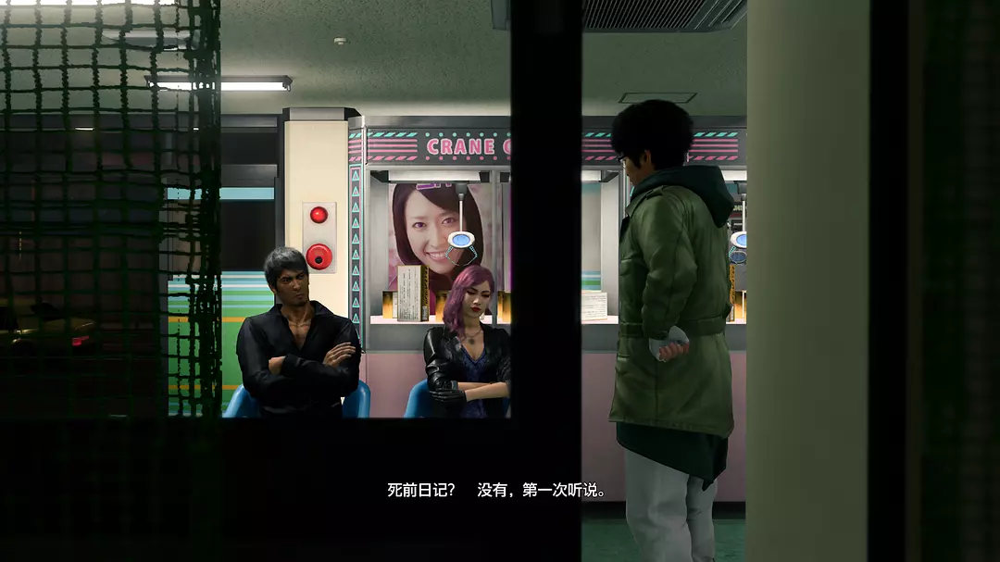

上个月的时候，翻自己的B站动态，又翻到Sega官方发的庆祝真岛吾朗（Goro Majima，后简称麻吉麻）60大寿的视频。

  <iframe 
    src="//player.bilibili.com/player.html?isOutside=true&aid=1354698773&bvid=BV1tz42127MC&cid=1543778194&p=1" 
    scrolling="no" 
    border="0" 
    frameborder="no" 
    framespacing="0" 
    allowfullscreen="true"
    style="position: absolute; top: 0; left: 0; width: 100%; height: 100%;"
  ></iframe>

妈呀，传说中的黑道们都已经从大叔变成了大爷。遂翻出xxs买了但一直没有通关的《如龙0》玩。

知道《如龙》系列是很早之前的事情了，但是一直没有设备玩。22年的时候买了一台xss，开通了xgp，才终于入门了《如龙》系列。玩的是《如龙7》，热血笨蛋勇者春日一番的故事，22年的五一假期通关。游戏快到最后的时候出现了麻吉麻和冴（hù）老师。

 所以翻到麻吉麻60大寿的视频的时候，又想重新回味一下《如龙》系列最开始的故事，也就是《如龙0》。可能是从回合制的《如龙7》入门，玩经典的《如龙》系列反而还不习惯了，也有可能之前玩的日式RPG《勇者斗恶龙》和《最终幻想》都是回合制的，所以自己对回合制的喜爱程度更高一些。

然后在xxs商店里面随意地翻了一下其他几部《如龙》。刚好！！！看见《如龙8》打折，原价400多，现价180多。立马入手，下载，开玩，一气呵成。

---

先说玩法好了，《如龙8》还是和《如龙7》一样，是回合制的游戏。比上一代有进步的是，这一代的回合制可以在一定范围内移动了。有了这一圈蓝圈，就可以实施更多的动作策略，比如说选一个可以让技能打中更多敌人的位置；也可以让自己的身位更加靠近敌人，达到“近身攻击”的状态，实现更高的伤害。

忘记截图了，从B站up主视频里找了一张图，图侵删
职业也更多了，除了原来在异人町的职业之外，还有更具有夏威夷风情的职业，比如说热带风情舞者啊狂野舞者啊海洋大师啊之类的。然后就是夏威夷的地图很大很大！这点我在玩《如龙0》的时候，就感觉神室町的地图好逼仄了，到《如龙7》的时候，是异人町，就觉得比神室町大了好多。现在到了《如龙8》，夏威夷的地图比异人町还大！

而且没有《如龙7》里等级曲线那么陡峭了。在《如龙7》真的被麻吉麻和冴老师教做人了，让我知道了什么是传说中的黑道，他俩登场的时候等级陡升，一拳就把春日干趴下。逼得我不得不去斗技场刷了两小时级，更新完了装备，才敢有勇气重新挑战两位老师。《如龙8》里面一路打过来，基本上不用怎么刷级，就能够打通关。不过最后的决战里，因为我只刷过夏威夷1-20级迷宫和异人町1-10级的迷宫，主角团的等级都在48级左右，最终boss一个是50级，另外一个是52级，打起来还是很吃力，吃了好多药才慢慢地磨光了他们的血量。

再开始说我最喜欢这代游戏的部分！

剧情和情怀！！！

这代游戏是春日一番和桐生一马双主角，1-7章春日是主角，从第8章开始，按照第8、10、12章桐生是主角，第9、11、13章春日是主角，最终章是春日和桐生各带一队打爆boss。

春日到了夏威夷，因为被陷害导致警察追捕他，山穷水尽的时候，突然桐生一马出现了！救春日于危难之中，那一刻我和春日的感情是一致的！

桐生大哥！你来了！

我还给桐生戴上了健康戒指和平安胸针，希望早日战胜病魔。呜呜。杀我别用癌症刀。

最喜欢的部分是桐生的死前日记。

第8章桐生被难波带回异人町后，因为知道自己身患癌症还有半年可活，桐生也已经放弃了治疗。难波和胜熙告诉桐生“死前日记”这个东西，劝桐生“这辈子都是为了别人而活，也请桐生大哥任性一回，为自己而活吧！”

于是桐生开始写死前日记。

呜呜呜呜呜呜，真的太有回忆了。从《如龙0》到《如龙6》的全部故事都回忆了一遍。走到神室町的某个熟悉的地方，或者在异人町看见了某个让桐生泛起回忆的人/事/物，桐生都会把它们全部记下来。

尤其上面这张图的狭山熏。意难平啊！！！桐生和狭山就应该在《如龙2》的结尾处，带着遥远走他乡，过上有老婆有孩子的幸福生活，这样的结尾多好啊！但是横山老贼总是见不得人好啊，进了黑道就没有办法过上平常幸福的一生啊！硬生生地让堂岛之龙桐生一马变成了躺倒龙、背锅龙！

还是网友锐评得好！

> 最后发现原来是拿错了横山的病历，然后和狭山跑美国治贫血休养去了，皆大欢喜😭

桐生啊桐生，你在《如龙1》错过了泽村由美，那就在《如龙2》不要错过狭山熏了啊。

桐生一马如此回忆： 

狭山熏如此隔空回应：

真的很喜欢桐生一马啊！就是任侠的一生啊！这样一位大哥，看见他就感觉有了依靠。

让春日一行先走，自己独自留下来善后的桐生大哥！

> “要相信大哥的话，我们可不是那些矫情的年轻人，说着谎话劝别人离开，自己留下来独自战死。”

---

春日在异人町的楼顶平房也是我很喜欢的样子！就是在楼顶，夏天暴晒，太热了。

---

【剧透警告！！！】（结局记忆有点混乱，描述不准请见谅）

最后结尾是桐生把海老名按在地上，告诉海老名黑道的未来就让桐生来背负了，不要再带着恨生活了，桐生原谅了海老名的所作所为。因为他知道，他们这种黑道，以前做过那么坏事，让人们一下子接受，接受曾经的黑道们已经成为了只好安心过日子的好人是不可能的。但是冤冤相报何时了，只有互相放过，也许才会有更好的未来。

我还想起来冴老师的内脏文学。

人生就如同烤大肠，火候不够的大肠就不是能吃的东西，我们的人生不被烤炼一下就算不上真正的人生。

  <iframe 
    src="//player.bilibili.com/player.html?isOutside=true&aid=99562740&bvid=BV1j7411y71U&cid=169928667&p=1" 
    scrolling="no" 
    border="0" 
    frameborder="no" 
    framespacing="0" 
    allowfullscreen="true"
    style="position: absolute; top: 0; left: 0; width: 100%; height: 100%;"
  ></iframe>

还有春日和桐生都说过的那句话。

> 人生到了谷底，怎么走都是向上啊。

很正能量的话啊，对于目前处于莺谷的我来说，给予了很大的力量。

就是很喜欢春日那股乐观热情开朗的劲儿，在他身上永远充满朝气，永远都是正能量；而桐生呢，则是一位正义感爆棚的任侠，一位能够让人安心依靠的大哥，一位坚韧不拔的堂岛之龙。他们对待生活都是认真的，认真生活的人生就是无限的财富啊！