> 本系列文章为《指挥：现代作战行动》（Command: Modern Operations，CMO）研究备忘。用来记录自己研究该软件怎么使用。

# 写在前面

CMO是一款商业化的计算机兵棋推演软件，以其可定制化的作战想定场景、全面的武器装备参数、拟真的智能体行为模拟而闻名于世。

其前身为《指挥：现代海空行动》（Command: Modern Air/Naval Operations，CMANO）。CMANO倍受美国海军、空军、德国空军、英国国防科学技术实验室等部门的青睐，并多次获得“年度兵棋游戏”奖项。

CMO是CMANO的升级版本，不仅可以模拟前作海战和空战，更可以模拟海陆空一体化的联合作战指挥行动。

之前一直是即时战略游戏（Real-Time Strategy Game，RTS）游戏的爱好者，玩过诸如《星际争霸》系列、《帝国时代》系列、《英雄连》系列和《战争之人》系列游戏，还是第一次接触计算机兵棋游戏。加上CMO所有的任务简报和信息都是英文，仅把界面做了汉化，因此游玩起来总是不如之前的RTS游戏那么自如。

 而且CMO里存在大量的军事名词，加上还是英文，很容易读了之后又忘掉了，所以在这里开一个备忘录，以期在繁忙的学习工作中间或再次打开CMO时，不至于又要重新学习，显得一头雾水。

本系列今年内计划完成CMO的`Tutorials-Air warfare tutorials-Flight tutorial`部分。

2026年内，如果没有其他工作打扰，再完成`Tutorials-Air warfare tutorials-Multi-domain strike planner tutorial`和`Electronic warfare tutorial`部分。

每篇文章由2部分组成：

1. 翻译任务中出现的简报和信息。为保留文本的完整性，即使有一些信息是重复的，仍会翻译；出于排版美观考虑，某些内容不会按照原文排版方式给出。
2. 给出每个任务的通关操作流程。

因为可能有的读者是从某一篇备忘进来，而非从第一篇备忘进来，所以上述内容我会在每一篇文章中重复强调。

该游戏所代表的价值观和政治立场与本人无关，仅出于学习目的，作为游戏过程的备忘。

# 任务简报和信息

## 任务简报

欢迎来到Basic Manual Flight Tutorial教程。

在本场景中，你将学习以下内容：

- 飞机起飞准备
- 飞机起飞操作
- 手动操控飞机飞行
- 返航与着陆

本场景中会弹出包含重要信息的提示窗口。你可在教程附带的文档中查看这些信息，也可按下快捷键Ctrl+Shift+M打开消息历史记录窗口（在新窗口中显示），然后滚动到对应的消息进行查看。

## 消息1

早上好！

今天你将担任以色列北部Ramat David空军基地的指挥官，并学习如何运用空中资产。

你麾下有6架F-16I Sufa战斗机和2架湾流G550 AEW Nahshon预警机。首先，请按下`空格键（SPACE）`启动模拟。

然后选中Ramat David空军基地，按下`F6`键打开空中行动窗口（你也可以在选中机场后，点击屏幕右侧的“飞机（Aircraft）”选项打开该窗口）。

## 消息2

现在你可以看到，
- 2架F-16I配备的是AIM-120中远程空对空导弹（AIM-120 (long range Air-to-Air missile)），采用“轻型202”（Light 202）挂载配置；
- 另外2架配备的是“怪蛇”5近中程空对空导弹（Python 5 (short/medium range Air-to-Air missile)），采用“轻型004”（Light 004）挂载配置；
- 最后2架则挂载了AGM-88A“哈姆”反辐射导弹（AGM-88A HARM (Anti-radiation missile)）和SPICE2000空对地滑翔炸弹（SPICE2000 (Air-to-Ground glide bomb)）。

目前有4架F-16I已做好起飞准备，剩余2架仍在进行武器挂载。

配备空对空导弹（AAM）挂载的飞机还开启了“快速周转”（Quick Turnaround）模式。这意味着它们可以执行多架次任务，且架次间的准备时间会缩短。

在“紧急行动”（Surge Operations）状态下，配备空对空导弹挂载的飞机需3小时才能做好再次出动准备（如Sufa #4所示）；在“持续行动”（Sustained Operations）状态下，则需20小时。但开启“快速周转”模式后，首次任务结束后只需等待20分钟即可再次出动。

“紧急行动”“持续行动”和“快速周转”均属于“准则设置”（Doctrine Settings），可通过“阵营准则窗口”（Side Doctrine Window）进行修改，打开该窗口的快捷键为`Ctrl+Shift+F9`。

不过，场景设计者通常会锁定这些设置（在编辑器中取消勾选每个准则设置旁的复选框即可实现锁定），禁止玩家修改，因为在一个场景中，准则通常不会发生变化。

另外2架G550 AEW Nahshon预警机目前处于“备用（Reserve）”状态。你需要先对它们进行准备，使其能够作为空中雷达平台执行任务。

选中其中1架预警机，点击“准备/挂载（Ready/Arm）”按钮；在弹出的新窗口中选择一种挂载配置（除“转场（Ferry）”“备用（Reserve）”和“维护（Maintenance）”外，唯一可用的配置是“保形空中早期预警（Conformal Aerial Early Warning）”）；然后点击“确认-准备（OK-Ready）”。

几小时后，“纳肖恩”预警机即可做好起飞准备。

## 消息3

现在该让一架飞机执行巡逻任务了。

选中1架已做好准备的F-16I，点击“单独起飞（Launch Individually）”。几分钟后，该机将升空。

## 消息4

当F-16I升空后，你就可以对其进行操控了。

若要规划航线，需先选中该飞机，然后按`下F3`键。此时鼠标指针下方会出现一个箭头，点击地图上的任意一点即可设定第一个航线点。之后你可以继续设定下一个航线点，或按下`ESC`键确认你规划的航线。

## 消息5

飞机正在沿你设定的航线飞行。现在请按下`F2`键，调整飞行速度和高度。

在某些情况下，你需要让飞机贴近地面飞行，以避免被敌方雷达探测到；而在另一些情况下，则需要让飞机在高空飞行，避开单兵防空导弹（MAN-Portable Air Defense Missile，MANPADS）的射程。

## 消息6

当飞机弹药耗尽（军事术语称“Winchester”）或燃油量过低（军事术语称“Bingo”，即“燃油低位”）时，飞机将自动返航。若你希望提前返航，按下`B`键即可。

## 消息7

做得好！

手动操控单架飞机并不难，但如何操控多架次飞机呢？下一篇教程将重点讲解“任务（missions）”相关内容。

# 任务操作流程

打开CMO，出现如下图所示界面。

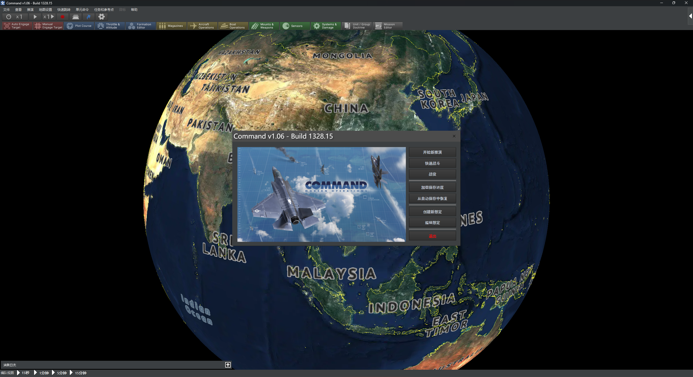

- 最上面是菜单栏，一般不用看它。
- 再往下是推演开始/暂停按钮，还有调速按钮，这些按钮比较常用。
- 再再往下就是每个单位的指令，从`F1`键到`F11`键。不用特意记快捷键，用多了自然就记住了。

点击中间界面的“开始新推演”。

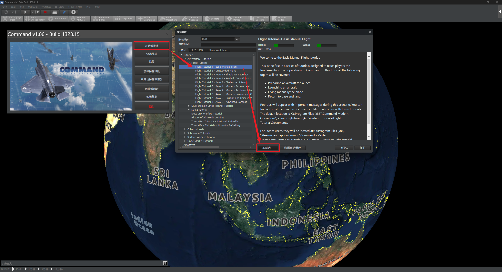

选择要进行的推演。我们从教程做起。因为CMO是个极其复杂的游戏，要想搞懂它怎么运作，不能一蹴而就，得步步为营。所以先从教程做起。选择`Tutorials-Air warfare tutorials-Flight tutorial-Flight tutorial 1-basic manual flight`。再点击“加载选中”。进入游戏之后会看见下图所示的空军基地。

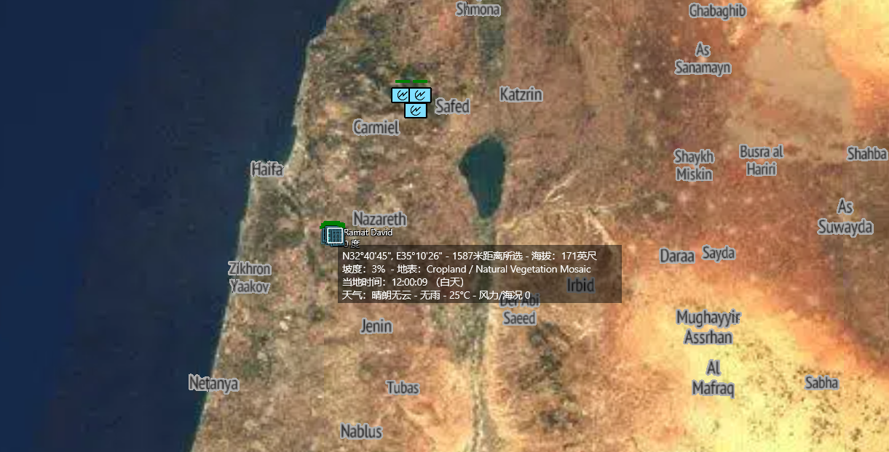

左键单击选中，按`F6`，进入飞机选择界面。（也可以在整个游戏界面的最右方发现“飞机”的按钮，点它，同样可以查看该基地存放的飞机。）如下图所示。

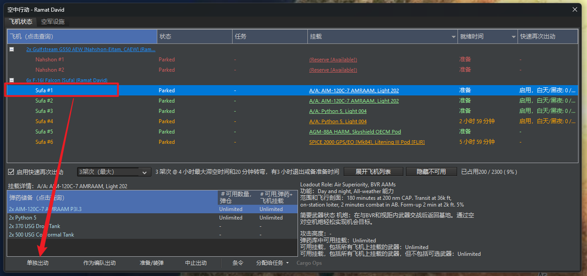

我们选择代号为Sufa #1的F-16l起飞，按照给出的消息，点击单独出动。

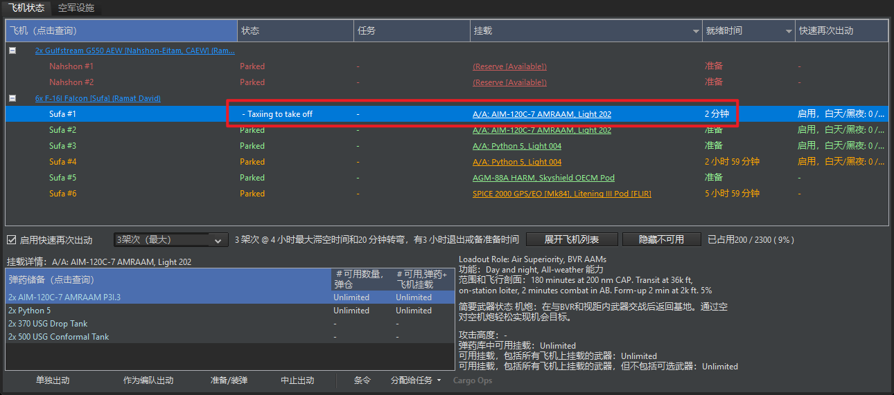

飞机会进入2分钟的起飞准备时间。在这里可以把时间调快，不用楞等2分钟让飞机起飞。

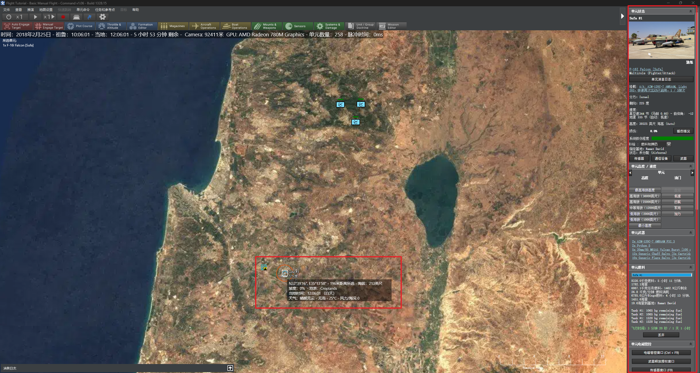

飞机起飞后，会在地图上显示半圆+长条形+外圈圆的组合。可以点击右边的各个按钮，即可查看Sufa #1的参数。如下图所示。

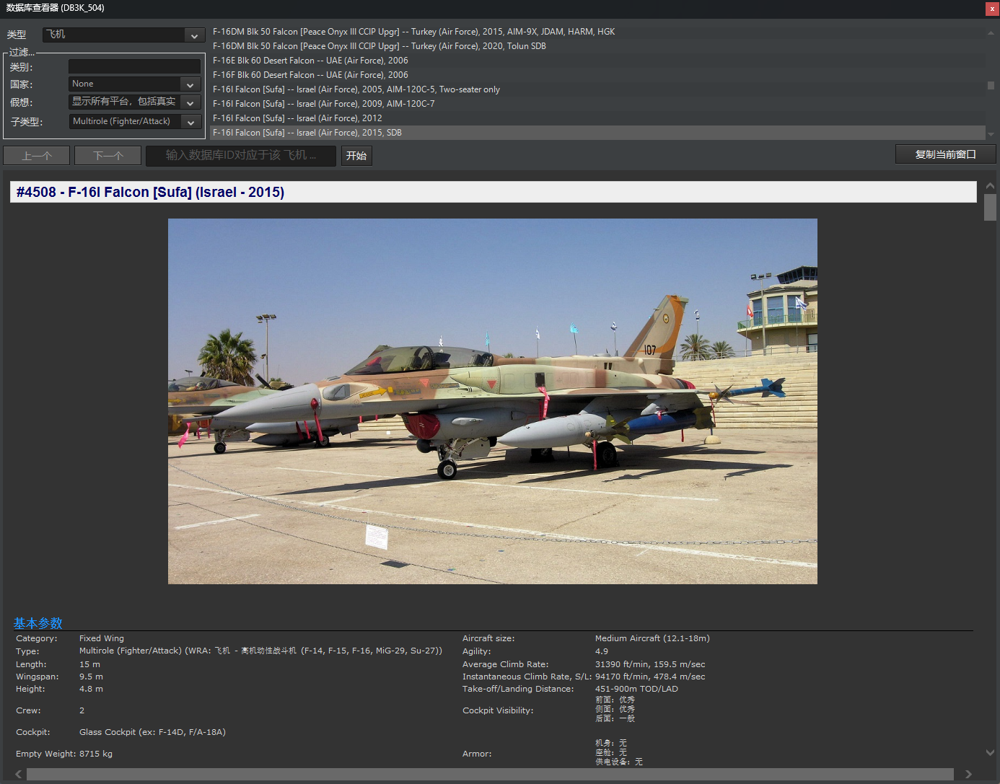

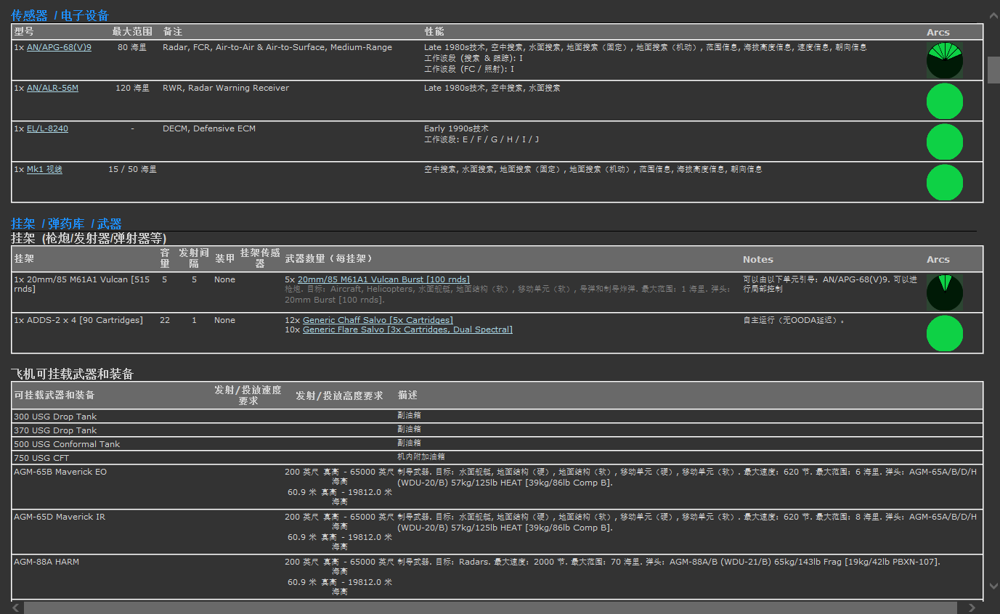

按`F2`可以手动设定Sufa #1的飞行参数。

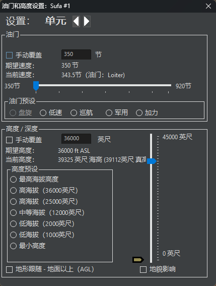

按`F3`可以手动设定Sufa #1的航路点。

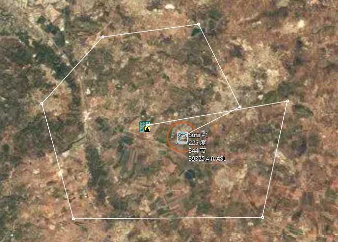

让推演保持“继续”状态，不要让它“暂停”，本关结束。弹出最终评估分数。

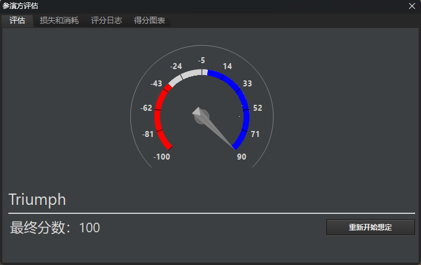

# 总结

这一关看起来挺简单的，但因为我是第一次上手计算机兵棋推演软件，加上任务简报和信息是全英文，搞不清这个任务究竟想干什么。最后找到了游戏里自带的每关教程文件，读了一遍，才完成了任务要求的内容。

之后如果有时间，会继续更新CMO教程备忘录系列，争取今年做完`Tutorials-Air warfare tutorials-Flight tutorial`部分。现在玩到了和敌方进行现代空战的部分，发现打不过，还得再研究一下咋操作。

也挺有意思的一个软件，起码让我对现代空战有了更加直观的印象。

欢迎通过邮箱联系我：lordofdapanji@foxmail.com

来信请注明你的身份，否则恕不回信。