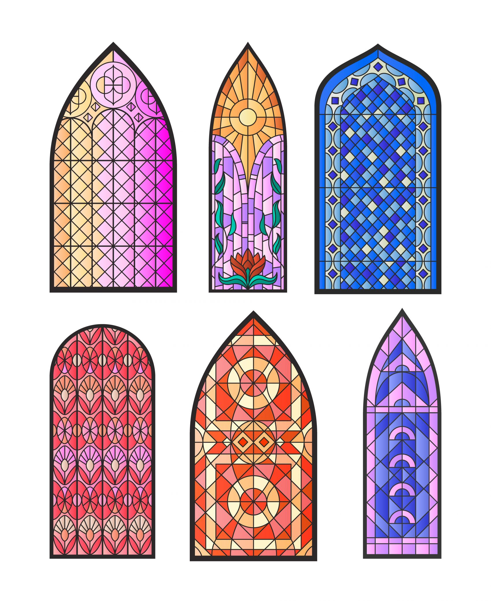
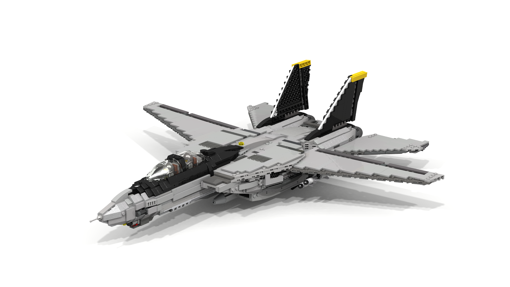

# 术语释义

马赛克战（Mosaic warfare，MW）是美国国防高级研究计划局（Defense advanced research projects agency，DARPA）在2017年提出的一种作战概念。

其涵义在于：借鉴马赛克简单、多功能、可快速拼接等特点，实现大量低成本、单一功能武器系统的动态组合、密切协作及自主规划，形成一个按需集成、极具弹性的作战体系，能够有效防范他国对手打击并瘫痪美军关键信息网络节点，以及支撑与他国对手进行全方位的体系化作战。

坦诚地说，这么多术语一下子冒上来，我看不懂马赛克战究竟是想要干什么事情。唯一的理解就是从字面意思上，马赛克是一种艺术流派，是用不同颜色的物品拼接成为另一种新的物品的艺术。

比如下图的马赛克玻璃。

也可能和乐高积木比较类似。就是用不同的乐高积木组装搭建成了一个新的东西，比如说战机。

找个类比吧！找个例子来帮助自己理解什么是马赛克战吧。

## 例子

可能在想，马赛克战是不是就像一台完完整整的手机。屏幕、CPU、相机镜头、电池全焊在主板上，坏一个零件，比如说主板电容坏了，整台手机就没法用，得换主板。其他没有报废的零件可能也要随之更换。这里假设修手机的人员水平比较低，不会拆主板，只会换主板。总而言之，成本很高。

现代战场要应对的威胁很灵活，比如敌人突然出新防空导弹、新无人机，传统大块部队反应慢、怕被打坏。

马赛克战就是把这台手机拆成独立小配件——屏幕是一个模块、CPU是一个模块、相机镜头是一个模块，甚至电池都能多备几块。这些小配件能随便拼：想办公就拼屏幕+键盘+CPU，想出门就多加两块电池；就算相机镜头坏了，换个新相机镜头就行，其他配件照样用。

参考模块化手机Project Ara。

## 马赛克战的流程

上面说的小配件，在军事里叫节点。每个节点只干一件最实用的小事，比如只负责看敌人、只负责定敌人位置、只负责做决策、只负责打敌人。这些节点靠能无缝传信息的先进网络，比如说卫星、加密无线电，连接起来。就像用蓝牙连手机、耳机、平板，信息能实时传。

具体怎么拆？拿传统战斗机举例子。  

将传统战机视作全能选手。它可以观察敌人（通过雷达），定位敌人（通过火控系统），打击敌人（通过导弹或机炮）。  

马赛克战里，这架战机被拆成如下4个部分：  

- 观察节点：用10架小型雷达无人机代替战机雷达，专门在天上飞，负责看敌人在哪；  
- 定位节点：再用5架小型光电无人机，专门靠近敌人，确定敌人战机的速度、高度、型号；  
- 决策节点：不是战机飞行员做决定，而是地面指挥中心或卫星。收到前两个节点的信息后，判断要不要打、用哪个节点打；  
- 行动节点：用3辆移动导弹发射车代替战机导弹，专门负责发射导弹。  

这4类节点靠网络连起来，就组成了一个空战小组。没有传统意义上的战机，但能干和战机一样的事，甚至更灵活。

## 从OODA循环的视角理解马赛克战

OODA（Observation, orientation, decision, action）循环，是美空军上校John Boyd发明的一种作战理论。通俗地说，分成四步：看敌人→定位置→做决定→动手打。从OODA循环的视角，找个例子来理解马赛克战。

更进一步地，细化上一节的内容。

1. 第一步：观察（O）——看敌人在哪
   10架雷达无人机在空域巡逻，其中2架发现了可疑目标，立刻把大概位置通过网络传给所有节点，包括定位节点、决策节点。  

2. 第二步：定位（O）——确定敌人具体情况
   地面指挥中心收到信息，立刻让2架光电无人机飞过去，近距离拍敌人战机的照片，确认是敌方的XX型号战机，速度800公里/小时，高度1万米，再把精准信息传回去。  

3. 第三步：决策（D）——要不要打、怎么打  
   决策节点结合敌人位置和自己的导弹节点位置，判断：用东边的2辆导弹发射车打，导弹选A型，30秒后发射，并把指令传给行动节点。  

4. 第四步：行动（A）——动手打 
   2辆导弹发射车收到指令，立刻发射2枚导弹，同时观察节点和定位节点持续跟踪敌人，把敌人是否拐弯、减速的信息传给导弹，引导导弹精准命中。  

整个过程中，就算有1架观察节点被敌人打下来，还有9架在工作；就算1辆行动节点没反应，还有1辆能发射。不会因为一个节点坏了，整个任务就黄了。

## 深入理解

马赛克战的优点：

1. **抗揍（即弹性强）**：节点多且有备份，比如10架观察节点，敌人就算打掉几个，剩下的节点照样能凑成作战网，不会像传统战机那样打下来一架就少一个战力。  
2. **灵活**：想干不同任务，就拼不同节点，比如要侦查敌人阵地，就只拼观察节点+定位节点；要打敌人坦克，就拼观察节点+定位节点+反坦克导弹节点，不用专门造新的大部队。  
3. **响应快**：遇到新威胁，不用等造新的大装备，比如传统要造新战机得好几年，直接加新节点就行，比如敌人出新防空导弹，传统战机不敢靠近，马赛克战直接加几架小型隐身无人机，就能绕开防空，继续侦查。

本质上就是让从笨重的大块头，变成灵活的变形金刚。

# 总结

本文仅为自己理解马赛克战这个概念所作记录，可能存在理解不到位的地方，请各位读者海涵，也欢迎大家赐教。

欢迎通过邮箱联系我：lordofdapanji@foxmail.com

来信请注明你的身份，否则恕不回信。