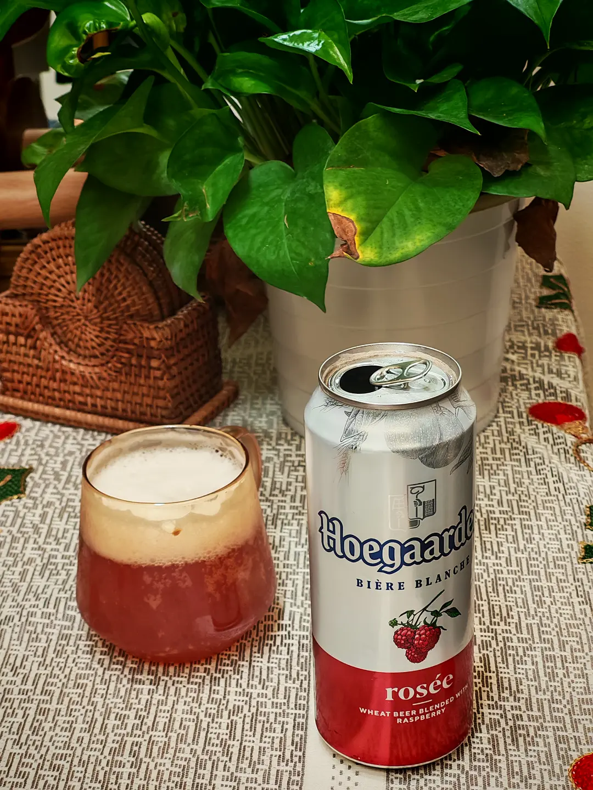

今天长沙终于天晴，晚上学完习已经九点，然后准备实践一下《晚酌的流派》里先做50min有氧运动，再回家用冰镇过的玻璃杯喝冰镇啤酒。

于是决定出门骑车。

从湖南大学转出来之后，遇见一个哥们骑得巨快。我在后面追了他6km都没追上。但我发现体力变好了，昨天同样的剧情，从中南大学转出来后遇见俩人，我追他们追到缺氧and视线模糊、视线边缘逐渐变黑了还是追不上，今天起码没有视线模糊了。核心要义就是踩得足够快。看他们的踏频可能有80rpm-90rpm了吧！

到家之后，看见了朋友发来的西安的洋槐花开了，附上照片。有一种“陌上花开，可缓缓归”的既视感。也算是浪漫了一下（x

> 晚上路过大雁塔，洋槐花都开了，不知道你以前注意到过这种花没有，这种树南方大概没有。洋槐花开的时候空气里会有一种甜味儿，这种话可以做成麦饭吃……哈哈春夜一切都很美。

确实有感到体力变好，感性层面来说，一开始骑30km气喘吁吁，再到骑50km才气喘吁吁，现在骑50km也没有那么气喘吁吁了。理性层面来说，均速也有提高！16km/h->18km/h->19km/h->21km/h->23km/h这样子。

最近看完了石黑一雄的几本小说，用他的话来说，就是：The real world is not perfect, but human beings can counter it by creating an ideal world in their minds, or find a way to compromise with it.